# 자바 스터디 - 1주차
목차
1. [JVM이란 무엇일까?](#jvm이란-무엇일까)
2. [컴파일 하는 방법](#컴파일-하는-방법)
3. [실행하는 방법](#실행하는-방법)
4. [바이트코드란 무엇인가](#바이트코드란-무엇인가)
5. [JIT컴파일러란 무엇이며 어떻게 동작하는지](#jit컴파일러란-무엇이며-어떻게-동작하는지)
6. [JVM 구성 요소](#jvm-구성요소)
7. [JDK와 JRE의 차이](#jdk와-jre의-차이)
## JVM이란 무엇일까?
JVM이 무엇인지 알기 전에 JVM이 왜 쓰이는지에 대해서 알아야한다.

java라는 언어는 os를 런타임 환경으로 사용하던 타 언어의 단점인 os마다 다른 코드를 작성해야 하는 점을 해소하기 위한 기능을 갖고 있다. 따라서 자바의 표어가 `Write once, run anywhere`일 정도로 어느 os에서든 잘 돌아가게 설계되었다.

후술하겠지만 java가 `WORA`를 실천할 수 있는 이유는 JDK를 이용해 작성한 java코드를 JRE를 이용해 바이트 코드를 생성하고 이를 JVM을 통해 실행하기 때문이다.

[JVM 동작 원리](https://steady-snail.tistory.com/67), [오라클 자바22 documents](https://docs.oracle.com/en/java/javase/22/)
## 컴파일
### [컴파일 과정](https://gyoogle.dev/blog/computer-language/Java/%EC%BB%B4%ED%8C%8C%EC%9D%BC%20%EA%B3%BC%EC%A0%95.html)
- .java작성
- Java Compiler가 소스파일을 컴파일 (이 때 나오는 코드는 바이트코드(.class))
- JVM의 Class Loader에 바이트 코드 전달
- 동적로딩(Dynamic Loading)을 통해 필요한 클래스들을 로딩 및 링크하여 Runtime Data Area, 즉 JVM의 메모리에 올림
- 실행엔진(Execution Engine)은 JVM 메모리에 올라온 바이트 코드들을 명령어 단위로 하나씩 가져와서 실행
## 실행하는 방법
### JDK 설치
[오라클 JDK](https://www.oracle.com/kr/java/technologies/downloads/) 다운로드 사이트에서 22, 21, 17.. 등 원하는 버전으로 다운 받아서 설치한다.
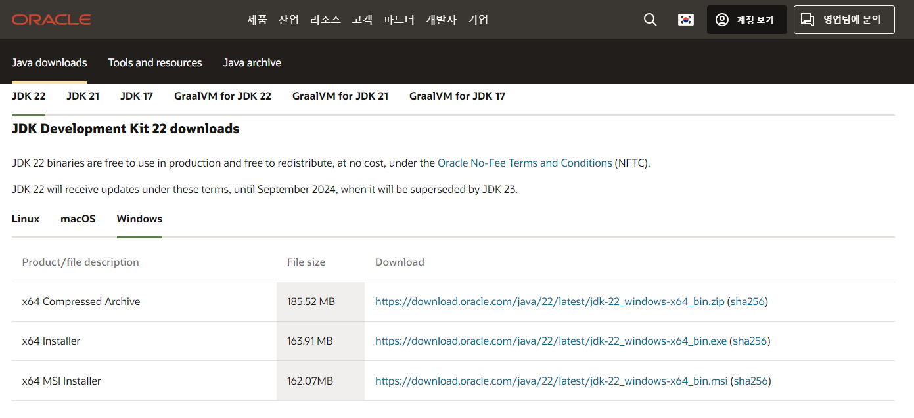
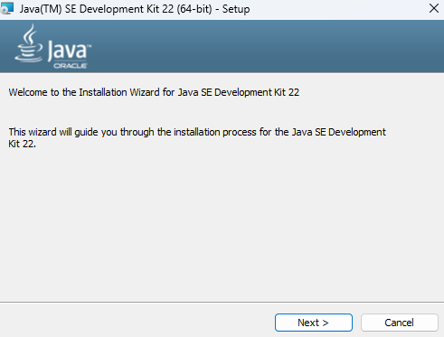
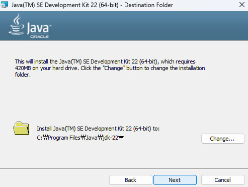
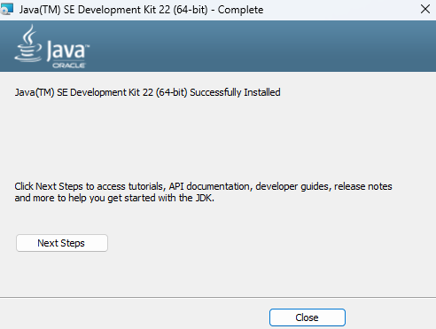
### 환경 변수 설정
1. 시스템 환경 변수 편집 검색
   - 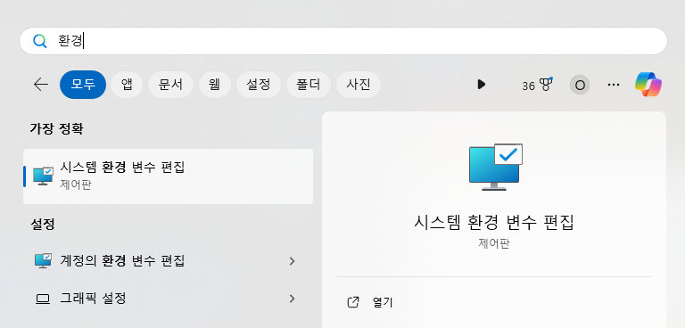

2. 환경 변수 선택 후 시스템 변수에 새로 만들기
   - 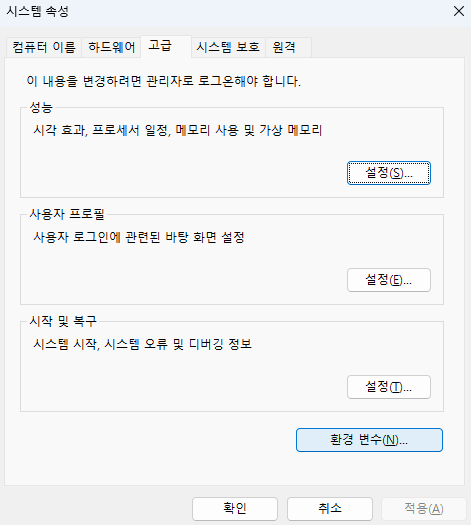
   - 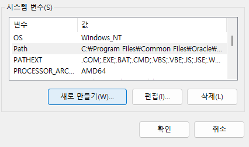

3. `JAVA_HOME`의 이름으로 아까 설치한 JDK 위치를 변수 값으로 설정
   - 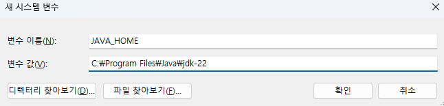

4. 시스템 변수의 PATH 편집을 선택, `%JAVA_HOME%\bin` 추가
   - 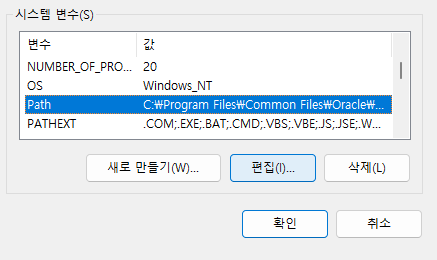
   - 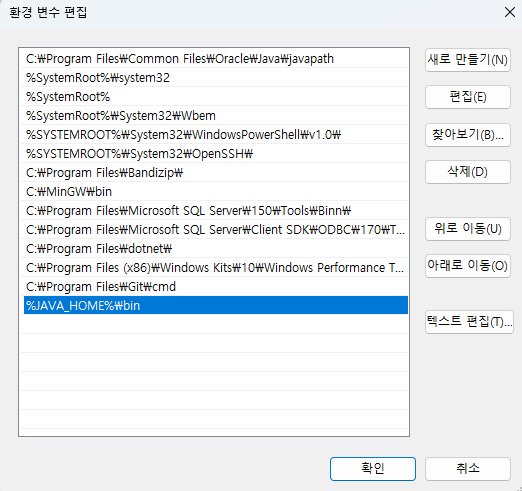

환경변수 설정이 완료 되었는지 확인하는 방법은 CMD에서 `javac -version` 명령어를 실행하면 설치한 JDK의 버전이 뜬다.
### Hello World! with VSCode
1. `Ctrl + Shift + P` -> `JAVA: Create Java Project...`
   - 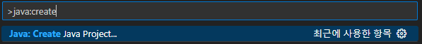
2. `No build tools`
   - 
3. JAVA project name 설정
   - 
4. Hello World!
   - 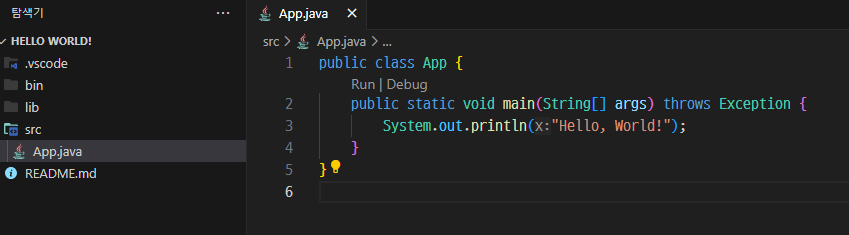
   - 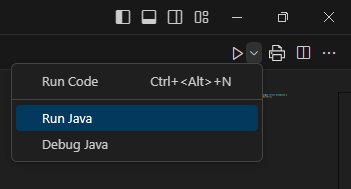
   - 
## [바이트코드란 무엇인가?](https://www.tcpschool.com/java/java_intro_programming)
JVM이 이해할 수 있는 언어로 변환된 자바 소스코드를 의미함(.class)

자바 컴파일러에 의해 변환되는 코드의 명령어의 크기가 1byte라서 자바 바이트 코드라고 불림
## [JIT컴파일러란 무엇이며 어떻게 동작하는지](https://www.ibm.com/docs/ko/sdk-java-technology/8?topic=reference-jit-compiler)
JIT 컴파일러는 JVM의 Execute Engine에서 인터프리터와 같이 구동됨

JIT 컴파일러는 [후술](#excutable-engine)하여 요약했듯이 인터프리터의 속도 측면을 보완하기 위해 있는 것

프로그램이 시작될 때 수천 개의 메소드가 호출되는데, 이를 모두 컴파일하면 시작 시간에 큰 영향을 줌. 따라서 시작할 때 컴파일 하지는 않음

JVM은 각 메소드에 대해 사전 정의된 컴파일 임계값에서 시작되고, 해당 메소드가 호출될 때마다 감소되는 호출 개수를 유지보수함. 호출 개수가 0에 도달하면 해당 메소드에 대한 JIT 컴파일이 트리거 됨. 따라서 자주 사용되는 메소드는 JVM이 시작된 직후 컴파일되며 자주 사용되지 않는 메소드는 훨씬 나중에 컴파일되거나 컴파일 되지 않음

JIT Compiler는 최적화 레벨(cold, warm, hot, veryHot or scorching)에서 메소드를 컴파일 할 수 있다. 최적화 레벨이 높을수록 더 나은 성능을 제공할 것으로 기대되지만, CPU 및 메모리 측면에서는 컴파일 비용이 더 높아짐. 기본 레벨은 warm이며, 시작 시간이 느릴 경우 cold로 다운그레이드 될 수 있음
## JVM 구성요소
### [JVM](https://docs.oracle.com/en/java/javase/22/vm/java-virtual-machine-technology-overview.html#GUID-982B244A-9B01-479A-8651-CB6475019281) (Java Virtual Machine)
- JVM은 라이브 Java 애플리케이션을 실행 모든 JRE에는 기본 JRE가 포함되지만, 특정 리소스 요구사항을 충족하는 다른 JRE를 자유롭게 선택 가능
- 아래 나열한 기능을 수행함
  - 적응형 컴파일러
  - 메모리 할당 및 가비지 수집 (Native Memory Tracking)
  - 쓰레드 동기화
- [JVM api](https://docs.oracle.com/en/java/javase/22/vm/jvm-apis.html#GUID-D9FACC07-31DF-49EC-B539-5875BD05DB1C)가 있어서 런타임 시 JVM과 상호작용 가능
#### [JVM 구조](https://brewagebear.github.io/fundamental-jvm-classloader/)
> 
#### Class Loader System Area
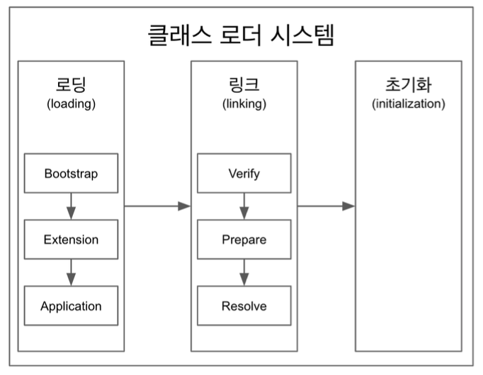

[클래스 로더 세부 동작](https://velog.io/@ddangle/Java-클래스-로더란)
  - Loading
    - 자바 바이트 코드(.class)를 메소드 영역에 저장
    - 각 자바 바이트 코드는 JVM에 의해 메소드 영역에 다음 정보들을 저장
      - 로드된 클래스를 비롯한 그의 부모 클래스의정보
      - 클래스 파일과 Class, Interface, Enum의 관련 여부
      - 변수나 메소드 등의 정보
  - Linking
    - verify: 읽어 들인 클래스가 자바 언어 명세 및 JVM 명세에 명시된 대로 잘 구성되어 있는지 검사
    - prepare: 클래스가 필요로 하는 메모리를 할당하고, 클래스에서 정의된 필드, 메소드, 인터페이스를 나타내는 데이터 구조를 준비
    - resolve: symbolic 메모리 레퍼런스를 메소드 영역에 있는 실제 레퍼런스로 교체
  - Initialization
    - 클래스 변수들(static 변수)을 적절한 값으로 초기화
    - 즉, static 필드들이 설정된 값으로 초기화
#### Runtime Data Area
모든 쓰레드가 공유하는 영역
- Method Area
  - 클래스 수준의 정보(클래스 이름, 부모 클래스 이름, 메소드, 변수)를 저장하는 영역
- Heap Area
  - 객체 저장

쓰레드 별 하나씩 생성되는 영역
  - Stack Area
    - 쓰레드마다 런타임 쓰레드를 만들고 그 안에 Method Call을 스택 프레임이라 부르는 블럭으로 쌓음
    - 쓰레드를 종료하면 스택도 사라짐
  - Native Method Area
    - 자바 외의 언어로 작성된 네이티브 코드를 위한 스택
    - 이 때 네이티브 메소드 인터페이스를 통해 호출하는 코드들을 위한 스택
  - Program Counter Register
    - 쓰레드 마다 쓰레드 내 현재 실행할 스택 프레임을 가르키는 포인터가 생성됨
#### Excutable Engine
인터프리터
- 자바 바이트 코드를 한 줄씩 실행 (이 때문에 느린 부분은 JIT 컴파일러로 속도 보완)

JIT 컴파일러 (Just In Time Compiler)
- 반복적인 코드는 JIT 컴파일러가 미리 바이트 코드에서 네이티브 코드로 바꿔서 저장
- 인터프리터는 해당 구문을 만나면 저장해둔 결과를 가져와서 네이티브 코드로 바꿔서 수행
- JIT 컴파일러는 하나씩 인터프리팅 하는 것보다 느리기 때문에 자주 수행되는지 여부와 어느정도 반복 되는지에 대한 여부를 확인하여 컴파일 수행

Garbage Collector
- 어플리케이션이 생성한 객체의 생존 여부를 판단하여 더 이상 사용되지 않는 객체를 해제하는 방식으로 메모리를 자동 관리함.
#### Class Loading Process
위 Class Loader System Area에서 서술 했듯이 아래의 과정을 거침
- Verify
- Prepare
- Resolve
#### Dynamic Loading
런타임에 동적으로 클래스를 로딩하는 것은 JVM이 클래스에 대한 정보를 갖고 있지 않다는 것을 의미함.

즉, JVM은 이 클래스가 유효한지 로딩할 때 판단 해야함.

JVM은 내부적으로 클래스를 분석할 수 있는 기능을 갖고 있으며 개발자들은 이것을 Reflection을 통해 분석할 수 있다.

Load-Time Dynamic Loading
- 다른 클래스를 읽어오는 과정에서 함께 로딩되는 것을 로드타임 동적 로딩이라고 함

Run-Time Dynamic Loading
- 클래스를 로딩할 때가 아닌 코드를 실행하는 순간에 클래스를 로딩하는 것을 런타임 동적 로딩이라 함
## JDK와 JRE의 차이
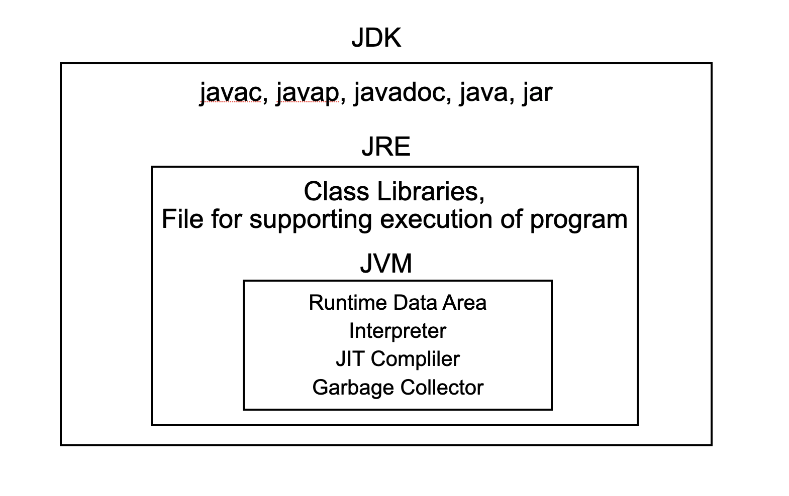
JVM, JRE, JDK의 관계
### [JDK](https://docs.oracle.com/en/java/javase/21/docs/specs/man/index.html) (Java Development Kit)
개요
- 자바 개발 환경으로 자바 어플리케이션을 개발하기 위한 도구 제공
- Java EE(Java Enterprise Edition), Java SE(Java Special Edition) 또는 Java ME(Java Mobile Edition) 등 Java 버전 및 패키지나 에디션에 따라 JDK를 선택
- Java 프로그램의 실행이 Java 프로그램 개발 프로세스의 일부이므로, 모든 JDK에는 항상 호환 가능한 JRE가 포함됨

개발 파일 및 디렉토리 예시
- jdk1.8.0
    - bin
        - java*
        - javac*
        - javap*
        - javah*
        - javadoc*
    - lib
        - tools.jar
        - dt.jar
    - jre
        - bin
            - java*
        - lib
            - applet
            - ext
                - jfxrt.jar
                - localdata.jar
            - fonts
            - security
            - rt.jar
            - charsets.jar
#### [주요 도구](https://docs.oracle.com/en/java/javase/11/tools/tools-and-command-reference.html#GUID-55DE52DF-5774-4AAB-B334-E026FBAE6F34)
- [javac](https://docs.oracle.com/en/java/javase/22/docs/specs/man/javac.html) : java 클래스 및 인터페이스 정의를 읽고 이를 바이트코드 및 클래스 파일로 컴파일
- [javap](https://docs.oracle.com/en/java/javase/22/docs/specs/man/javap.html) : 하나 이상의 클래스 파일을 disassemble 해줌
- [javadoc](https://docs.oracle.com/en/java/javase/22/docs/specs/man/javadoc.html) : 자바 소스 파일의 api documentation HTML을 만들어줌
- [java](https://docs.oracle.com/en/java/javase/22/docs/specs/man/java.html) : 자바 어플리케이션 실행
- [jar](https://docs.oracle.com/en/java/javase/22/docs/specs/man/jar.html) : 클래스와 리소스의 아카이브 생성, 조작 및 복원
- [jlink](https://docs.oracle.com/en/java/javase/22/docs/specs/man/jlink.html) : 모듈 세트와 의존성을 커스텀 런타임 이미지로 assemble하고 최적화함
- [jmod](https://docs.oracle.com/en/java/javase/22/docs/specs/man/jmod.html) : jmod 파일을 생성하며 콘텐츠를 나열함
- [jdeps](https://docs.oracle.com/en/java/javase/22/docs/specs/man/jdeps.html) : java클래스 의존성 분석기 실행
- [jdeprscan](https://docs.oracle.com/en/java/javase/22/docs/specs/man/jdeprscan.html) : jar 파일에서 더이상 사용되지 않는 api 요소를 검색하기 위한 정적인 분석 도구로 사용
- 기타 등등
### [JRE](https://www.ibm.com/kr-ko/topics/jre) (Java Runtime Environment)
- 컴퓨터의 운영체제 소프트웨어 상에서 실행
  - 옛날엔 OS를 런타임 환경으로 직접 사용 -> OS마다 코드가 달라지는 단점
- 클래스 라이브러리 및 특정 Java 프로그램이 실행해야 하는 기타 리소스를 제공하는 소프트웨어 계층임
- JRE는 JDK를 사용하여 작성된 Java 코드를 JVM에서 이를 실행하는 데 필요한 필수 라이브러리와 결합한 후 결과 프로그램을 실행하는 JVM의 인스턴스를 작성
- JVM은 다수의 운영체제에 사용 가능하며, JRE를 사용하여 작성된 프로그램이 이 모두에서 실행
- 이러한 방식으로, JRE(Java Runtime Environment)는 수정 없이도 어떤 운영체제에서든 Java 프로그램을 실행 가능
#### [JRE 작동 원리](https://aws.amazon.com/ko/what-is/java-runtime-environment/)
Class Loader
- 사용자 입출력과 같은 일반적인 작업에 필요한 작업에 대해 내장 메소드 제공
- 요청 시 필요한 클래스 파일을 JVM에 동적으로 로드
- Class Loader 구조
  - Loading
    - Class file을 가져와서 JVM 메모리에 로드
  - Verifying
    - Java Language Specification 및 JVM 명세에 위배된 정보가 있는지 검사
  - Preparing
    - 클래스가 필요로 하는 메모리 할당
    - 클래스에서 정의된 필드, 메서드, 인터페이스를 나타내는 struct를 준비
  - Linking
    - 클래스의 상수 풀 내 모든 심볼릭 레퍼런스를 다이렉트 레퍼런스로 변경
  - Initializing
    - 클래스 변수를 적절한 값으로 초기화
- 더 자세한 설명은 [여기](https://wonit.tistory.com/590)

바이트 코드 검증기
- JVM에 로드하기 전에 바이트 코드의 형식과 정확성을 확인
- 시스템 무결성, 엑세스 권한 위반 등이 있으면 로드X

인터프리터
- 바이트코드가 성공적으로 로드된 후 기본 시스템에서 JAVA프로그램을 실행하는 JVM 인스턴스를 생성