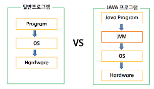
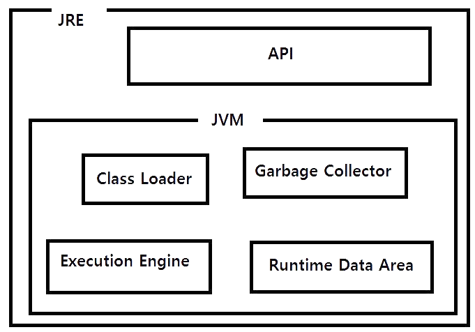
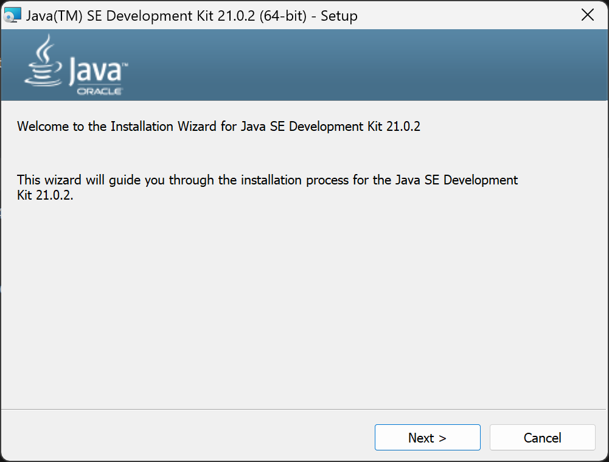
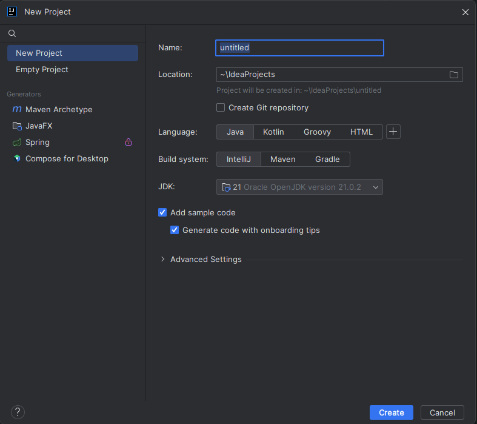
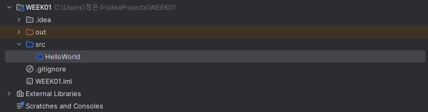

# Java 1주차

## Java

**Java**는 썬 마이크로시스템즈에서 개발한 **객체 지향 프로그래밍 언어**(*OOP*)입니다.

Java는 다음과 같은 특징을 가지고 있습니다.

- **1. 모든 운영체제에서 호환**
    
    > **Write once, run anywhere**
    *한 번 쓰면, 어디서든 실행된다*
    > 
    
    Java의 슬로건 같이, Java로 작성된 프로그램은 JDK만 지원한다면 흔히 사용하는 운영체제인 Windows, MacOS 뿐만 아니라, Linux에서도 프로그램을 수정하지 않고 실행할 수 있다는 특징이 있습니다. 
    

- **2. 객체 지향 프로그래밍(*OOP*)**
    
    절차 지향인 C에서 파생된 객체 지향 프로그래밍 언어인 C++과 달리, Java는 처음부터 객체 지향 프로그래밍을 위해 설계되었기 때문에 객체 지향 프로그래밍을 위한 최적의 언어입니다.
    

- **3. 메모리 자동 정리**
    
    Java는 가비지 컬렉션(*Garbage Collection*)을 통해 메모리를 자동으로 정리합니다. 사용자가 더 이상 사용하지 않는 객체, 함수 등을 자동으로 감지하여 해제합니다. C++과 같은 다른 언어는 메모리를 할당(*new*)하고 해제(*delete*)하는 작업을 해야하지만, Java는 수고를 덜어주어 개발자가 프로그램의 핵심 기능에만 더 집중할 수 있게 해줍니다.
    

---

## Java 가상 머신(JVM)

Java는 모든 운영체제에서 실행이 가능하다고 했지만, 전제 조건이 붙습니다. ‘**JVM**(*Java Virtual Machine*)이 지원이 된다’는 조건입니다.

Java를 실행하기 위해서는 **JVM이 필수적으로 설치**되어 있어야 합니다.



사용자가 만든 Java 소스 코드는 **javac**(*Java 컴파일러*)를 통해 **컴파일*** 되어 **바이트코드** **로 변환합니다.

JVM은 Java 프로그램이 실행되는 가상 환경을 제공하고, 모든 OS에서 동일하게 실행될 수 있는 언어인 **Java 바이트코드**를 해석하고 실행***합니다.

즉, Java의 경우, 컴파일과 실행이 분리되어 있기 때문에 OS에 독립적일 수 있다는 특징을 가지게 된 것입니다.

JVM는 4개의 요소로 구분되어 있습니다.



- **Class Loader**
    
    바이트코드를 동적으로 로드하고 JVM 내부의 메모리에 배치합니다.
    

- **Garbage Collector**
    
    더 이상 사용하지 않는 객체 및 함수를 자동으로 해제해, 메모리를 관리합니다.
    

- **Execution Engine**
    
    바이트코드를 실행하는 역할을 담당합니다. 주로, 인터프리터와 JIT 컴파일러로 구성되는데, 전자의 경우는 코드를 한 줄씩 해석하여 실행하고, 후자는 반복되는 코드 영역을 기계어로 컴파일하여 실행 속도를 향상시킵니다.
    

- **Runtime Data Area**
    
    JVM이 프로그램을 실행하는 동안 사용하는 메모리 영역입니다.
    

컴파일(*Compile*)*: 소스 코드를 컴퓨터가 이해할 수 잇는 언어인 기계어로 변환하는 과정

바이트코드(*Bytecode*)**: 고급 언어로 작성된 소스 코드를 가상머신이 이해할 수 있는 중간 코드

실행(*Execution*)***: 컴파일된 프로그램이 실제로 실행하는 것

---

## JDK와 JRE

**JDK**(*Java Development Kit*)는 **JRE를 포함**합니다. 이는 Java 프로그래밍을 위해 사용하는 개발 키트로, 개발 도구 및 라이브러리를 제공하며, 여기에는 **javac, 디버거** 등이 모두 포함됩니다. 즉, Java를 이용해 개발하기 위해서는 JDK가 필요합니다.

**JRE**(*Java Runtime Environment*)는 Java 프로그램을 실행하기 위해 필요한 런타임 환경을 제공하는 소프트웨어로, 여기에는 **JVM이 포함**됩니다. 개발 도구 및 컴파일러가 포함되지 않기 때문에, Java 프로그램을 실행만 하려는 사용자가 설치합니다.

---

## JIT 컴파일

Java는 실행될 때, **바이트코드로 변환**된 후 다시 **기계어로 번역**되기 때문에 다른 언어들에 비해 실행 속도가 길다는 단점이 있습니다. 이를 보완하기 위해 등장한 것이 바로 **JIT**(*Just In Time*) 컴파일러입니다. **JIT 컴파일러**는 프로그램을 실행할 때, 필요한 부분을 즉석으로 컴파일하는 방식으로, 인터프리터 언어의 느린 실행 속도를 높이기 위해 사용됩니다.

쉽게 말해서, JIT 컴파일러 바이트코드를 기계어로 변환하여 실행하는데, 이때 **반복되는 코드 영역을 기계어로 컴파일 후 캐시에 저장**합니다. **캐시에 저장된 코드는 나중에 같은 코드가 다시 실행될 때 재사용**되므로, 실행 속도가 향상됩니다.

하지만, 소스 코드가 짧을수록 반복되는 코드가 줄어드는 경향이 있기 때문에, JIT 컴파일러의 장점이 희석된다는 단점이 있습니다. 그러나, 이 경우에는 일반적인 컴파일과 의미 있는 속도 차이를 내지는 않으므로 크게 신경 써야할 부분은 아닙니다.

---

## Java 소스 코드 컴파일 및 실행

Java로 프로그래밍을 하기 위해 우선, Intellij라는 IDE를 사용하였습니다. JDK로는 Oracle JDK를 사용했습니다.








클래스 이름을 HelloWorld로 지정했습니다. 코드는 다음과 같습니다.

```Java
package WEEK01;

public class HelloWorld {
    public static void main(String[] args) {
        System.out.println("Hello, World!");
    }
}
```

Java를 통해, ‘Hello, World!’를 출력하는 프로그램입니다.

우선, 이 코드는 사용자가 지정한 어떤 패키지(*Package*)에도 속하지 않으므로, **기본 패키지**(*Default Package*)에 생성됩니다. **패키지**란, 자바 클래스를 모아놓은 디렉토리입니다. 이름이 같은 파일이라도, 다른 폴더에 있다면 사용 가능하듯, 이름이 같은 클래스라고 하더라도, 다른 패키지에 저장되어 있다면 정상적으로 사용할 수 있습니다. 특정 패키지에 속해 있다면, 가장 위에, ‘*package (패키지명)*;’을 명시하면 됩니다.

**클래스**(*Class*)란, 객체를 만들어내는 틀입니다. 클래스를 선언할 경우, 클래스명은 소스 파일명과 동일해야 한다는 특징을 가집니다.

**객체**(*object*)는 자료를 저장하고 특정 기능을 수행합니다. 자료를 저장하기 위해서는 변수가 필요할 것이고, 특정 기능을 하기 위해서는 함수(메소드)가 필요합니다. 즉, 객체는 변수와 함수(메소드)를 묶은 것입니다.

**메소드**(*Method*)는 객체 내의 함수를 의미합니다.

Java를 통해 바이트 코드 파일을 실행한다면, 클래스 블록 내부에 있는 **main() 메소드**를 실행하게 되며, 이는 프로그램 **실행 진입점**(*Entry Point*)라고 부릅니다.

코드를 실행하게 된다면, 바이트코드가 생성됩니다. 바이트코드는 .class라는 확장자명을 가지며, 이 코드를 실행한 경우에도 동일한 결과가 출력됩니다.
