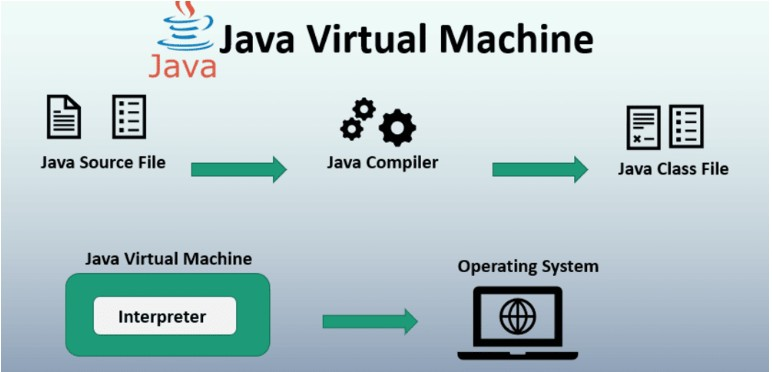
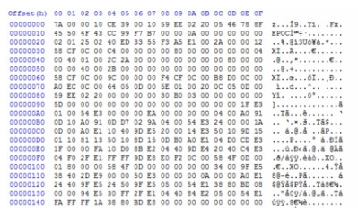
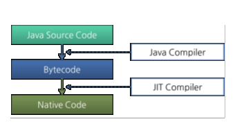
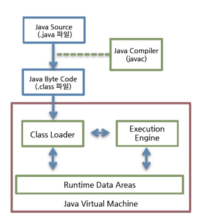

# Week 1 과제

1. JVM이란 무엇인가
24.03.18 ~  24.03.22

java 가상 머신의 줄임말로 자바를 돌리기 위해서는 필수적으로 설치가 되어있어야하는 프로그램입니다. 

JVM 은 자바를 실행하는 가상환경을 제공하고 java 바이트 코드를 해석하고 실행하는 일을 합니다. 

JVM은 자바 가상 머신으로 자바 어플리케이션을 실행하는 가상 머신이고 실제 컴퓨터로 부터 JAVA 어플리케이션 실행을 위한 메모리를 할당 받아 Runtime Data Area를 구성하는 역할을 합니다.

2. 컴파일 하는 방법

개발자가 자바 소스코드(.java)를 작성합니다.

자바 컴파일러가 자바 소스코드(.java)파일을 읽어 바이트코드(.class)코드로 컴파일 합니다. 바이트코드(.class)파일은아직 컴퓨터가 읽을 수 없는 JVM(자바 가상 머신)이 읽을 수 있는 코드입니다. (java - > class)

컴파일된 바이트코드(.class)를 JVM의 클래스로더(Class Loader)에게 전달합니다.

클래스 로더는 동적로딩(Dynamic Loading)을 통해 필요한 클래스들을 로딩 및 링크하여 런타임 데이터 영역(Runtime Data Area의 Method Area), 즉 JVM의 메모리에 올립니다.

실행엔진(Execution Engine)은 JVM 메모리에 올라온 바이트 코드들을 명령어 단위로 하나씩 가져와서 실행합니다. 이 때 실행 엔진은 두 가지 방식으로 변경합니다

-1. 인터프리터 : 바이트 코드 명령어를 하나씩 읽어서 해석하고 실행합니다. 하나하나의 실행은 빠르나, 전체적인 실행 속도가 느리다는 단점을 가집니다.

-2. JIT컴파일러 : 인터프리터의 단점을 보완하기 위해 도입된 방식으로 바이트 코드 전체를 컴파일하여 바이너리 코드로 변경하고 이후에는 해당 메서드를 더이상 인터프리팅 하지 않고, 바이너리 코드로 직접 실행하는 방식입니다. 하나씩 인터프리팅하여 실행하는 것이 아니라 바이트 코드 전체가 컴파일된 바이너리 코드를 실행하는 것이기 때문에 전체적인 실행속도는 인터프리팅 방식보다 빠릅니다.

3. 실행하는 방법:

자바 컴파일러를 통해 자바 클래스 파일(.java)를 자바 바이트코드(.class)로 변환합니다.
클래스 로더를 통해 자바 바이트코드를 JVM 런타임 데이터 영역에 로드합니다.
실행 엔진을 통해 실행합니다.
빌드 툴을 통해 실행 가능한 파일로 빌드 한 후에 실행하거나 class 파일을 직접 실행합니다.

4. 바이트코드란 무엇인가:

바이트코드는 자바 프로그램의 중간 형태로, JVM이 이해할 수 있는 언어로 변환된 코드입니다. 자바 코드를 가장 작은 단위로 표현하며, 확장자는 .class입니다. JVM은 이 바이트코드를 해석하여 프로그램을 실행합니다.

5. JIT 컴파일러란 무엇이며 어떻게 동작하는지:

JIT 컴파일러는 프로그램을 실행하는 시점에 코드를 번역하는 컴파일 기법입니다. 프로그램을 실행하는 동안 인터프리터와 JIT 컴파일러를 사용하여 프로그램을 더 효율적으로 실행합니다.

6. JVM 구성 요소:

JVM은 크게 Class Loader, Execution Engine, Runtime Data Area로 구성됩니다.

Class Loader: 클래스를 JVM의 메모리에 로드하고, 실행 엔진이 사용할 수 있는 형태로 변환합니다.
Execution Engine: 바이트코드를 실행하고, 프로그램을 실행하는 역할을 합니다.
Runtime Data Area: 프로그램의 실행에 필요한 메모리를 관리합니다.

7. JDK와 JRE의 차이:

JDK는 Java Development Kit의 약자로, 자바 개발 환경을 제공합니다. 반면에 JRE는 Java Runtime Environment의 약자로, 자바 실행 환경을 제공합니다. JDK에는 컴파일러와 디버거 등의 개발 도구가 포함되어 있지만, JRE에는 이러한 도구가 포함되어 있지 않습니다.