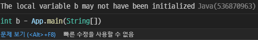
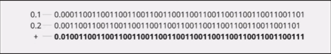
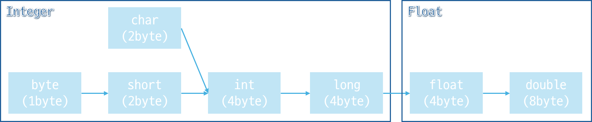
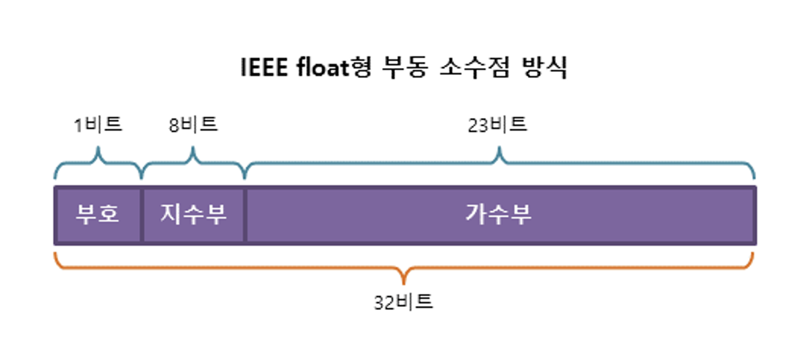
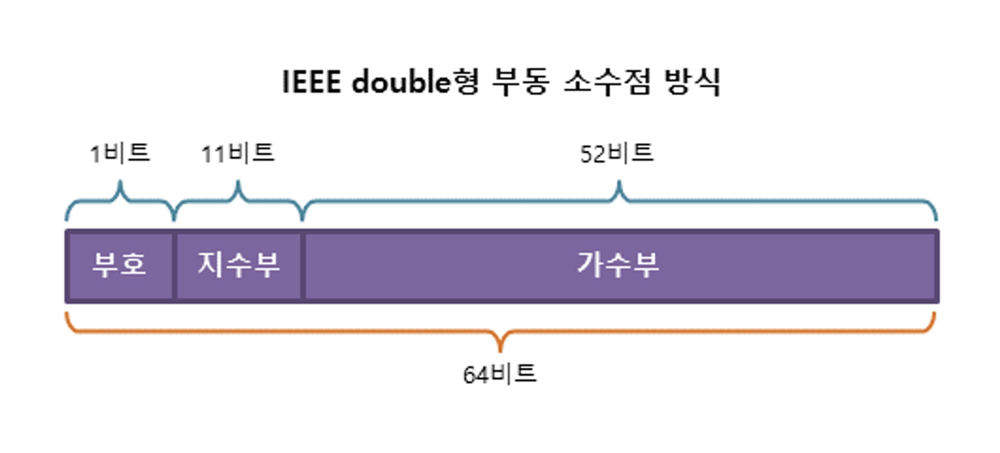

# 자바 스터디 - 2주차

# 1. 프리미티브 타입 종류와 값의 범위 그리고 기본 값
Primitive Data Type [Oracle Java Tutorials](https://docs.oracle.com/javase/tutorial/java/nutsandbolts/datatypes.html)

자바는 8개의 `Primitive Type`을 가지고 있다.
- Integer
  - byte, short, int, long
- Floating Point
  - float, double
- true or false
  - boolean
- Unicode character
  - char

| 자료형  | 크기          | 기본값   | 설명                                                                                              |
| ------- | ------------- | -------- | ------------------------------------------------------------------------------------------------- |
| byte    | 8bit (1Byte)  | 0        | 2의 보수 정수. <sub>(-2<sup>7</sup> ~ 2<sup>7</sup>-1)</sub>                                      |
| short   | 16bit (2Byte) | 0        | 2의 보수 정수. <sub>(-2<sup>15</sup> ~ 2<sup>15</sup>-1)</sub>                                    |
| int     | 32bit (4Byte) | 0        | 2의 보수 정수. <sub>(-2<sup>31</sup> ~ 2<sup>31</sup>-1)</sub> Java SE 8 이상에서는 unsigned 지원 |
| long    | 64bit (8Byte) | 0L       | 2의 보수 정수. <sub>(-2<sup>63</sup> ~ 2<sup>63</sup>-1)</sub> Java SE 8 이상에서는 unsigned 지원 |
| float   | 32bit (4Byte) | 0.0f     | 32비트 IEEE 754<sup>*</sup> 부동 소수점. 정확한 값을 저장할 때 사용X.<sup>**</sup>                |
| double  | 64bit (8Byte) | 0.0d     | 64비트 IEEE 754 부동 소수점. 정확한 값을 저장할 때 사용X.                                         |
| char    | 16bit (2Byte) | '\u0000' | 16비트 유니코드 문자. <sub>'\u0000' ~ '\uffff'</sub>                                              |
| boolean | 1bit?         | false    | boolean은 1비트의 정보를 갖지만, 자료형의 "size"는 정확하게 정의되지 않음.                        |

이 자료형들은 사용자가 초기화하지 않아도 기본값을 컴파일러가 알아서 할당해주는 것이 특징이다. 아래 예시를 보자
``` java
public class Main {
    static int a;
    public static void main(String[] args) throws Exception {
        int b;
        System.out.println(a);
        System.out.println(b);
    }
}
```


해당 코드는 `static 전역 변수`인 `a`를 자동으로 초기화 시켜주었지만, `지역 변수`인 `b`는 자동으로 초기화 시켜주지 않았다.
이유는 `클래스 로더`의 `Initialization`과정에 있는데, 해당 과정은 클래스 변수나 static 필드에 있는 변수들을 초기화한다. (다른 static 필드에서 static 변수를 참조할 수 있기 때문)
static 변수는 디버깅하기 힘들기 때문에 자동으로 초기화 시켜준다는 의견도 [인터넷](https://yeon-kr.tistory.com/180)에 있다.

부동소수점은 2진법이어서 생기는 특이한 점이 있는데 바로 0.1 + 0.2 != 0.3의 계산 결과를 갖는 것이다.
부동소수점의 경우 10진법의 소수점을 무한소수로 표현할 수 밖에 없는데, 이 때문에 오류가 생기는 것이다.

번외로 자바에서는 java.lang.String 클래스를 통해 문자열을 지원한다. String 객체는 처음 설정되면 변경될 수 없다.

---
IEEE 754<sup>*</sup>: IEEE에서 개발한 컴퓨터에서 부동소수점을 표현하는 가장 널리 쓰이는 표준.


부동 소수점의 무한 소수<sup>**</sup>



# 2. 프리미티브 타입과 레퍼런스 타입
클래스, 인터페이스, 변수, 배열을 `Reference Type`으로 정의하고 있다.

## 2.1. Primitive vs. Reference Type
`Primitve`와 `Reference` Type의 메모리 저장 방식에는 차이가 있다.

| Type      | 위치  |
| --------- | ----- |
| Primitive | stack |
| Reference | heap  |

`Primitive Type`은 `stack`영역에 실제 값을 저장한다. `Reference Type`은 `heap`영역에 실제 값을 저장하고, `stack`영역에 실제 값의 메모리 주소를 저장한다. C언어의 pointer처럼 메모리 주소를 참조하기 때문에 reference라고 불린다.

## 2.2. [Stack의 해제](https://yeon-kr.tistory.com/180)
`heap`영역은 사용이 끝나면 `Garbage Collector`가 해제한다. 하지만 `stack`영역은 `Garbage Collector`의 영역이 아니다.

`stack`영역은 JVM 메모리의 쓰레드 영역에 존재한다. 즉, 새로운 쓰레드가 생기면 `stack`영역에 `frame`을 만들고, `frame`은 `stack`영역을 가진다. 그리고 하나의 `frame`은 쓰레드가 종료됨에 따라 `pop`되어 해제된다.

# 3. 리터럴
## 3.1. What is Literal
`new`라는 키워드를 Primitive Type의 변수를 초기화할 때 사용하는 것을 본 적이 없을 것이다. 이는 Primitive Type이 언어에 내장된 특수 타입이기 때문인데, 클래스로 만들어진 객체가 아니어서 그렇다.
literal은 소스코드에서 보이는 그대로 컴퓨터에 입력된다. 따라서 아래 예시처럼 Primitive Type 변수에 literal을 할당할 수 있다.
``` java
boolean result = true;
char capitalC = 'C';
byte b = 100;
short s = 10000;
int i = 100000;
```
## 3.2. Integer Literals
정수형 literal은 `L` 또는 `l`로 끝나는 유형은 `long`, 나머지는 `int`이다.

Interger Literals는 다음과 같이 표현될 수 있다.

| n진법    | 범위         | 표현   |
| -------- | ------------ | ------ |
| 8진수    | 0 ~ 8        | 012    |
| 10진수   | 0 ~ 9        | 10     |
| 16진수   | 0 ~ 9, A ~ F | 0x0A   |
| 바이너리 | 0과 1        | 0b1010 |

`java.lang.Integer`클래스의 `toBinaryString()`, `toOctalString()`, `toHexaString()` 메소드를 사용하면 10진수를 2, 8, 16진수로 바꿀 수 있다. <sub>(return type: `static String`)</sub>

[진법 변한](https://hianna.tistory.com/527)

## 3.3. Floating-Point Literals
부동소수점 literal은 `F` 또는 `f`로 끝나는 유형은 `Float`, `D` 또는 `d`로 끝나는 유형은 `Double`이다.

`Double`이 기본형이며 관례에 따라 생략 가능하다.

Floating-Point Literals는 다음과 같이 표현될 수 있다.
``` java
double d1 = 123.4;
// 위와 같은 표기이지만 과학적 표기법에 따른 표기
double d2 = 1.234e2;
float f1 = 1232.4f;
```

## 3.4. Character and String Literals
`Char`와 `String`은 모든 Unicode(UTF-16) 문자를 포함할 수 있다.

editor와 file system이 허용한다면 유니코드 문자를 바로 코드에 적을 수 있다. 허용하지 않는다면, 다음과 같이 "Unicode escape"를 사용할 수 있다. `S\u00ED`(스페인 문자 í)

자바는 몇몇의 `escape sequences`를 지원하고 있는데, 다음과 같다.

| escape sequences | mean            |
| ---------------- | --------------- |
| \t               | tab             |
| \n               | line feed       |
| \f               | form feed       |
| \r               | carriage return |
| \"               | double quote    |
| \'               | single quote    |
| \\\\             | backslash       |

`null`또한 literal이다. `null`은 어떤 `Reference Type`에도 들어갈 수 있으며, `Primitive Type`에는 들어갈 수 없다. 이는 어떤 객체에 null값을 가지면 유효하지 않은 객체라고 판단하는 데에 있어 도움을 줄 수 있다.

## 3.5. Underscord Characters in Numeric Literals
Java SE 7 이후부터 숫자형에 `_`를 넣을 수 있게 되었다. 단, 주의할 점이 있는데 무조건 정수와 정수 사이에 넣어야만 한다.

다음과 같은 예시로 사용할 수 있다.
``` java
long creditCardNumber = 1234_5678_9012_3456L;
long phoneNumvber = 010_1234_5678L;
float pi = 3.14_15F;
long hexBytes = 0xFF_EC_DE_5E;
long hexWords = 0xCAFE_BABE;
long maxLong = 0x7fff_ffff_ffff_ffffL;
byte nybbles = 0b0010_0101;
long bytes = 0b11010010_01101001_10010100_10010010;
```

# 4. 변수 선언 및 초기화하는 방법
선언과 초기화는 의미가 조금 다르다.
- 선언: 이런 Type의 변수(혹은 객체)가 있다고 하는 것.
- 초기화: 이런 Type의 변수(혹은 객체)에 값을 할당하는 것.
``` java
int myInt1;
int myInt2 = 10;
```

## 4.1. [Objects vs. Primitives](https://www.baeldung.com/java-initialization)
``` java
// src/InitTest/User.java
package InitTest;

public class User {
    private String name;    // Reference Type
    private int id;         // Primitive Type

    // Default Constructor
    public User() { }

    // Constructor Overload
    public User(String name) {
        this.name = name;
    }

    public User(int id) {
        this.id = id;
    }

    public User(String name, int id) {
        this.name = name;
        this.id = id;
    }

    // simple getter
    public String getName() {
        return this.name;
    }

    public int getId() {
        return this.id;
    }
}
```
`Objects`와 `Primitives`의 차이에 앞서 변수에 대해서 다시 서술하자면, [위](#21-primitive-vs-reference-type)에서 설명했지만 `Primitive Type`은 메모리에 값을 들고 있지만, `Reference Type`은 메모리에 객체의 값을 들고있지 않고 객체를 가리키는 메모리 주소를 저장한다.

다음은 해당 코드와 [위의 코드](#1-프리미티브-타입-종류와-값의-범위-그리고-기본-값)를 종합했을 때의 결론이다.

**클래스 변수와 static 변수는 초기화 시켜주지 않아도 JVM의 `Class Loader`가 기본값을 넣어주는 반면, 지역변수는 JVM이 기본값을 넣어주지 않는다.**

## 4.2. [Init Block](https://dev-cini.tistory.com/58)
그렇다면 '*JVM은 변수를 초기화 시킬 때의 순서를 어떻게 가져가는가?*'에 대한 의문이 있을 수 있다. 이에 대해 설명하고자 한다.

우선 초기화 블록의 개념이 있다.
``` java
class InitBlock {
  static {/* 클래스 초기화 블록 */}
  {/* 인스턴스 초기화 블록 */}
}
```
- 클래스 초기화 블록
  - 클래스 변수를 초기화 함
  - 클래스가 메모리에 처음 로딩되 때 한 번만 수행
    - 클래스 변수들이 메모리에 만들어진 후, 바로 초기화됨
  - 결론 : **기본값 -> 명시적 초기화 -> 클래스 초기화 블록**

- 인스턴스 초기화 블록
  - 인스턴스 변수를 초기화 함 (클래스 내부 함수의 변수 등)
  - 생성자와 같이 인스턴스를 생성할 때마다 수행
    - 생성자보다 인스턴스 초기화 블록이 먼저 수행됨
  - 결론 : **기본값 -> 명시적 초기화 -> 인스턴스 초기화 블록 -> 생성자**

> *스터디 질문 사항*: static이 붙어있지 않으면 클래스 내부 함수의 변수가 아니어도 인스턴스 초기화로 처리 되나요?

> *답변*:

## 4.3. Objects Init Example
이제 객체의 초기화 예시를 보자.
``` java
// src/Main.java
import InitTest.User;

public class Main {
    public static void main(String[] args) throws Exception {
        User user1 = new User();
        System.out.println(user1.getId());      // 출력: 0
        System.out.println(user1.getName());    // 출력: null
    }
}
```
위와 같이 `user1` 인스턴스를 만든다고 하자.
- [JVM의 초기화 순서](#42-init-block)
  - class User가 처음 로드
    - private String name, private int id 선언
    - 선언 O, 명시적 초기화 X, 클래스 초기화 블록 X
    - 최종적으로 name에는 null, id에는 0이 할당
  - 인스턴스를 생성자를 이용하여 생성
    - 인스턴스 user1에 user1.name과 user1.id가 존재
    - 명시적 초기화 X, 인스턴스 초기화 블록 X
    - 기본 생성자에는 따로 명시적 초기화 구문 X
    - 최종적으로 name에는 null, id에는 0이 그대로 있음

> *스터디 질문 사항*: 위와 같은 순서대로 변수들이 초기화 되는 것이 맞나요? final이 아닌 변수들은 초기화 순서에 따라 값이 달라질 것 같아서 궁금합니다.

> *답변*:

# 5. 변수의 스코프와 라이프타임
## 5.1. Variable Scope
### 5.1.1. public, protected, private
변수에는 접근 가능한 범위가 있다. 지금까지 설명하지 않고 넘어왔지만 `public`이니 `private`니 하는 예약어를 봤을 것이다. 우선 표부터 보자.

| Modifier              | Package | Subclass | World |
| --------------------- | ------- | -------- | ----- |
| public                | Yes     | Yes      | Yes   |
| protected             | Yes     | Yes      | No    |
| Default (no modifier) | Yes     | No       | No    |
| private               | No      | No       | No    |

- public
  - 모든 접근을 허용 (어떤 클래스가 접근하든 모두 허용)
- protected
  - 상속받은 클래스 또는 같은 패키지에서만
- default
  - 기본 제한자로써 아무것도 붙지 않고, 자신 클래스 내부와 같은 패키지 내에서만
- private
  - 외부에서 접근이 불가능 (같은 클래스 내에서만)

### 5.1.2. [static](https://dar0m.tistory.com/252)
`static`이 붙어있는 함수가 있다. main이 그 대표적인 예시이다.

main을 정의하고 `new`를 사용하지 않았음에도 main이 실행되었던 이유가 `static` 키워드 때문이다.

즉, `static` 키워드를 사용하면 인스턴스화 하지 않아도 사용할 수 있다.

따라서 `static`한 메소드 내에서 `static`하지 않은 필드는 사용할 수 없다. 그 이유는 `static`한 메소드가 다른 클래스에 접근할 때 해당 클래스가 인스턴스화 되어있지 않았을 수도 있기 때문이다.

반대로 `static`하지 않은 필드에서 `static` 메소드는 사용할 수 있다.

## 5.2. Variable Lifetime
변수의 선언 방식에 따라 라이프 타임이 결정된다.
### 5.2.1. Instance Variable
클래스 내에서 선언되지만 매소드 및 블록 외부에 선언되는 변수
- Scope
  - static method를 제외한 모든 클래스 (이유는 [위에서](#512-static) 설명)
- Lifetime
  - 클래스의 객체가 메모리에 남아있을 때까지

따라서 인스턴스 변수는 객체 생성 시마다 변수 저장 공간이 새로 할당된다.
### 5.2.2. Class Variable
클래스 안에서 선언되며, 어떠한 메소드나 블럭 안에서 선언되지 않았으며, static 키워드가 포함된 변수
- Scope
  - Class 전체
- Lifetime
  - 프로그램 종료 시까지

따라서 클래스 변수는 클래스가 로드될 때 하나의 저장 공간에 할당된다.
### 5.2.3. Local Variable
Instance Variable과 Class Variable이 아닌 모든 변수
- Scope
  - 변수가 선언된 Block 내부
- Lifetime
  - 변수가 선언된 Block 내부에 프로그램이 도는 동안
# 6. 타입 변환, 캐스팅 그리고 타입 프로모션
## 6.1. [타입 변환](https://kephilab.tistory.com/27)


### 6.1.1. 묵시적(자동) 타입 변환
프로그램 실행 도중 자동으로 타입 변환이 일어난다. 아래 예시를 보자.
``` java
int a = 10;
float b = 0.5;
double c = a + b;    // result = 10.5
```
a는 `int`형이고, b는 `float`이며 c는 `double`이다. 위와 같은 연산을 시행하면 [6.1의 사진](#61-타입-변환)처럼 더 큰 형식의 자료형으로 자동으로 변환된다.

### 6.1.2. 명시적(강제) 타입 변환
명시적 타입 변환은 `(바꿀 자료형)변수`로 사용한다.

자동으로 타입 변환을 시킬 수도 있지만, 우리가 명시적으로 데이터 타입을 변환시킬 수도 있다. 다른 말로는 강제적으로 데이터 타입을 바꾼다는 말이다.

왜 강제일까? 그 이유는 `float`형을 `int`형으로 바꾸면 소수점 부분은 버려지기 때문이다.

다음 조금 더 복잡한 예시가 있다.
``` java
int result;
int num1 = 123_456_780;
int num2 = 123_456_780;

float num3 = num2;    // int->float 묵시적 형 변환
num2 = (int)num3;     // float0>int 명시적 형 변환

result = num1 - num2; // result == -4
```
이와 같은 결과가 나오는 이유는 무엇일까?



- `int`형은 정수를 표현할 수 있는 범위가 31비트이다.
  - (머리 비트는 부호)
  - 2<sup>31</sup>-1 = 2,147,483,647
  - 따라서 10자리 수
- `float`형은 가수부가 23비트이며, 지수부가 8비트이다.

따라서 표현할 수 있는 수의 한계로 인해 정밀도가 떨어져서 값이 달라지기 때문이다.

[`float`의 수 표현 방식](https://bigpel66.oopy.io/library/c/chewing-c/4)
> 스터디 질문 사항: 위 글을 읽어도 잘 이해가 되지는 않는다.

> 답변: 

### 6.1.3. [안전하게 형 변환하기](https://hudi.blog/java-type-casting/)
`java`에는 자료형마다 최대 크기의 숫자와 최소 크기의 숫자를 출력할 수 있게 되어있다.

| Primitive Type | MAX               | MIN               |
| -------------- | ----------------- | ----------------- |
| byte           | Byte.MAX_VALUE    | Byte.MIN_VALUE    |
| short          | Short.MAX_VALUE   | Short.MIN_VALUE   |
| int            | Integer.MAX_VALUE | Integer.MIN_VALUE |
| long           | Long.MAX_VALUE    | Long.MIN_VALUE    |
| float          | Float.MAX_VALUE   | Float.MIN_VALUE   |
| double         | Double.MAX_VALUE  | Double.MIN_VALUE  |

위 값들을 확인하고 형 변환을 하는 것이 안전하게 형 변환을 하는 방법이다.

## 6.2. [타입 캐스팅](https://velog.io/@sezzzini/Java-Casting)
타입 캐스팅은 형 변환을 의미한다.
### 6.2.1. Primitive Type vs. Reference Type
Primitive Type Casting은 위에서 다뤘으므로 Reference Type Casting에 대해서 다룰 것이다.

Reference Type에서 클래스의 객체끼리의 형 변환을 살펴볼 것이다.
- 업 캐스팅
  - 서브 클래스의 객체가 수퍼 클래스 타입으로 형 변환 되는 것
- 다운 캐스팅
  - 업 캐스팅 된 것을 다시 복구 시키는 것
  - 업 캐스팅이 선행 되어야 사용할 수 있음
  - 명시적으로 타입을 지정해주어야 함

### 6.2.2. super vs. super()
super
- 부모 클래스와 자식 클래스의 멤버 변수 이름이 같을 때 구분하기 위해 사용하기도 함
  - ex) 자식 클래스에서 this.x와 super.x를 사용할 수 있다는 것

super()
- 부모 클래스의 생성자를 호출하는 메소드.
- 자식 클래스의 인스턴스를 생성하면, 부모 클래스의 모든 멤버까지 포함됨
- 따라서 부모 클래스를 초기화하기 위해서는 super()를 사용해야함
- java는 명시적으로 초기화하지 않아도 자식 클래스의 첫 줄에 자동으로 super()를 추가해줌

### 6.2.3. polymorpism ([다형성](https://danmilife.tistory.com/23))
- 하나의 객체가 여러 자료형 타입을 가질 수 있는 것
- 부모 클래스의 참조 변수로 자식 클래스 타입의 인스턴스를 참조할 수 있음
### 6.2.4. @Override
오버라이딩은 상속을 통해 '같은 이름의 메소드를 서로 다른 내용으로 구현'한다.

이는 객체 지향의 다형성을 잘 실현한다고 할 수 있다고 한다.

### 6.2.5. 클래스 업캐스팅
필요한 개념은 앞에서 모두 살펴보았으니 업 캐스팅에 대하여 알아볼 시간이다.
- 업 캐스팅: 자식 클래스를 부모 클래스로 형 변환하는 것
``` java
// Person이라는 클래스가 있다고 하자.
class Person {
    String name;

    public Person(String name) {
        this.name = name;
    }
}

// Student 클래스는 Person 클래스를 상속한다.
class Student extends Person {
    String age;

    public Student(String name) {
        super(name);
    }
}

public class CastingTest {
    public static void main(String[] args) {

        // student reference 변수는 age와 name 모두 접근 가능
        Student student = new Student("미누");

        // 업 캐스팅
        Person person = student;

        // 정삭 작동
        person.name = "미누미누";
        // 컴파일 오류
        // person.age = "22";
    }
}
```
여기서 `person` 참조 변수는 student라는 참조 변수를 가리킨다. 하지만 `Person` Type이므로 name에만 접근할 수 있다. 따라서 age에 접근하려 했을 때 오류가 생기는 것.

그렇다면 이를 왜 사용하는 것일까? 이는 바로 다형성 때문이다.

아래 예시를 보자.
``` java
class 노래 {
    public void 노래선택() {
        // 뭐든
    }
}

class 발라드 extends 노래 {
    @Override
    public void 노래선택() {
        // 성시경 노래 中 1
    }
}

class KPOP extends 노래 {
    @Override
    public void 노래선택() {
        // 아이유 노래 中 1
    }
}

class 코인노래방손님 {
    public void 노래부르기(노래 어떤노래) {
        어떤노래.노래선택();
    }
}

public class CastingTest {
    public static void main(String[] args) {
        코인노래방손님 손님1 = new 코인노래방손님();
        노래 선곡 = new KPOP();
        // 노래(상위 클래스) 타입에 KPOP(하위 클래스)로 업 캐스팅
        손님1.노래부르기(선곡);
    }
}
```
`선곡`이라는 참조 변수를 `KPOP 클래스`의 인스턴스로 선언한 뒤 바로 `노래 클래스`로 업 캐스팅 한 코드이다. 따라서 `노래선택()`을 접근하면 (부모 클래스에 있는 메소드이니 접근 가능) 자식 클래스에서 `오버라이딩` 했으니 아이유의 노래 중 하나를 선택하게 될 것이다.

### 6.2.6. 클래스 다운 캐스팅
다운 캐스팅은 업 캐스팅된 참조 변수를 다시 원상태로 복구한다.

vs. 업캐스팅
- 명시적으로 타입을 지정해야함
- 업캐스팅이 무조건 선행 되어야함

```java
// 업 캐스팅의 Person과 Student 클래스를 그대로 사용하자

// 업캐스팅
Person person = new Student("미누");

// 다운 캐스팅
Student student = (Student) person;

// 모두 접근 가능
student.name = "미누미누";
student.age = "22";
```
다만 다음 예시처럼 코드를 작성할 경우 `ClassCastException` 오류를 런타임에서 일으킬 수 있다. (Person은 Student의 하위 유형이 아니기 때문)
``` java
Student student2 = (Student) new Person("미누미누미누");
```


#### 6.2.6.1. instance of
참조 변수가 참조하고 있는 인스턴스가 어떤 클래스인지 구분하기 위해 사용되는 연산자이다.

사용법은 `참조변수 instanceof 클래스명`이며, 반환형은 boolean이다.

이를 활용하여 다운 캐스팅의 오류를 방지할 수 있다.

### 6.2.7. [배열 캐스팅](https://recordsoflife.tistory.com/583)
#### 6.2.7.1. String[] -> int[]
- Integer.parseInt()
``` java
String[] stringArr = {"1", "2", "3", "4", "5"};
int strArrLen = stringArr.length;

int[] intArr = new int[strArrLen];

for (int i=0; i<strArrLen; i++) {
    intArr[i] = Integer.parseInt(stringArr[i]);
}
```
- stream().mapToInt()
``` java
String[] stringArr = {"1", "2", "3", "4", "5"};

int[] intArr = Arrays.stream(stringArr)
                        .mapToInt(Integer::parseInt)
                        .toArray();
```
#### 6.2.7.2. int[] -> String[]
- Integer.toString()
``` java
int[] intArr = {1, 2, 3, 4, 5};
int intArrLen = intArr.length;

String[] stringArray = new String[intArr.length];

for(int i = 0; i < intArr.length; i++){
    stringArray[i] = Integer.toString(intArr[i]);
}
```
- stream().mapToObj()
``` java
int[] intArray = {1, 2, 3, 4, 5};

String[] stringArray = Arrays.stream(intArray)
                                .mapToObj(String::valueOf)
                                .toArray(String[]::new);
```
### 6.2.8. [힙 오염](https://inpa.tistory.com/entry/JAVA-☕-제네릭-힙-오염-Heap-Pollution-이란)
힙 오염이 발생하는 원인
- Primitive와 Reference 타입을 동시에 사용할 때
- 확인되지 않은 형 변환을 수행하는 경우
- 소스코드를 분리하면서
---
[Generic Type](https://st-lab.tistory.com/153)을 우선 알아야 일반적인 힙 오염 상황을 알 수 있다.

Generic Type 특징
- Generic Type은 객체를 선언할 때 \<Integer\>처럼 형을 지정해줄 수 있지만, 사용자가 선택하게 할 수 있음
- 잘못된 타입이 들어올 수 있는 것을 컴파일 단계에서 방지할 수 있음
- 클래스 외부에서 타입을 지정해주기 때문에 따로 타입을 체크하고 변환해줄 필요가 없으므로 편리함
- 비슷한 기능을 지원하는 경우 코드의 재사용성이 높아짐

| Type  | Description |
| ----- | ----------- |
| \<T\> | Type        |
| \<E\> | Element     |
| \<K\> | Key         |
| \<V\> | Value       |
| \<N\> | Number      |

컴파일되며 타입이 소거되면 제네릭 타입 파라미터들은 Object로 변환되거나 제거된다. 따라서 String list에 소수값이 들어갈 수 있다. 이 때 힙 오염이 된다.

``` java
// 이를 방지하기 위한 방법
List<String> list1 = Collections.checkedList(new ArrayList<>(), String.class);
```
## 6.3. [타입 프로모션](https://velog.io/@rabbit/타입-변환-타입-캐스팅-타입-프로모션)
타입 캐스팅은 범위가 큰 타입의 값을 작은 타입의 값으로 할당하기 위해서 사용되기도 한다.

타입 프로모션은 반대로 작은 타입의 값을 큰 타입에 할당하는 것인데, 캐스팅과 달리 자동으로 형 변환이 일어난다.
``` java
short a = 100;
int b = a;
```

# 7. [1차 및 2차 배열 선언하기](https://hongong.hanbit.co.kr/java-자바-배열array-선언하고-생성하기/)
- 같은 타입의 데이터만 저장할 수 있다.
- 한 번 생성된 배열은 크기를 조절할 수 없다.
- 배열 또한 Reference Type (참조 변수) 배열 객체가 없다면 null로 초기화시킬 수 있다.
  - 타입[] 변수 = null;
- 한 번 선언이 된 배열은 중괄호를 사용하여 초기화할 수 없다
  - 타입[] 변수;
  - 변수 = {값1, 값2, ...};    // 컴파일 에러
- 메소드의 매개값이 배열인 경우

``` java
int addInt(int[] integers) {
    // add integers
}

int result = addInt({1, 2, 3});    // 컴파일 에러
int result = addInt(new int[] {1, 2, 3});
```
배열을 선언만 할 경우 JVM이 초기화를 해주는데, 그 값은 다음과 같다.
| Type         | 초기화  |
| ------------ | ------- |
| byte[]       | 0       |
| char[]       | '\u000' |
| short[]      | 0       |
| int[]        | 0       |
| long[]       | 0L      |
| float[]      | 0.0F    |
| double[]     | 0.0     |
| boolean[]    | false   |
| 클래스[]     | null    |
| 인터페이스[] | null    |

## 7.1. [1차원 배열](https://keichee.tistory.com/349)
자바에서는 다음과 같이 배열을 선언할 수 있다.
``` java
int[] intArr1;
int []intArr2;
int intArr3[];
```
java는 배열을 선언해도 초기하하기 전까지 메모리를 차지하지 않는다. 즉, 배열의 길이를 정해줘야 메모리를 차지하게 된다.
``` java
int[] intArr4;
intArr4 = new int[3];

int[] intArr5 = {1, 2, 3};
```
위와 같이 초기화를 하면 `intArr4`는 길이가 3인 Integer 배열이 된 것이다. (안에 내용물은 0으로 초기화) 당연히 `intArr5`처럼 초기화할 수도 있다.
``` java
// 출력
System.out.println(Arrays.toString(intArr1));
```

## 7.2. [2차원 배열](https://keichee.tistory.com/423)
1차원 배열과 비슷하게 선언할 수 있다.
``` java
int[][] arr1;
int [][]arr2;
int arr3[][];
```
초기화 방법도 동일하다.
``` java
int[][] arr4 = new int[2][5];
int[][] arr5 = {{1, 2, 3}, {4, 5, 6}};
```
출력은 for문을 사용하면 된다.
``` java
arrlen = arr5.length;
for (int i=0; i<arrlen; i++) {
    System.out.println(Arrays.toString(arr5[i]));
}
```
# 8. [타입 추론, var](https://catch-me-java.tistory.com/19)
java 10부터 타입 추론(inference)을 지원하기 시작했다.
``` java
var str1 = "Hello Wolrd!";
```
위와 같이 선언하면 str1은 자연스럽게 `String`타입이 된다. 이는 컴파일 단계에서 자료형이 결정되며, 런타임에서 자료형이 바뀔 수는 없다. (JS는 된다)

var는 초기화 값이 없다면 사용할 수 없으며 null이 들어갈 수 없다.

var는 로컬 변수로만 사용이 가능하며 멤버로는 사용할 수 없다.

lambda 표현식에서는 명시적인 타입을 적어주어야 한다.

배열을 선언할 때 var 대신 타입을 명시해줘야한다.

주의할 점은 `var`는 Keyword, 즉 예약어가 아니라서 변수명으로 사용할 수 있다.

이쯤되니 var를 왜 사용하는 가에 대한 궁금증이 생긴다.

> *스터디 질문 사항*: var는 실제로 사용하는지와 var를 사용함에 있어서 장점이 무엇이 있는지

> *답변*: 
