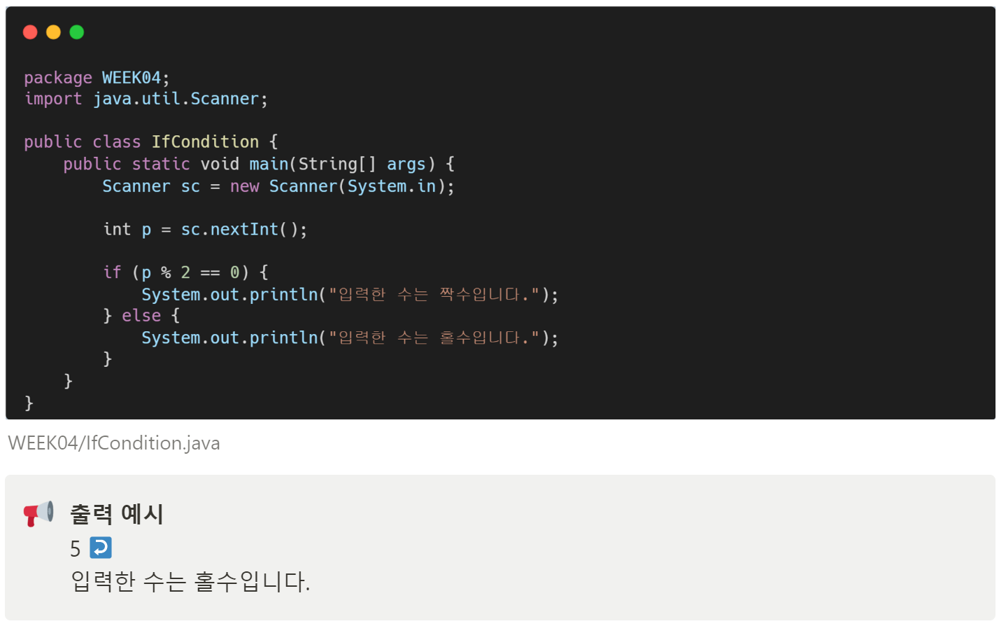
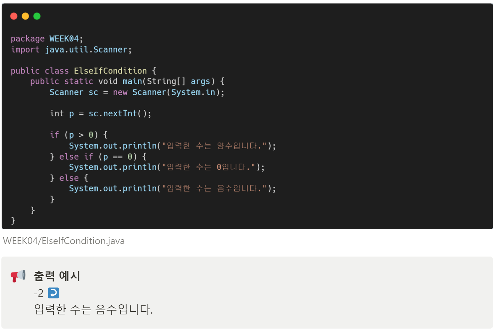
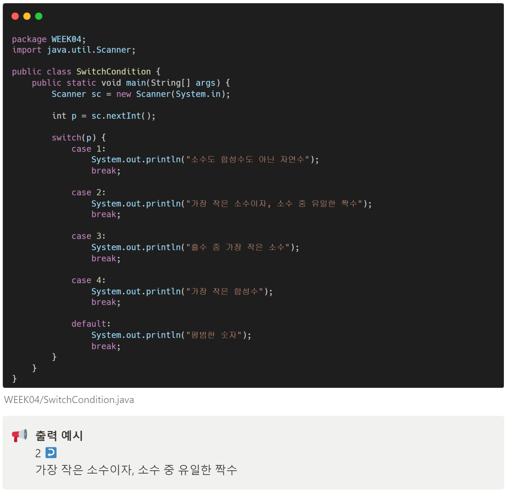
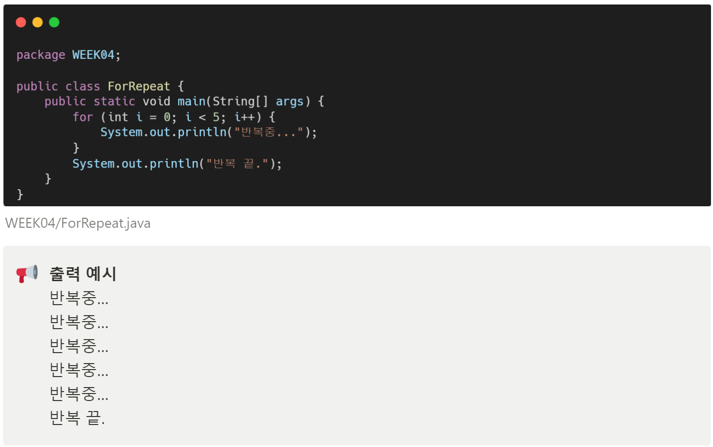
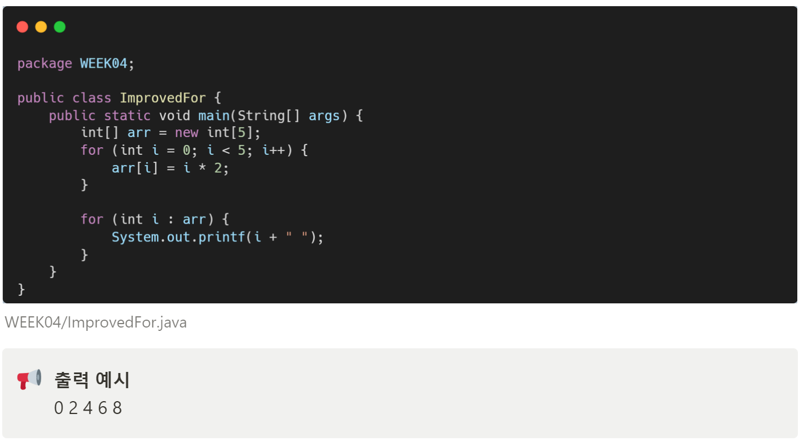
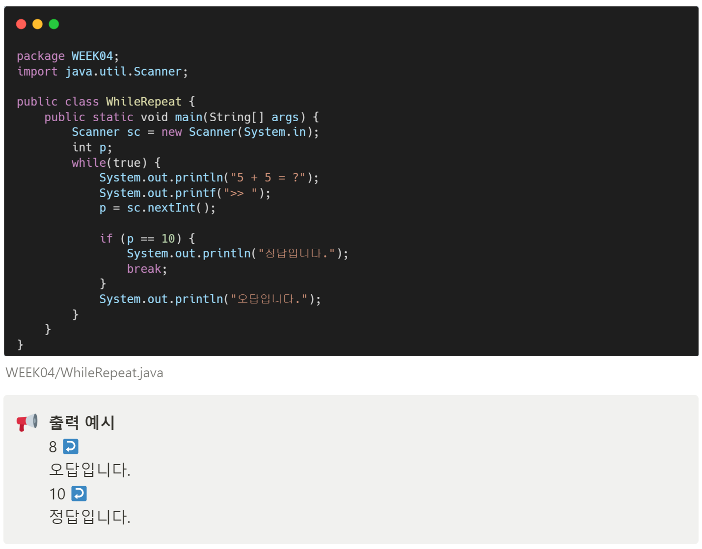
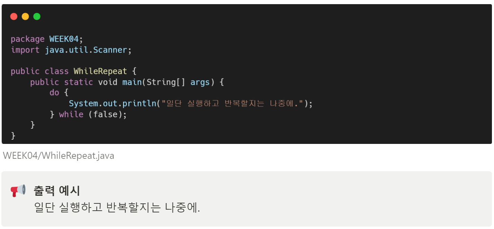

# 자바 스터디 - 4주차
## 개요

조건식에 따라 다른 실행문을 실행하기 위해 사용되는 것을 조건문이라고 하며, 작업이 반복적으로 실행되도록 할 때 사용되는 것을 반복문이라고 합니다.

---

## 조건문

### if문, else

if문은 조건식의 결과에 따라 함수 실행 여부가 결정됩니다. 

if-else문은 조건식의 결과가 참이면, if문 내부를, 그게 아닌 경우 else문 내부를 실행합니다.

### else if

else if를 통해, 조건을 더 세분화할 수 있습니다.

### switch문

switch문은 괄호 안에 있는 변수와 동일한 값을 가지는 case부터 실행문을 실행합니다. case가 없는 경우, default를 실행하며, break를 통해 switch문을 빠져나올 수 있습니다.

---

## 반복문

### for문

for문은 초기화식과 조건식, 증감식이 포함되며, 조건식이 true인 경우 반복 실행합니다.

### 향상된 for문

배열을 통해 향상된 for문을 사용할 수 있습니다.

위와 같이 반복문 안에서 배열의 값을 가져오고, 가져올 다음 항목이 없다면, 반복문을 종료합니다. 따라서, 향상된 for문의 반복 횟수는 배열의 길이와 동일합니다.

### while문

while문은 조건식이 true인 경우 계속 반복합니다. 

break문을 통해 반복문의 실행을 중지할 수 있습니다.

### do-while문

do-while문은 코드를 1번 실행 후에, 조건식이 true인 경우 반복 실행합니다.

위의 반복문은 조건이 false이므로, 반복을 하지 않지만, do-while문은 조건을 보기 전에 실행을 한 번 하기 때문에, 위와 같은 결과가 나오게 됩니다.