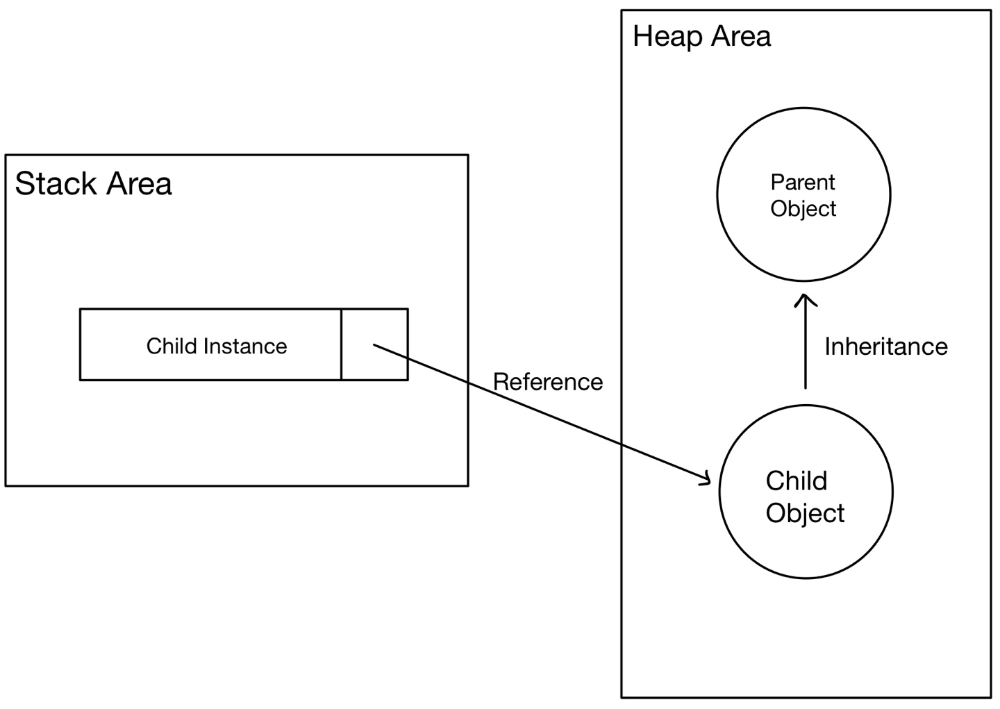
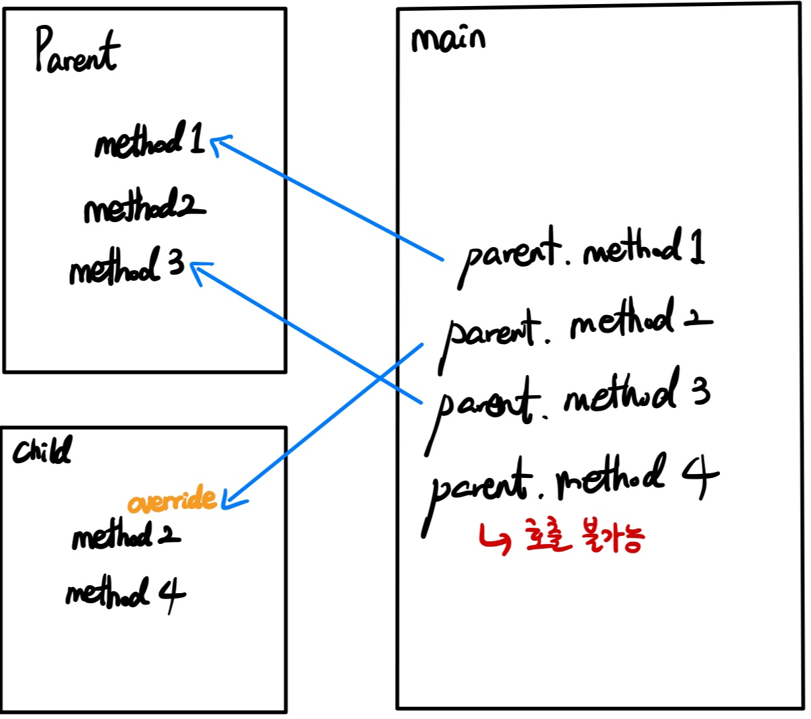

# 자바 스터디 - 6주차
## 개요

상속(Inheritance)은 클래스의 멤버를 다른 클래스에 물려주는 것을 의미합니다. 상속을 통해 클래스를 재사용하여 새로운 클래스를 만드는 것으로 중복되는 코드를 줄일 수 있습니다. 두 클래스가 상속 관계일 때, 상속을 하는 곳을 ‘상위 클래스(부모 클래스)’ 주는 곳을 ‘하위 클래스(자식 클래스, 파생 클래스)’라고 부릅니다.

---

## 자바 상속의 특징

Java는 대표적인 객체 지향 프로그래밍 언어로, 상속을 지원합니다. 

```Java
public ChildClass extends ParentClass { }
```


Java의 상속은 다음과 같은 특징을 가지고 있습니다.

1. **여러 개의 부모 클래스를 상속할 수 없음. (다중 상속 불가)**

C++와 Python은 다중 상속을 지원하지만, Java는 지원하지 않습니다. 따라서, extends 뒤에는 하나의 부모 클래스만 올 수 있습니다.
<br/>

2. **private 접근 제한인 멤버를 상속받을 수 없음.**

private 멤버는 자신의 객 내에서만 호출할 수 있으므로, private 타입인 멤버를 상속받을 수 없으며, 추가적으로, 패키지가 다른 두 클래스 또한, default 타입인 경우 상속할 수 없습니다.

---

## 클래스 상속

```Java
package WEEK06.Inheritance;
import java.util.Scanner;

// 부모 클래스
public class InheritanceBasic {
    protected int a;
    protected int b;

    void printA () {
        System.out.println(a);
    }

    void printB () {
        System.out.println(b);
    }
}

// 자식 클래스
class InheritanceBasic2 extends InheritanceBasic {
    Scanner sc = new Scanner(System.in);
    public int mode;
    private boolean power = true;

    void printUI() {
        System.out.println("모드를 선택해주세요.");
        System.out.println("1. A 출력");
        System.out.println("2. A 수정");
        System.out.println("3. B 출력");
        System.out.println("4. B 수정");
        System.out.println("5. 초기화");
        System.out.println("6. 종료");
        System.out.print(">> ");

        mode = sc.nextInt();
    }

    boolean getPower () {
        return power;
    }

    void modifyA (int a) {
        this.a = a;
    }

    void modifyB (int b) {
        this.b = b;
    }

    void controlCenter(int mode) {
        int newNum;
        switch (mode) {
            case 1:
                System.out.println("A의 값은 다음과 같습니다.");
                printA();
                break;

            case 2:
                System.out.print("수정할 값을 입력해주세요: ");
                newNum = sc.nextInt();
                modifyA(newNum);
                break;

            case 3:
                System.out.println("B의 값은 다음과 같습니다.");
                printB();
                break;

            case 4:
                System.out.print("수정할 값을 입력해주세요: ");
                newNum = sc.nextInt();
                modifyB(newNum);
                break;

            case 5:
                a = 0;
                b = 0;
                System.out.println("A와 B의 값이 초기화되었습니다.");
                break;

            case 6:
                power = false;
                System.out.println("시스템을 종료합니다.");
                break;

            default:
                System.out.println("잘못된 값을 입력했습니다. 다시 입력해주세요.");
                break;
        }
    }
}
```
```Java
package WEEK06.Inheritance;

public class Main {
    public static void main(String[] args) {
        InheritanceBasic2 it = new InheritanceBasic2();
        while (it.getPower()) {
            it.printUI();
            it.controlCenter(it.mode);
        }
    }
}
```

위의 코드에서 InheritanceBasic2 클래스는 InheritanceBasic을 상속받고 있습니다. 즉, InheritanceBasic2 객체를 생성하더라도, InheritanceBasic의 멤버를 사용할 수 있다는 뜻이며, this 참조를 통해, 부모 필드를 자신의 필드로 사용할 수 있습니다. InheritanceBasic의 필드는 모두 protected 제어자이기 때문에 자식 클래스는 부모 클래스의 필드값을 호출할 수 있습니다.

---

## 부모 생성자 호출

부모가 없으면, 자식도 없듯 JVM에서 자식 클래스를 생성할 경우 부모 객체가 우선적으로 생성되고, 후에 자식 객체가 생성됩니다. 



자식 클래스에서 부모 클래스의 생성자가 명시적으로 선언되지 않은 경우, 부모 클래스의 기본 생정자를 생성합니다. 컴파일러는 super();를 첫 줄에 추가하는데, 이는 부모의 기본 생성자를 호출합니다. 위의 코드의 경우 부모 클래스에 직접 생성자를 선언하지 않았기 때문에 문제 없이 실행됩니다. 명시적으로 부모 생성자를 호출하고 싶다면 자식 생성자 내에 super 키워드를 사용하여 나타낼 수 있습니다.

```Java
package WEEK06.SuperKeyword;


public class SuperKeyword {
    int a;
    String b;
}
```
```Java
package WEEK06.SuperKeyword;

public class SuperKeyword2 extends SuperKeyword {
    SuperKeyword2 (int a, String b) {
        super();
    }
}
```
<br/>

```Java
package WEEK06.SuperKeyword;

public class SuperKeyword3 {
    int a;
    String b;

    SuperKeyword3(int a, String b) {
        this.a = a;
        this.b = b;
    }
}
```
```Java
package WEEK06.SuperKeyword;

public class SuperKeyword4 extends SuperKeyword3 {
    SuperKeyword4(int a, String b) {
        super(a, b);
    }
}
```

위의 SuperKeyword 클래스는 SuperKeyword2에게 상속을 하고, SuperKeyword3는 SuperKeyword4를 상속합니다. 부모 클래스에 선언된 생성자에 따라 super() 내의 매개값이 달라질 수 있습니다. super 키워드는 반드시 첫 줄에 위치하며, 매개값의 타입과 일치해야 합니다.

---

## 메소드 오버라이딩

부모 클래스의 모든 메소드가 자식 클래스에 맞춰 설계되는 것이 이상적이겠지만, 실제로는 그렇지 않은 경우도 있습니다. 이 경우 상속된 일부 메소드를 자식 클래스에서 다시 수정해서 사용할 수 있는데, 이를 ‘메소드 오버라이딩(Method Overriding)’ 또는 ‘메소드 재정의’라고 합니다.

### 메소드 오버라이딩 방법

메소드 오버라이딩은 다음과 같은 조건을 만족해야할 수 있습니다.

1. **부모의 메소드와 동일한 시그니처(반환값, 메소드명, 매개 변수 목록)을 가져야 함.**
<br/>

2. **접근 제한을 더 강하게 오버라이딩할 수 없음.**

ex) 부모 메소드가 protected인 경우, 자식 메소드는 더 좁은 범위인 private로 오버라이딩 불가하지만, public 또는 default로 오버라이딩이 가능합니다.
<br/>

3. **새로운 예외(Exception)를 throws 할 수 없음.**

메소드가 오버라이딩된 경우 부모 객체의 메소드는 숨겨지므로, 자식 객체에서 메소드를 호출하면 오버라이딩된 자식 메소드가 호출됩니다.

```Java
package WEEK06.Override;

public class CircleCal {
    double r;

    CircleCal(double r) {
        this.r = r;
    }

    double getArea () {
        System.out.println("부모 클래스에서의 기존 메소드입니다.");
        return r*r*3.141592;
    }
}
```
```Java
package WEEK06.Override;

public class BetterCircle extends CircleCal {
    BetterCircle(double r) {
        super(r);
    }

    @Override // 어노테이션
    double getArea() {
        System.out.println("자식 클래스에서 오버라이드된 메소드입니다.");
        return r*r*Math.PI;
    }
}
```
```Java
package WEEK06.Override;
import java.util.Scanner;


public class Main {
    public static void main(String[] args) {
        Scanner sc = new Scanner(System.in);
        System.out.print("반지름을 입력해주세요: ");
        double input = sc.nextDouble();

        // 객체를 선언합니다.
        BetterCircle bc = new BetterCircle(input);

        // 오버라이드된 메소드가 호출됩니다.
        System.out.println(bc.getArea());
    }
}
```


위와 같이 getArea() 메소드가 오버라이딩되어 더 정확한 값을 반환하고 있는 것을 확인할 수 있습니다. @override는 어노테이션(Annotation)으로, 주석(Comment)과 비슷한 역할을 합니다. 어노테이션은 컴파일러에게 문법 에러를 체크하도록, 프로그램 빌드시 코드를 자동으로 생성할 수 있도록, 런타임에 특정 기능을 실행하도록 정보를 제공합니다. 어노테이션은 @를 사용하여 작성하며, 해당 타겟에 대한 동작을 수행하는 프로그램 외에는 다른 프로그램에게 영향을 주지 않습니다.

### 부모 메소드 호출

자식 클래스가 메소드 오버라이딩을 한 경우 기존 부모의 메소드는 숨겨지며, 이를 호출하기 위해서는 super 키워드를 사용하여 부모 메소드를 호출할 수 있습니다.

```Java
package WEEK06.SuperOverride;
import java.util.Scanner;

public class BatteryControlCenter {
    Scanner sc = new Scanner(System.in);
    protected int battery = 100;
    protected boolean power = true;

    void setBattery () {
        if (battery > 100) {
            battery = 100;
        }
        if (battery < 0) {
            battery = 0;
        }
    }

    void useBattery() {
        if (power) {
            System.out.println("배터리를 사용하였습니다.");
            battery--;
        }
        else {
            System.out.println("배터리가 부족합니다. 충전이 필요합니다.");
        }
    }

    void chargeBattery() {
        if (battery >= 100) {
            System.out.println("배터리가 완충 상태입니다.");
        }
        else {
            System.out.println("배터리 충전 중입니다.");
            battery++;
        }
    }

    void statusQuoBattery() {
        System.out.println("현재 배터리는 " + battery + "%입니다.");
    }
}
```
```Java
package WEEK06.SuperOverride;

public class BetterBatteryControlCenter extends BatteryControlCenter {
    boolean fastCharge = true;
    boolean batteryCare = false;
    int batteryMode = 1;

    // 배터리 사용 상태
    String batteryUsingStatus () {
        switch (batteryMode) {
            case 1:
                return "저전력";

            case 2:
                return "최적화";

            case 3:
                return "고성능";

            case 4:
                return "최고 성능";

            default:
                batteryMode = 2;
                return "최적화";
        }
    }

    // 배터리 사용 모드
    void batteryUsingMode () {
        System.out.println("배터리 사용 모드를 선택해주세요.");
        System.out.println("현재 사용 모드: " + batteryUsingStatus());
        System.out.println("1. 저전력\n2. 최적화 \n3. 고성능\n4. 최고 성능");
        batteryMode = sc.nextInt();
        System.out.println(batteryUsingStatus() + "으로 설정되었습니다.");
    }

    // 고속 충전 모드
    void fastChargeMode () {
        if (battery >= 80 && fastCharge) {
            System.out.println("배터리 보호를 위해, 고속 충전을 중단합니다.");
            fastCharge = false;
        }
        if (battery < 80 && !fastCharge) {
            System.out.println("빠른 충전을 위해, 고속 충전을 시작합니다.");
            fastCharge = true;
        }
    }

    // 배터리 절약 모드
    void batteryCareMode () {
        if (battery <= 20 && !batteryCare) {
            System.out.println("배터리가 부족하여 배터리 절약 모드가 활성화됩니다.");
            batteryCare = true;
        }
        if (battery > 30 && batteryCare) {
            System.out.println("배터리가 충분히 충전되어, 배터리 절약 모드가 비활성화됩니다.");
        }
    }

    @Override // 배터리 고속 충전
    void chargeBattery() {
        if (!fastCharge) {
            super.chargeBattery();
        }
        else {
            System.out.println("고속 충전 중입니다.");
            battery += 3;
        }
    }

    @Override // 배터리 사용량 조율
    void useBattery() {
        if (batteryMode == 1) {
            super.useBattery();
        }
        else if (batteryMode == 2) {
            if (battery >= 2) {
                System.out.println("배터리를 사용하였습니다.");
                battery -= 2;
            }
            else {
                System.out.println("배터리가 부족합니다. 충전이 필요합니다.");
            }
        }
        else if (batteryMode == 3) {
            if (battery >= 3) {
                System.out.println("배터리를 사용하였습니다.");
                battery -= 3;
            }
            else {
                System.out.println("배터리가 부족합니다. 충전이 필요합니다.");
            }
        }
        else {
            if (battery >= 4) {
                System.out.println("배터리를 사용하였습니다.");
                battery -= 4;
            }
            else {
                System.out.println("배터리가 부족합니다. 충전이 필요합니다.");
            }
        }
    }
}
```
```Java
package WEEK06.SuperOverride;
import java.util.Scanner;

public class Main {
    public static void main(String[] args) {
        Scanner sc = new Scanner(System.in);
        // tablet 객체 생성
        BatteryControlCenter oldTablet = new BatteryControlCenter();
        BetterBatteryControlCenter newTablet = new BetterBatteryControlCenter();

        System.out.println("배터리 관리 프로그램을 실행합니다.");
        while (true) {
            System.out.println("설정할 태블릿을 선택해주세요.");
            System.out.println("1. 구형 태블릿\n2. 신형 태블릿\n3. 종료");
            int tablet = sc.nextInt();
            if (tablet == 3) {
                System.out.println("프로그램을 종료합니다.");
                break;
            }

            while (true) {
                oldTablet.setBattery();
                newTablet.setBattery();

                System.out.println("모드를 선택해주세요.");
                if (tablet == 2) System.out.println("0. 배터리 사용 모드 설정");
                System.out.println("1. 배터리 사용");
                System.out.println("2. 배터리 충전");
                System.out.println("3. 배터리 상태");
                System.out.println("4. 태블릿 변경");
                int mode = sc.nextInt();

                if (mode == 4) {
                    System.out.println("태블릿 변경 화면으로 이동합니다.");
                    break;
                }


                if (tablet == 1) {
                    switch (mode) {
                        case 1:
                            oldTablet.useBattery();
                            break;

                        case 2:
                            oldTablet.chargeBattery();
                            break;

                        case 3:
                            oldTablet.statusQuoBattery();
                            break;

                        default:
                            System.out.println("오류 발생. 처음부터 다시 시도해주세요.");
                            break;
                    }
                }
                else {
                    switch (mode) {
                        case 0:
                            newTablet.batteryUsingMode();
                            break;

                        case 1:
                            newTablet.batteryCareMode();
                            newTablet.useBattery();
                            break;

                        case 2:
                            newTablet.fastChargeMode();
                            newTablet.chargeBattery();
                            break;

                        case 3:
                            newTablet.statusQuoBattery();
                            break;

                        default:
                            System.out.println("오류 발생. 처음부터 다시 시도해주세요.");
                            break;
                    }
                }
                System.out.println();
            }
        }
    }
}
```

---

## final 클래스와 final 메소드

final 키워드는 해당 선언이 최종 상태이고 수정될 수 없음을 뜻합니다. 필드에 사용할 경우, 초기값 설정 이후 값을 변경할 수 없어 상수로도 사용됩니다.
<br/>

### final 클래스

클래스 선언시 final 키워드를 class 앞에 붙이면, 이 클래스는 최종적인 클래스를 의미하게 되어 상속할 수 없는 클래스가 됩니다. 즉, final 클래스는 부모 클래스가 될 수 없어 자식 클래스를 만들 수 없게 됩니다.
<br/>

### final 메소드

final 메소드는 최종적인 메소드이므로, 자식 클래스가 메소드 오버라이딩을 하지 못하도록 합니다.

---

## 클래스의 타입 변환과 다형성

다형성(Polymorphism)이란, 하나의 변수 또는 메소드가 상황에 따라 다른 의미로 해석될 수 있는 것을 의미하고, 객체 지향 프로그래밍의 주요 요소입니다. 이를 통해, 다양한 객체를 이용해 다양한 실행결과를 만들 수 있습니다. 

다형성을 구현하기 위해서는, 메소드 재정의와 타입 변환이 필요합니다.
<br/>

### 자동 타입 변환

자동 타입 변환(Promotion)은 프로그램 실행 도중에 자동적으로 타입 변환이 발생하는 것을 의미하며, 이는 상속 관계에 있는 클래스 사이에서 발생하기도 합니다.

자동 타입 변환은 자식이 부모의 특징과 기능을 상속받기 때문에 부모와 동일하게 취급될 수 있다는 원리로 작동합니다. 즉, 자식은 부모 타입으로 자동 타입 변환이 가능합니다. 

```Java
package WEEK06.Promotion;

public class Person {
    String name;
    String gender;
    int age;
}
```
```Java
package WEEK06.Promotion;

public class Student extends Person {
    int grade;
    int pk;
}
```
```Java
package WEEK06.Promotion;

public class Main {
    public static void main(String[] args) {
        Student student = new Student();
        Person person = student;

        Person person1 = new Student();

        student.age = 22;
        System.out.println(person.age);

        // 오류: Student student1 = new Person();
    }
}
```

위의 코드에서, Student 클래스는 Person 클래스로부터 상속을 받으므로, 자식 객체로 정의할 수도 있으며 두 변수는 동일한 객체를 참조하게 됩니다. 또한, 부모 객체는 자식 클래스의 생성자를 통해 생성할 수 있습니다. 이는, 자식 클래스의 생성자가 부모 클래스의 생성자를 포함했기 때문입니다. 

다음은 A - B - D, A - C - E로 상속 관계인 클래스입니다.

```Java
package WEEK06.Promotion2;

class A { }

// A를 부모로 가진 자식 클래스
class B extends A { }
class C extends A { }

// 각각, B와 C를 부모로 가진 자식 클래스
class D extends B { }
class E extends C { }


public class Main {
    public static void main(String[] args) {
        A a = new A();
        B b = new B();
        C c = new C();
        D d = new D();
        E e = new E();

        // 가능한 조건: 부모 객체가 자식 클래스의 생성자를 통해 생성
        A ex1 = new B();
        C ex2 = new E();

        // 가능한 조건: 자식 타입이 부모 타입으로 변환
        A a1 = b; // b는 타입이 B이고, a1은 타입이 A입니다. B의 부모는 A이므로, 자동 변환이 발생합니다.
        B b1 = d;

        A a2 = e;
        C c1 = e;
    }
}
```

조건을 만족할 경우 프로모션이 발생합니다. 부모 타입으로 자동 변환된 이후에는 부모 클래스의 멤버만 접근할 수 있게 됩니다. 비록, 자식 객체를 참조하지만, 접근 가능한 멤버는 부모 클래스로 한정됩니다. 그러나, 자식 클래스에서 메소드가 오버라이딩된 경우 자식 클래스의 메소드가 대신 호출됩니다.

```Java
package WEEK06.PromotionAndOverriding;

public class Parent {
    int p1;
    int p2;

    void method1() { }
    void method2() { }
    void method3() { }
}
```
```Java
package WEEK06.PromotionAndOverriding;

public class Child extends Parent {
    int c1;
    int c2;

    @Override
    void method2() {
        return;
    }

    void method4() { }
}
```
```Java
package WEEK06.PromotionAndOverriding;

public class Main {
    public static void main(String[] args) {
        Child child = new Child();
        Parent parent = child; // 프로모션이 발생합니다.

        parent.method1();
        parent.method2(); // 오버라이딩된 메소드(child.method2)가 호출됩니다.
        parent.method3();

        // 호출 불가능: parent.method4();
    }
}
```


<br/>

### 필드의 다형성

이것만 본다면, 자동 타입 변환의 필요성을 느끼기 어렵습니다. 자식 타입을 처음부터 사용하면 되기 때문입니다. 위와 같은 작업을 하는 이유는 다형성을 구현하기 위해서입니다. 필드의 타입을 부모 타입으로 선언한다면 다양한 자식 객체들이 저장될 수 있어 필드 사용 결과가 달라질 수 있습니다. 자동차의 부품이 더 좋은 것으로 교체되는 것처럼, 객체 지향 프로그래밍에서도 객체들이 다른 객체로 교체될 수도 있어야 합니다.

```Java
package WEEK06.Polymorphism;

public class Battery {
    int batteryChargeCycle;
    int batteryStatusCycle;
    String brand;

    Battery(int batteryChargeCycle, String brand) {
        this.batteryChargeCycle = batteryChargeCycle;
        this.brand = brand;
    }

    boolean batteryCharge() {
        batteryStatusCycle++;
        if (batteryChargeCycle > batteryStatusCycle) {
            System.out.println("배터리 충전 싸이클 남은 횟수: " + (batteryChargeCycle - batteryStatusCycle));
            return true;
        }
        else {
            System.out.println("배터리 최대 충전 싸이클 도달. 더 이상 충전 불가.");
            return false;
        }
    }
}
```
```Java
package WEEK06.Polymorphism;

public class SamsungBattery extends Battery {
    SamsungBattery(int batteryChargeCycle, String brand) {
        super(batteryChargeCycle, brand);
    }

    @Override
    boolean batteryCharge() {
        batteryStatusCycle++;
        if (batteryChargeCycle > batteryStatusCycle) {
            System.out.println("남은 충전 싸이클: " + (batteryChargeCycle - batteryStatusCycle) + "회");
            return true;
        }
        else {
            System.out.println("배터리에 이상이 발견되었습니다. 가까운 대리점으로 가 배터리를 교체해주십시오.");
            return false;
        }
    }
}
```
```Java
package WEEK06.Polymorphism;

public class Machine {

    // 필드를 생성합니다.
    Battery battery1 = new Battery(15, "bundle");
    Battery battery2 = new Battery(15, "bundle");
    Battery battery3 = new Battery(13, "bundle");
    Battery battery4 = new Battery(15, "bundle");

    int run() {
        int errorBat = 0;

        if (!battery1.batteryCharge()) {
            errorBat = 1;
        }
        if (!battery2.batteryCharge()) {
            errorBat = 2;
        }
        if (!battery3.batteryCharge()) {
            errorBat = 3;
        }
        if (!battery4.batteryCharge()) {
            errorBat = 4;
        }
        return errorBat;
    }
}
```
```Java
package WEEK06.Polymorphism;

public class Main {
    public static void main(String[] args) {
        Machine machine = new Machine();

        for (int i=0; i<15; i++) {
            int batteryDead = machine.run();

            switch(batteryDead) {
                case 1:
                    machine.battery1 = new AppleBattery(500, "Apple");
                    break;

                case 2:
                    machine.battery2 = new SamsungBattery(400, "Samsung");
                    break;

                case 3:
                    machine.battery3 = new AppleBattery(550, "ApplePro");
                    break;

                case 4:
                    machine.battery4 = new SamsungBattery(1100, "SamsungUltra");
                    break;
            }
            System.out.println("----------------------------");
        }
    }
}
```


배터리 수명을 다한 배터리를 교체할 때, Apple과 Samsung의 배터리로 교체를 했습니다. 이때, Machine 객체의 필드인 battery1~4에 AppleBattery와 SamsungBattery 객체를 대입하여 자동 타입 변환을 일으키고 있습니다. 객체가 교체된 이후에도 계속 코드는 정상적으로 실행됩니다. 
<br/>

### 매개변수의 다형성

메소드를 호출할 때, 매개값을 다양화하기 위해 매개 변수에 객체를 지정할 수도 있습니다.

Bus 클래스는 Vehicle로부터 상속을 받고 있고, 매개변수를 Bus로 선언하게 된 경우 자동 타입 변환이 발생합니다. 매개변수의 타입이 클래스일 경우, 해당 클래스의 객체뿐만 아니라 자식 객체의 매개값도 사용할 수 있습니다. 자식 객체가 메소드를 오버라이딩한 경우 메소드의 실행 결과도 마찬가지로 재정의됩니다.

```Java
package WEEK06.Polymorphism2;

public class Vehicle {
    void run() {
        System.out.println("부릉부릉");
    }
}
```
```Java
package WEEK06.Polymorphism2;

public class Bus extends Vehicle {
    @Override
    void run() {
        System.out.println("버스가 부릉부릉");
    }
}
```
```Java
package WEEK06.Polymorphism2;

public class Driver {
    void drive(Vehicle vehicle) {
        vehicle.run();
    }
}
```
```Java
package WEEK06.Polymorphism2;

public class Main {
    public static void main(String[] args) {
        // 객체를 매개변수로 지정할 수 있습니다.
        Driver driver = new Driver();
        Vehicle vehicle = new Vehicle();
        driver.drive(vehicle);

        // 자식 객체를 매개변수로 지정할 수 있으며, 재정의된 메소드를 반영합니다.
        Bus bus = new Bus();
        Vehicle vehicle2 = bus;
        driver.drive(vehicle2);
    }
}
```
<br/>

### 강제 타입 변환

강제 타입 변환(casting)은 부모 타입을 자식 타입으로 변환하는 것을 의미하며, 변수의 캐스팅과 같이 항상 변환될 수 있는 것은 아닙니다. 객체의 강제 타입 변환은 자식 타입이 부모 타입으로 자동 타입 변환된 후에 다시 자식 타입으로 변환될 때만 사용할 수 있습니다.

즉, 위와 같은 경우에만 강제 타입 변환이 가능해집니다.

```Java
package WEEK06.Casting;

public class Parent {
    Parent() {
        System.out.println("Parent 객체의 생성자가 호출되었습니다.");
    }
    
    void method1() {
        System.out.println("이것은 부모 객체의 method1입니다.");
    }

    void method2() {
        System.out.println("이것은 부모 객체의 method2입니다.");
    }
}
```
```Java
package WEEK06.Casting;

public class Child extends Parent {

    Child() {
        System.out.println("Child 객체의 생성자가 호출되었습니다.");
    }

    @Override
    void method2() {
        System.out.println("이것은 자식 객체의 재정의된 method2입니다.");
    }

    void method3() {
        System.out.println("이것은 자식 객체의 method3입니다.");
    }
}
```
```Java
package WEEK06.Casting;

public class Main {
    public static void main(String[] args) {
        // Child의 생성자는 Parent 생성자를 호출하는 함수인 super()가 있기 때문에, 부모 클래스가 우선적으로 생성됩니다.
        Parent parent = new Child();

        System.out.println();
        parent.method1();
        parent.method2();
        //오류: parent.method3();

        // Child 클래스로 자동 타입 변환된 것을 다시 강제 타입 변환합니다.
        Child child = (Child) parent;
        System.out.println();
        child.method1();
        child.method2();
        child.method3();
    }
}
```
<br/>

### 객체 타입 확인

강제 타입 변환은 자식 타입이 부모 타입으로 변환된 상태에서 다시 자식 타입으로 변환할 때만 사용 가능하기에 처음부터 부모 타입으로 생성된 객체는 자식 타입으로 변환할 수없습니다. 코드가 짧다면 크게 문제가 안 될 수 있지만, 코드가 길다면, 이를 찾는 것이 어려울 수도 있습니다. 이때 사용한 것이 instanceof 연산자입니다. 

instanceof 연산자는 좌항에 객체가, 우항에는 타입이 오는데, 좌항의 객체가 우항의 인스턴스(instance)면 true를, 아니면 false를 반환합니다. 다음과 같이 조건을 확인한 후에 강제 타입 변환을 한다면 코드의 오류(ClassCastException)를 줄일 수 있습니다.

```Java
package WEEK06.InstanceOf;

public class Parent { }
```
```Java
package WEEK06.InstanceOf;

public class Child extends Parent {
    void method(Parent parent) {

    }
}
```
```Java
package WEEK06.InstanceOf;

public class Main {
    public static void main(String[] args) {
        Parent parent = new Child();
        if (parent instanceof Child) {
            Child child = (Child) parent;
        }
    }
}
```

---

## 추상 클래스

객체를 직접 생성할 수 있는 클래스를 ‘실체 클래스’라고 하고 이 클래스들의 공통적인 특성을 추출해서 선언한 것을 ‘추상(Abstract) 클래스’라고 부릅니다. 예를 들어, CPU.class, GPU.class, RAM.class의 공통적인 특성을 추출하여, Computer.class를 만들 수 있습니다. 이때, Computer.class는 추상 클래스입니다.

### 추상 클래스 용도

추상 클래스를 사용하는 이유는 공통된 필드와 메소드의 이름을 통일하고, 실체 클래스를 작성할 때의 시간을 절약하기 위해 사용됩니다. 
<br/>
### 추상 클래스 선언

추상 클래스를 선언하는 경우 class 앞에 abstract를 붙여야 합니다. 추상 클래스는 자기 자신의 객체를 new 연산자를 통해 생성할 수 없고 오로지 자식 클래스만 만들 수 있습니다. 그러나, 추상 클래스는 자식 객체가 생성될 때, 부모 클래스의 생성자를 호출하므로, 추상 클래스도 직접 호출할 수는 없지만, 생성자가 필요합니다.

```Java
package WEEK06.Abstract;

public abstract class Phone {
    String model;
    String AP;
    int capacity;
    int price;

    Phone() { }

    Phone(String model, String AP, int capacity, int price) {
        this.model = model;
        this.AP = AP;
        this.capacity = capacity;
        this.price = price;
    }
}
```
```Java
package WEEK06.Abstract;

public class BrandPhone extends Phone {
    BrandPhone(String model, String AP, int capacity, int price) {
        super(model, AP, capacity, price);
    }
}
```
```Java
package WEEK06.Abstract;

public class Main {
    public static void main(String[] args) {
        // 오류: Phone phone = new Phone();
        BrandPhone galaxyS = new BrandPhone("Galaxy S 24 Ultra", "SnapDragon 8 Gen 3 for Galaxy", 256, 1299);
        BrandPhone iPhone = new BrandPhone("iPhone 15 Pro Max", "A17 Pro", 256, 1199);
    }
}
```
<br/>

### 추상 메소드 오버라이딩

추상 클래스로 공통적인 부분을 잡았다고 하더라도, 자식 클래스가 메소드를 재정의해야하는 상황이 발생할 수도 있습니다. 추상 메소드를 선언한다면 위의 문제를 해결할 수 있씁니다. 추상 메소드는 abstract를 반환 타입 앞에 둬서 선언할 수 있고, 메소드 실행 내용이 없어, 중괄호가 포함되어 있지 않습니다. 추상 클래스 설계시, 자식 클래스가 반드시 실행 내용을 채워야 하는 경우 추상 메소드를 사용하여 자식 클래스가 반드시 메소드를 재정의하게 할 수 있습니다.

```Java
package WEEK06.AbstractOverriding;

public abstract class Laptop {
    String brand;
    String deviceName;
    String CPU;
    String OS;
    int SSD;

    Laptop(String brand, String deviceName, String CPU, String OS, int SSD) {
        this.brand = brand;
        this.deviceName = deviceName;
        this.CPU = CPU;
        this.OS = OS;
        this.SSD = SSD;
    }

    void printAll() {
        System.out.println("========기본 사양========");
        System.out.println("제작: " + brand);
        System.out.println("모델: " + deviceName);
        System.out.println("프로세서: " + CPU);
        System.out.println("운영체제: " + OS);
        System.out.println("용량: " + SSD);
        System.out.println("=======================");
    }

    abstract void addSSD();
}
```
```Java
package WEEK06.AbstractOverriding;

public class AppleLaptop extends Laptop {
    AppleLaptop(String brand, String deviceName, String CPU, String OS, int SSD) {
        super(brand, deviceName, CPU, OS, SSD);
    }

    @Override
    void addSSD() {
        System.out.println("처음 구매한 스토리지를 늘릴 수 없습니다.");
    }
}
```
```Java
package WEEK06.AbstractOverriding;

public class LGLaptop extends Laptop {
    LGLaptop(String brand, String deviceName, String CPU, String OS, int SSD) {
        super(brand, deviceName, CPU, OS, SSD);
    }

    @Override
    void addSSD() {
        System.out.println("SSD 256GB를 추가하셨습니다.");
        SSD += 256;
    }
}
```
```Java
package WEEK06.AbstractOverriding;

public class SamsungLaptop extends Laptop {
    SamsungLaptop(String brand, String deviceName, String CPU, String OS, int SSD) {
        super(brand, deviceName, CPU, OS, SSD);
    }

    @Override
    void addSSD() {
        System.out.println("SSD 512GB를 추가하셨습니다.");
        SSD += 512;
    }
}
```
```Java
package WEEK06.AbstractOverriding;

public class Main {
    public static void main(String[] args) {
        // 일반적인 호출 방식입니다.
        AppleLaptop al = new AppleLaptop("Apple", "MacBook Pro", "M3 Pro", "MacOS", 512);
        LGLaptop ll = new LGLaptop("LG", "LG gram pro", "Intel Ultra 7 155H", "Windows 11 Home", 256);
        SamsungLaptop sl = new SamsungLaptop("Samsung", "Galaxy Book 4 Pro", "Intel Ultra 5 125H", "Windows 11 Education", 512);

        al.addSSD();
        ll.addSSD();
        sl.addSSD();

        System.out.println();
        // 자동 타입 변환을 이용한 호출 방식입니다.
        Laptop laptop = null;
        laptop = new AppleLaptop("Apple", "MacBook Pro", "M3 Pro", "MacOS", 512);
        laptop.addSSD();
        laptop = new LGLaptop("LG", "LG gram pro", "Intel Ultra 7 155H", "Windows 11 Home", 256);
        laptop.addSSD();

        System.out.println();
        // 메소드의 다형성을 이용한 호출 방식입니다.
        extraSSD(new LGLaptop("LG", "LG gram pro", "Intel Ultra 7 155H", "Windows 11 Home", 256));
        extraSSD(new SamsungLaptop("Samsung", "Galaxy Book 4 Pro", "Intel Ultra 5 125H", "Windows 11 Education", 512));
    }

    public static void extraSSD(Laptop laptop) {
        laptop.addSSD();
    }
}
```


3가지 호출 방식을 통해, 메소드를 호출했습니다.

---

## Object 클래스

Java에서 클래스가 그 어떤 클래스로부터 상속받지 않을 때, Object 클래스를 기본적으로 상속받게 됩니다. Object는 자바의 최상위 부모 클래스이며, 사용자가 정의한 클래스를 상속받지 않는 클래스도 결국 Object 클래스를 상속받으므로, 모든 클래스는 Object 클래스를 상속받게 됩니다.

Object 클래스는 필드가 존재하지 않고 11개의 메소드로만 구성되어 있고, 모든 클래스에서 이용할 수 있다는 특징이 있습니다.

Object 클래스의 대표적인 메소드로는 equals(), toString()이 있습니다. 모든 클래스는 Object 클래스의 자식 클래스이기 때문에, 메소드들은 오버라이딩될 수도 있습니다.
<br/>
### equals()

Object 클래스에서 equals() 메소드는 ‘public boolean equals(Object obj) { … }’와 같은 형태를 가집니다. 매개변수로 Object를 받으므로 모든 자식 타입이 올 수 있습니다.

equals()는 비교 연산자인 ‘==’와 동일한 결과를 반환합니다. 두 객체가 참조하는 값이 같은 경우 true를, 다를 경우 false를 반환합니다.

하지만, 참조 타입인 String과 같은 변수도 사용할 수 있는데, 이 경우 참조하는 값을 확인하는 것이 아닌 문자열이 동일한지를 조사하여 같으면 true, 아니면 false를 반환하게 합니다. String 클래스가 Object의 equals() 메소드를 오버라이딩했기 때문입니다.

```Java
package WEEK06.ObjectClass;

public class MyClass {

}
```
<br/>

### toString()

toString() 메소드는 해당 인스턴스에 대한 정보를 문자열로 반환합니다. 반환되는 문자열은 클래스 이름과 함께 구분자로 '@'가 사용되며, 그 뒤로 16진수 해시 코드(Hash Code)가 추가됩니다.

16진수 해시 코드 값은 인스턴스의 주소를 가리키는 값으로, 인스턴스마다 모두 다르게 반환됩니다. 하지만, toString()은 String을 통해 오버라이딩하여 저장한 문자열을 반환하게 할 수 있습니다.

```Java
package WEEK06.ObjectClass;

public class Overriding {
    String str1;
    String str2;

    Overriding(String str1, String str2) {
        this.str1 = str1;
        this.str2 = str2;
    }

    @Override
    public String toString() {
        return str1 + ", " + str2;
    }
}
```
```Java
package WEEK06.ObjectClass;

public class Main {
    public static void main(String[] args) {
        MyClass obj1 = new MyClass();
        MyClass obj2 = new MyClass();

        // 둘이 같은 결과를 반환합니다.
        boolean result1 = obj1.equals(obj2);
        boolean result2 = (obj1 == obj2);

        System.out.println(result1 + " " + result2 + "\n");

        // String 클래스는, equals() 메소드를 오버라이딩합니다.
        String s1 = "Hello";
        String s2 = "Hello";
        boolean result3 = s1.equals(s2);
        boolean result4 = (s1 == s2);
        System.out.println(result3 + " " + result4);
        System.out.println();

        System.out.println(obj1.toString());
        System.out.println(obj2.toString());

        // String 클래스는, toString() 메소드를 오버라이딩합니다.
        String str1 = "Hello, World!";
        System.out.println(str1.toString());

        Overriding ov = new Overriding("Hello", "World!");
        String str2 = ov.toString();
        System.out.println(str2);
    }
}
```
