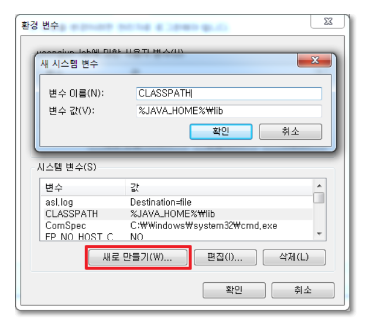

# 자바 스터디 - 7주차
## package 키워드  

**패키지:** 클래스와 인터페이스의 집합  
서로 관련이 있는 클래스나 인터페이스를 함께 묶음으로써 파일을 **효율적**으로 관리할 수 있음  
협업 시 서로 작업한 클래스 사이에서 발생할 수 있는 이름 충돌 문제도 패키지를 사용하면 해결할 수 있음  

자바에서 패키지는 물리적으로 하나의 **디렉터리**를 의미함  
하나의 패키지에 속한 클래스나 인터페이스 파일은 모두 **해당 패키지 이름의 디렉터리에 포함**되어 있음   
이러한 패키지는 다른 패키지를 포함할 수 있으며, 이 때 디렉터리의 계층 구조는 **점(.)**으로 구분됨  
<br>

예시:  `java.lang.String`  

패키지 선언: `package 패키지 이름;`  
위와 같은 명령문을 클래스나 인터페이스의 소스 파일에 추가하기만 하면 됨  
이때 패키지 이름에는 패키지의 경로까지 포함한 풀 네임을 명시해야 함  \
<br>

`이름 없는 패키지`: 어떤 패키지의 선언도 포함되지 않으면, 기본적으로 **이름 없는 패키지에 포함해 컴파일함**  
패키지를 명시하지 않은 모든 클래스와 인터페이스는 모두 같은 패키지에 포함되게 됨   
<br>

## import 키워드
**자바 라이브러리 패키지의 클래스를 사용**하거나   
**사용자의 다른 패키지 안의 클래스를 사용할 때** `import` 명령어를 사용함  

```java
import java.util;

public class Main{
    public static void main(String [] args){
        //import를 하지 않았을 때 
        // java.util.Scanner in = new java.util.Scanner(System.in);

        Scanner in = new Scanner(System.in);
    } 
}

```

`패키지명.*`를 사용하면 해당 패키지의 하위 클래스를 모두 import 할 수 있음   
<br>

`Ctrl+Shift+O` 를 사용하면 현재 파일에서 사용하는 모든 클래스의 import문을 자동으로 추가함  
`Ctrl+Shift+M` 를 사용하면 커서 아래에 존재하는 메서드나 변수의 import문을 자동으로 추가함  
`ALT+Enter`를 사용하면 커서 아래에 존재하는 클래스나 인터페이스의 import 문을 자동으로 추가함  
 

- static import 

<br>

```java
import static 패키지명.클래스명.멤버명;   
```  
  
다른 클래스의 static 멤버를 현재 클래스에서 **직접** 사용할 수 있음  
클래스명을 생략하고 static 멤버의 이름만으로 사용하여 코드의 가독성을 향상시킴     

<br>

## 클래스패스  
**클래스 패스:** 자바가 클래스를 사용하려고 탐색할 때 JVM 혹은 자바 컴파일러가 사용하는 파라미터  
==> **프로그램을 실행할 때 클래스나 패키지를 찾기 위한 기준이 되는 경로**

만약 클래스 패스를 설정하지 않으면 디폴트는 현재 경로를 바라봄.  
소스코드를 컴파일하면 바이트코드로 컴파일되고, JVM이 바이트코드로 된 파일을 실행하려면 이 파일을 찾을 수 있어야 하는데, 이때 .class 파일을 찾을 때 classpath에 지정된 경로를 사용함.

class path는 .class 파일이 포함된 디렉토리와 파일을 콜론으로 구분한 목록임  
java runtime(JVM)은 이 classpath에 지정된 경로를 모두 검색해서 특정 클래스에 대한 코드가 포함된 .class 파일을 찾음. 찾으려는 클래스 코드가 포함된 .class 파일을 찾으면 첫번째로 찾은 파일을 사용함.  


<br>

classpath를 지정할 수 있는 방법은 두가지가 있음.  

하나는 `환경변수 CLASSPATH`를 사용하는 것이고,     
또 하나는 `java runtime에 -classpath 플래그`를 사용하는 것     

<br>


## CLASSPATH 환경변수  
**환경변수:** 운영체제에서 자식 프로세스들을 생성할 때 참조하는 변수  
프로세스가 컴퓨터에서 동작하는 방식에 영향을 미치는 동적인 값들을 모아둠  
JVM 기반의 애플리케이션도 이 **환경변수 값을 참고**해서 동작함  

이 값을 지정하면 실행할 때마다 -classpath 옵션을 사용하지 않아도 됨  
그러나 운영체제를 변경하면 클래스 패스가 유지되지 않고 사라지기 때문에 이식성 측면에서는 좋지 않음   

컴파일된 바이트 코드를 클래스 로더가 클래스 로딩 단계에서 **CLASSPATH라는 환경변수에 있는 경로들을 참조**하여 로딩함.  
<br>

  

ㄴ **클래스 로더 시스템:** 자바 바이트 코드를 읽어서 JVM의 실행 엔진이 사용할 수 있도록 Runtime Data Area의 메서드 영역에 적재하는 역할을 함   

클래스 파일이 JVM에 로드될 때 가장 먼저 클래스 로더를 거쳐감    
<br>


## -classpath 옵션  

`javac <options> <source files>`
컴파일러가 컴파일 하기 위해 필요로 하는 참조할 클래스 파일들을 찾기 위해서 파일 경로를 지정해주는 옵션  

`javac -classpath [필요한 클래스 파일이 위치한 경로] [실행할 소스코드 경로 포함 파일명]`

만약 참조할 클래스 파일들이 여러개라면 세미콜론으로 구분하여 기입이 가능함  
-classpath 옵션을 사용하지 않을 경우 클래스 파일이 위치한 현재 디렉토리를 기본 클래스 패스로 잡아줌
-classpath 옵션은 java(런타임)과 javac(컴파일 타임) 명령어에 모두 사용이 가능함  
+ 런타임 (소스코드->기계어 번역과정), 컴파일 타임(코드가 실제로 실행되는 과정)  
<br>


## 접근지시자   
자바에서의 접근 지시자는 클래스, 변수, 메서드 등의 접근 가능 범위를 지정함.  

1. `public:` 어떤 클래스에서도 접근 가능
2. `protected:` 같은 패키지 내의 클래스 또는 자식 클래스에서만 접근 가능
3. `default(package-private):` 접근 제한자를 명시하지 않았을 경우, 같은 패키지에서는 제한 없이 호출될 수 있지만 다른 패키지에서는 호출할 수 없음
4. `private:` 같은 패키지 내의 클래스에서만 접근 가능

<br>

class, method, field 등을 접근 지시자로 접근 가능 범위를 지정할 수 있음  
접근 제한을 통해 `캡슐화`를 구현할 수 있음! => 데이터 보호, 무분별적인 접근 제한

<br>

| 접근 지시자              | 같은 클래스 | 같은 패키지 | 자식 클래스 | 전체   |
| ------------------------ | ----------- | ----------- | ----------- | ------ |
| public                   | 가능        | 가능        | 가능        | 가능   |
| protected                | 가능        | 가능        | 가능        | 불가능 |
| default(package-private) | 가능        | 가능        | 불가능      | 불가능 |
| private                  | 가능        | 불가능      | 불가능      | 불가능 |


## 구현 과제 (Optional)  

<br>

## 추후 구현 예정 ....

<br>

1. LinkedList를 구현하세요.  
    LinkedList에 대해 공부하세요.  
    정수를 저장하는 ListNode 클래스를 구현하세요.  
    ListNode add(ListNode head, ListNode nodeToAdd, int position)를 구현하세요.  
    ListNode remove(ListNode head, int positionToRemove)를 구현하세요.  
    boolean contains(ListNode head, ListNode nodeTocheck)를 구현하세요.  
<br>

2. Stack을 구현하세요.  

    int 배열을 사용해서 정수를 저장하는 Stack을 구현하세요.  
    void push(int data)를 구현하세요.  
    int pop()을 구현하세요.  
    앞서 만든 ListNode를 사용해서 Stack을 구현하세요.  
    ListNode head를 가지고 있는 ListNodeStack 클래스를 구현하세요.  
    void push(int data)를 구현하세요.  
    int pop()을 구현하세요.  