# About

## 스터디 개요
자바 프로그래밍 능력 향상을 위한 Prompt! 동아리 내 자바 스터디 운영.


## 스터디 일정
총 10주 구성 (24.03.18~24.05.24)

## 스터디 인원
|이름|GitHub 닉네임|R&R|
|---|------|----|
|김경환|[KyongHwan-Kim](https://github.com/KyongHwan-Kim)|스터디 장|
|김민우|[M1nu0x0](https://github.com/M1nu0x0)|스터디 원|
|김민지|[zizonminji](https://github.com/arenran02)|스터디 원|
|김찬결|[Kck106](https://github.com/kck106)|스터디 원|
|정은수|[eunsoo03181](https://github.com/eunsoo03181)|스터디 원|

## 스터디 참여 방법
### Step 1. Java Study Repo Fork.
자바 스터디 과제 제출을 위해 해당 Repo를 자신의 Repo로 Fork한다.
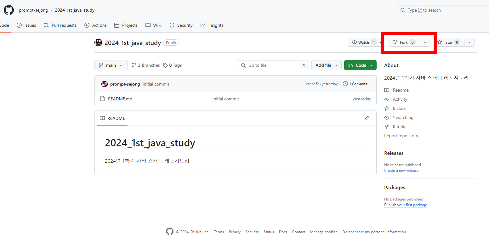
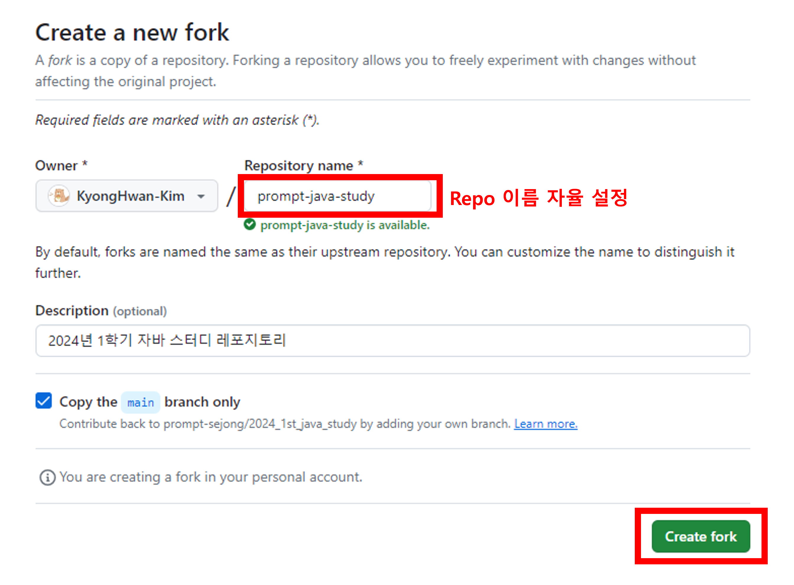

### Step 2. Local Git Clone. ([Git 사전 설치 필수](https://sfida.tistory.com/46))
자신의 Repo로 복제한다.
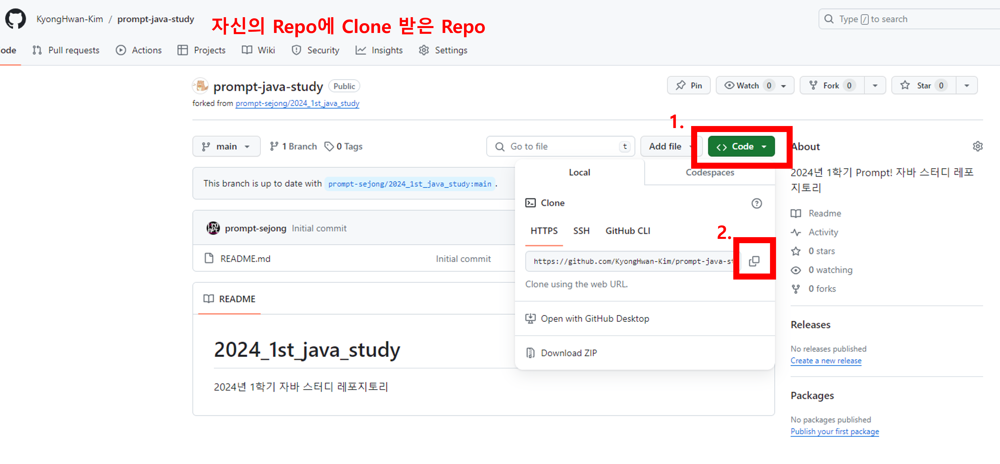
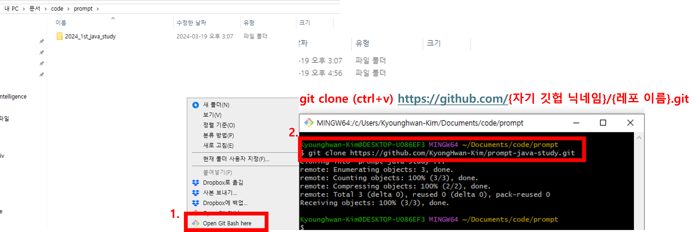

### Step 3. 과제 작성.
복제 후, VS Code를 통해 폴더를 연다.
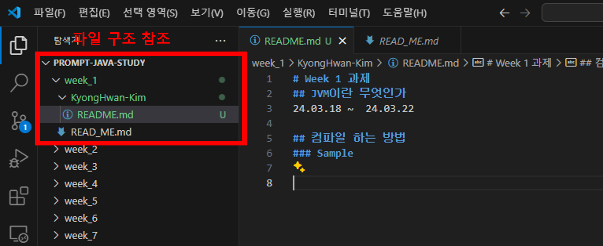
week_x 폴더 하위에 자기 GitHub Nickname으로 폴더 생성후, READ_ME.md 파일 작성.
```
[폴더 구조]
|- /week_x
|- READ_ME.md // 과제 설명
|-- /KyongHwan-Kim
|--|-- READ_ME.md
|--|-- /assets
|--|--|-- img1.png
|--|--|-- img2.png
|--|-- /src
|--|--|--/{package-path}
```
만약, img 등 asset이 필요하면, assets 폴더 생성 후 폴더 안에 경로 잡기.
또한 실제로 구현한 코드가 있다면 src 폴더 안에 package를 넣어도 좋고, java 코드를 넣어도 좋음.

과제 완료 후 Commit 메세지 작성 후 커밋.
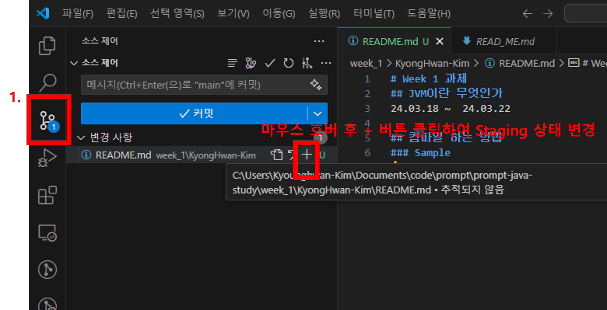
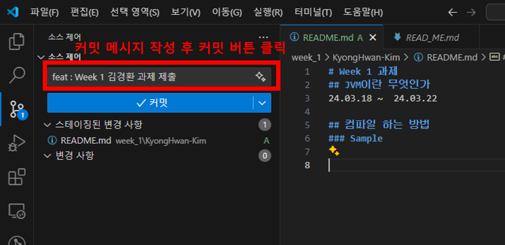
Commit 완료 후 원격 저장소(Remote Repo)에 Push.
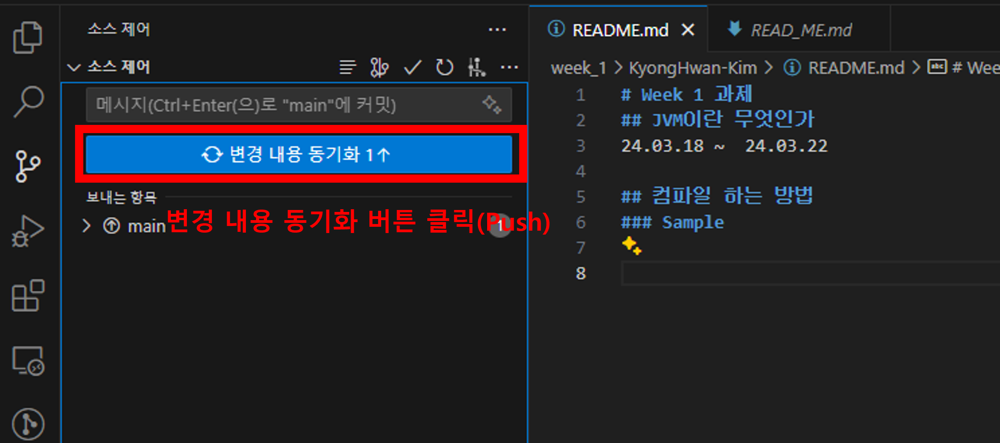

### Step 4. Pull Request 생성.
Push한 자신의 GitHub Repo로 이동. ahead된 commit이 있는 지, 확인 후 PR(Pull Request).
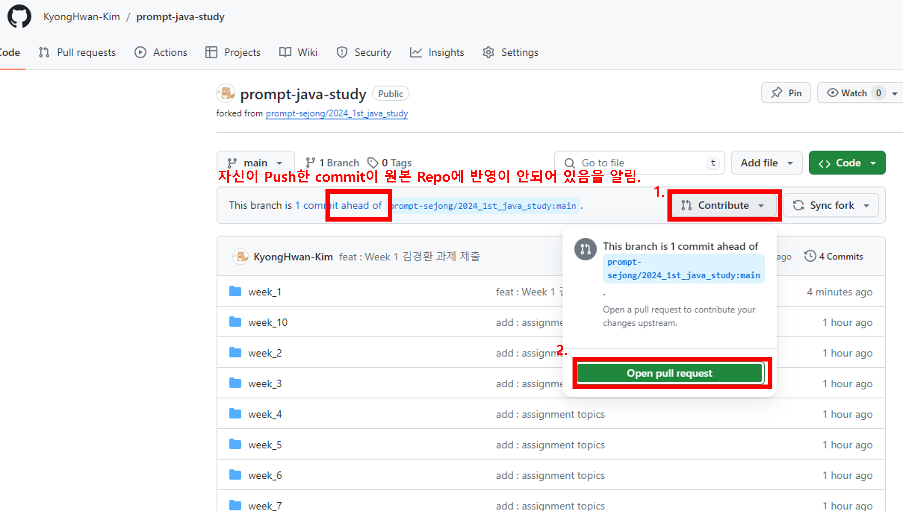
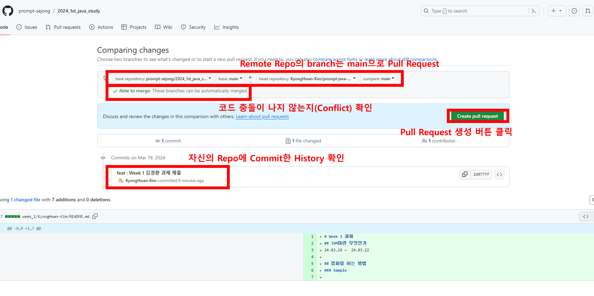
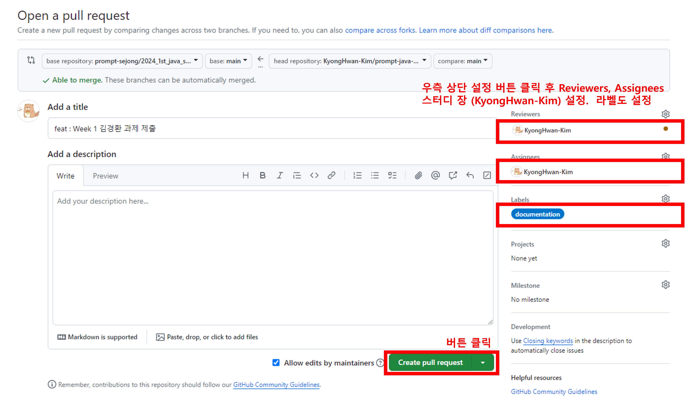
### Step 5. Code Review.
스터디 장이 PR로 Open된 Issue 하단에 과제한 내용에 Comment를 달고, 일정 정도 과제 완성도 이상 시, Merge 수행. 
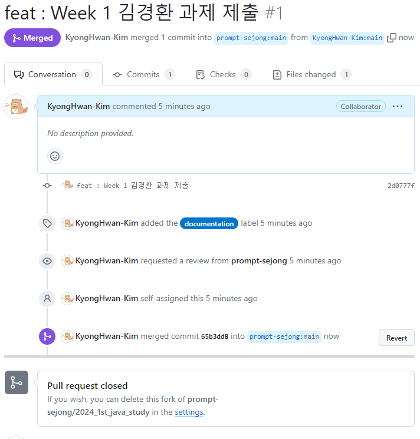

# TODO (스터디 장)
- 스터디 원들이 작성한 위키를 볼 수 있는 Web 구성 (VuePress 이용.)