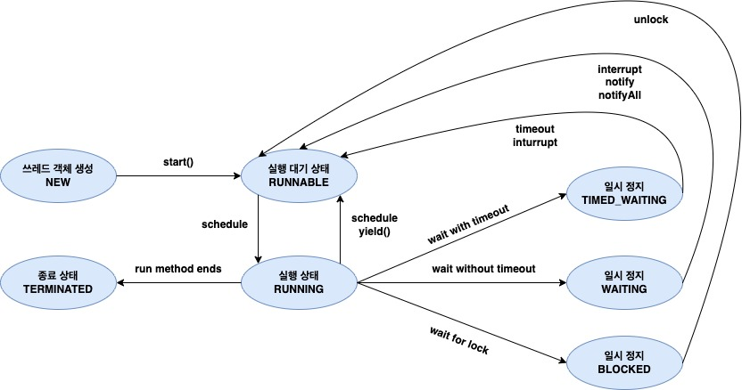

# 자바 스터디 - 10주차
## Thread 클래스와 Runnable 인터페이스  

프로세스: 프로그램의 실행 단위   
스레드: 작업을 실행하는 단위, 자바에서는 JVM에 의해서 관리됨.   

프로세스에는 적어도 한개 이상의 스레드가 있으며, **Main 스레드 하나로 시작하여 스레드를 추가 생성하면 멀티 스레드 환경이 됨.**  
스레드는 프로세스의 리소스를 공유하기 때문에 효율적이지만 잠재적인 문제점에 노출될 수 있음. 
==> 왜 공유되느냐? resource allocation의 단위는 프로세스이기 때문.  

이런 기능을 수행할 수 있도록 하는 것: **자바의 Thread 클래스**와 **Runnable 인터페이스**  

- **자바의 Thread 클래스**  
스레드를 구현하는 자바의 클래스.  
쿨래스를 이용해 스레드를 생성하고, 스레드를 만들 때는 일반적으로 실행할 코드를 Runnable 객체로 전달함.  

- **Runnable 인터페이스**  
자바에서 다중 스레드를 구현하기 위한 인터페이스.  
Runnable을 구현한 객체는 스레드 생성 시에 생성자에 저장하거나,  
Thread 클래스의 run 메서드를 오버라이드 하여 실행 가능한 코드를 정의할 수 있음.  

## 스레드 구현 방법

1. Thread 클래스를 상속받아 구현
   
```java
//Thread 클래스 상속
public class MyThread extends Thread {

    //run 메소드 오버라이딩
    @Override
    public void run(){
        System.out.println("MyThread is running ");
    }
}
```

```java
public static void main(String[] args){
    Thread MyThread = new MyThread();
    MyThread.start();   //MyThread is running
}
```

2. Runnable 인터페이스를 구현하여 스레드의 인자로 전달  
   
`Thread(Runnable target)` : Runnable target이 구현된 스레드 객체 할당   

```java
public class MyRunnable implements Runnable{
    @Override
    public void run(){
        System.out.println("MyRunnable is running");
    }
}
```

```java
public static void main(String [] args){
    //인터페이스 레퍼런스를 이용해 구현체를 사용함
    //MyRunnable 
    Runnable MyRunnable = new MyRunnable();
    Thread MyThread = new Thread(MyRunnable);
    MyThread.start();   //MyRunnable is running
}
```
<br>

Q: 돌고 돌아 결국에는 스레드 클래스를 이용해서 사용하는 것이 아닌가?  
A: 대신에 Runnable 인터페이스를 이용하면 스레드를 사용할 수 있을 뿐만 아니라 상속 또한 이용할 수 있음. 스레드 클래스를 이용하여 구현할 경우에는 다중 상속이 불가능하여서 상속받기 어려움.  

## Thread 생성자와 메소드

- **Thread 생성자**  

`Thread( )` : 새로운 스레드 객체 할당  
`Thread(String name)` : 새로운 스레드 객체가 할당되며, 스레드 이름은 name으로 설정됨  
`Thread(Runnable target)` : Runnable target이 구현된 스레드 객체 할당  
`Thread(Runnable target, String name)` : Runnable target이 구현된 스레드 객체가 할당되면 스레드 이름은 name으로 설정됨.  

- **Thread 메소드**  

`void run( )` : 스레드의 실행코드가 작성되는 메소드로 사용자는 run() 메소드를 오버라이드 하여 사용해야 함  
`void start( )` : 스레드가 시작되도록 요청하는 메소드로 JVM은 해당 스레드의 run() 메소드를 호출  
<br>

`void interrupt( )` : 스레드를 중지   
<br>

`void join( )` : 이 스레드가 끝날때까지 기다림   
`void join(long millis)` : 최대 millis 시간동안 이 스레드가 끝날때까지 기다림  
<br>

`static void sleep(long millis)` : millis 시간동안 현재 스레드를 일시중지시킴   
`static void yield( )` : 현재 스레드의 실행시간을 다른 스레드에게 양보   
`static Thread currentThread( )` : 현재 실행중인 스레드 객체의 참조값을 반환   
<br>

`long getId( )` : 스레드의 Id를 반환   
`String getName( )` : 스레드의 이름을 반환   
`int getPriority( )` : 스레드의 우선순위 값을 반환 (우선순위 범위 : 1 ~ 10)  
`Thread.State getState( )` : 스레드의 state 값을 반환  
`ThreadGroup getThreadGroup( )` : 스레드가 속한 스레드 그룹을 반환   
`static boolean interrupted( )` : 현재 스레드의 interrupted 여부를 반환   
`boolean isInterrupted( )` : 이 스레드의 interrupted 여부를 반환   
`boolean isAlive( )` : 이 스레드가 살아있는지 여부를 반환   
`boolean isDaemon( )` : 이 스레드가 데몬 스레드인지 여부를 반환   
<br>

`void setDaemon(boolean on)` : 이 스레드를 데몬 스레드로 변경    
`void setName(String name)` : 이 스레드의 이름을 name으로 변경   
`void setPriority(int newPriority)` : 이 스레드의 우선순위를 newPriority로 변경   
`String toString( )` : 이 스레드의 이름, 우선순위, 스레드그룹등의 정보를 담은 문자열을 반환   


## 쓰레드의 상태


without timeout은 그냥 wait 콜을 받았을 때  
block이 unlock된 것은 IO 인터럽트가 발생한 것임  


| 상태      | 열거 상수    | 설명                                                         |
| --------- | ------------ | ------------------------------------------------------------ |
| 객체 생성 | NEW          | 스레드 객체가 생성, 아직 start() 메소드가 호출되지 않은 상태 |
| 실행 대기 | RUNNABLE     | 실행 상태로 언제든지 갈 수 있는 상태                         |
| 일시 정지 | WAITING      | 다른 스레드가 통지할 때까지 기다리는 상태                    |
| -         | TIME_WAITING | 주어진 시간동안 기다리는 상태                                |
| -         | BLOCKED      | 사용하고자 하는 객체의 락이 풀릴 때까지 기다리는 상태        |
| 종료      | TERMINATED   | 실행을 마친 상태                                             |

<br>

`Thread.State getState( )` : 스레드의 state 값을 반환  
위 함수를 이용하여 스레드의 상태를 얻을 수 있음.  


## 쓰레드의 우선순위
2개 이상의 스레드가 동작중일 때 우선 순위를 부여하여 우선 순위가 높은 스레드에게 실행의 우선권을 부여할 수 있음.  
우선 순위를 지정하기 위한 상수를 지정함  

MAX_PRIORITY, MIN_PRIORITY, NORM_PRIORITY => MAX는 10, MIN은 1, NORM은 5(기본값)  
setPriority 함수로 스레드의 우선순위를 변경할 수 있음.  

- **JVM의 스케쥴링 규칙**  

철저한 우선 순위 기반  
가장 높은 우선 순위의 스레드가 우선적으로 스케쥴링  
동일한 우선 순위의 스레드는 돌아가면서 스케쥴링(Round-Robin)  
Round-Robin은 timeout을 이용해 번갈아서 실행되는 알고리즘  

## Main 쓰레드
자바 프로그램의 시작과 동시에 하나의 스레드가 즉시 동작하게 됨.  
이를 메인 스레드라고 부름.  
메인 스레드 실행중일 때 Thread.currentThread()로 현재 실행중인 스레드(메인 스레드)로 참조값(레퍼런스)를 얻을 수 있음.  


## 동기화
프로세스의 자원을 공유해서 사용하기 때문에 공유 자원을 동시에 수정하여 잘못된 값을 얻지 않도록 해야 함 => 동기화 필요  

[동기화를 위한 자바 툴 참고자료](https://velog.io/@jjbin/%EC%9E%90%EB%B0%94-%EB%8F%99%EA%B8%B0%ED%99%94-Java-Synchronization)

## 데드락
프로그램은 실행되고 있는데 정작 아무런 작업도 하지 않는 상태  
예를 들어 메인 스레드에서 자식 스레드가 종료될 때까지 대기시켰는데 (Thread.currentThread().join()) 자식 스레드가 없을 경우 데드락이 발생함.  

<br>

- **데드락의 발생 조건**

**상호 배제 (Mutual Exclusion)** : 한 자원에 대해 여러 쓰레드 동시 접근 불가  
**점유와 대기 (Hold and Wait)** : 자원을 가지고 있는 상태에서 다른 쓰레드가 사용하고 있는 자원 반납을 기다리는 것  
**비선점 (Non Preemptive)** : 다른 쓰레드의 자원을 실행 중간에 강제로 가져올 수 없음  
**환형대기 (Circle Wait)** : 각 쓰레드가 순환적으로 다음 쓰레드가 요구하는 자원을 가지고 있는 것  

```java
public class Main {

    public static Object object1 = new Object();
    public static Object object2 = new Object();

    public static void main(String[] args) {
        FirstThread thread1 = new FirstThread();
        SecondThread thread2 = new SecondThread();

        thread1.start();
        thread2.start();

    }

    private static class FirstThread extends Thread{
        @Override
        public void run() {
            //synchronized를 이용하여 object1과 object2가 동시에 쓰레드를 사용할 수 없게 만듦
            //object1의 락을 가짐
            synchronized (object1){
                System.out.println("First Thread has object1's lock");

                try {
                    //스레드 10ms간 대기
                    Thread.sleep(10);
                } catch (InterruptedException e) {
                    e.printStackTrace();
                }
                System.out.println("First Thread want to have object2's lock. so wait");

                 //object1의 락을 가진 상태로 object2의 락을 가지길 원함
                synchronized (object2){
                    System.out.println("First Thread has object2's lock too");
                }
            }
        }
    }

    private static class SecondThread extends Thread{
        @Override
        public void run() {
            //synchronized를 이용하여 object1과 object2가 동시에 쓰레드를 사용할 수 없게 만듦
            synchronized (object2){
                System.out.println("Second Thread has object2's lock");

                try {
                    //스레드 10ms간 대기
                    Thread.sleep(10);
                } catch (InterruptedException e) {
                    e.printStackTrace();
                }
                System.out.println("Second Thread want to have object1's lock, so wait");

                 //object2의 락을 가진 상태로 object1의 락을 가지길 원함
                synchronized (object1){
                    System.out.println("Second Thread has object1's lock too");
                }
            }
        }
    }
}
```
