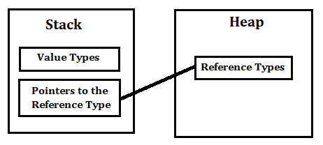
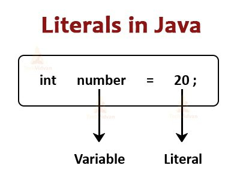

# 자바 스터디 - 2주차
## 프리미티브 타입 종류와 값의 범위 그리고 기본 값  
&nbsp;
**primitive type** : 원시 타입, 실제 데이터의 값을 저장하는 타입  
&nbsp;

원시 타입은 `스택 메모리`에 저장됨  
참조 타입은 `힙 메모리`에 저장됨   
&nbsp;
- - -  
### 프리미티브 타입 종류  
- **int**  (초기값: 0)  
`size`: 4 byte (32 bits)  
`range`: -2^(-31)~2^(31)-1  

- **long**  (초기값: 0.L)  
`size`: 8 byte (64 bits)  
`range`: -2^(63)~2^(63)-1 

- **double**  (초기값: 0.0)  
`size`: 8 byte (64 bits)    
`range`: -2^(-1074)~(2-2^(-52))*2^(1023)  

- **float**  (초기값: 0.0F)  
`size`: 4 byte (32 bits)      
`range`: -2^(-149)~(2-2^(-23))*2^(127)  
  
- **boolean**  (초기값: false)    
`size`: 1 byte (8 bits)  
`range`: true, false  
* 자바는 파이썬과 다르게 true, false 모두 소문자

- **byte**  (초기값: 0)  
`size`: 1 byte (8 bits)    
`range`: -128~127

- **short**  (초기값: 0)  
`size`: 2 byte (16 bits)    
`range`: -2^(-15)~2^(15)-1

- **char**  (초기값: '\u0000')  
`size`: 2 byte (16 bits)     
`range`: 0~2^(16)-1  
&nbsp;

- - -
&nbsp;
&nbsp;

## 프리미티브 타입과 레퍼런스 타입  
&nbsp;
&nbsp;

`primitive type`: 정수, 실수, 문자, 논리 리터럴 등의 실제 데이터 값을 저장하는 타입  
기본 자료형은 반드시 사용하기 전에 선언되어야 하고, 자료형의 길이는 운영체제에 독립적이고 변하지 않음.   

&nbsp;
`reference type`: 객체(Object)를 참조하여 주소를 저장하는 타입, 메모리 번지 값을 통해 객체를 참조함  
참조 타입은 Java에서 최상위 클래스인 Java.lang.Object 클래스를 상속하는 모든 클래스를 말함  
실제 객체는 힙(heap) 메모리에 저장됨. 참조 타입 변수는 스택 메모리에 실제 객체들의 주소를 저장하여 객체를 사용할 때마다 참조 변수에 저장된 객체의 주소를 불러와서 사용함.   

&nbsp;  
  
&nbsp;  


## 리터럴  
 &nbsp;
 

리터럴은 데이터 값 그 자체를 말함. 변수에 넣는 변하지 않는 데이터를 의미함.   
**상수와의 차이점:** 상수에 넣는 데이터는 숫자 뿐만이 아니라 `객체, 구조체` 등도 가능함.  
리터럴은 메모리 공간 안에 저장되는 값임.  

 &nbsp;

## 변수 선언 및 초기화하는 방법  
&nbsp;

**멤버 변수 초기화** : 초기화를 하지 않아도 자동적으로 **변수의 자료형의 기본값** 으로 초기화됨.  
**지역변수 초기화** : 사용하기 전 반드시 초기화 필요함!  
&nbsp;  


>  **초기화 방법**  
> 1. 명시적 초기화
> 2. 생성자
> 3. 초기화 블록  

&nbsp;  

- - -
&nbsp;  


`1. 명시적 초기화`  
&nbsp;  

변수를 선언과 동시에 초기화하는 것.

```Java
int minji=2;
Student m=new Student();
```  
&nbsp;  


`2. 생성자`
&nbsp;  

생성자의 이름은 클래스 이름과 동일해야 함  
생성자는 다른 멤버함수와 다르게 리턴 타입이 없으며, 객체가 생성될 때 자동으로 한번 호출됨
생성자는 매개변수 조건에 따라서 여러개 작성할 수 있고 (오버로딩) 생성자가 없을 경우 컴파일러가 기본 생성자를 자동으로 생성함. 그러나 만약 생성자가 1개라도 작성되어 있으면 컴파일러는 기본 생성자를 자동으로 생성하지 않음. 

```java
public class Minji{
    String name;
    int age;
    int height;
    int weight;

    public Minji(){ }      //기본 생성자

    public Minji(String b, int a){   //매개변수를 가진 생성자
        this.age=a;
        this.name=b;
    }
}
```  
&nbsp;  

**사용 예시**
```java
public class HelloWorld {
	public static void main(String[] args) {
        Minji m1=new Minji();
        Minji m2=new('minji', 22);
    }
}
```  
&nbsp;  


`3. 초기화 블록`

**1. 클래스 초기화 블럭**
```java
class minji{
    static{
        /*클래스 초기화 블럭*/
    }
}
```
&nbsp;  

**2. 인스턴스 초기화 블럭**
```java
class minji{
    {
        /*인스턴스 초기화 블럭*/
    }
}
```  

인스턴스 초기화 블럭은 인스턴스를 생성할 때마다 수행됨   
ㄴ 모든 생성자에서 **공통**으로 수행할 코드를 넣어주는 것이 좋음!
&nbsp;  

클래스 초기화 블럭은 클래스가 메모리에 처음 로딩될 때 한번만 수행됨  

&nbsp;  


## 변수의 스코프와 라이프타임  
&nbsp;

**변수의 스코프:** 변수가 접근할 수 있는 유효 범위  
**라이프 타임:** 이러한 변수가 유효한 시간,  
프로그램이 구동되는 동안 변수가 '값을 담고 있을 수 있는 주기'를 말함.  


| **변수의 종류**   | **선언 위치**                    | **스코프**                                       | **라이프 사이클**                                        |
| ----------------- | -------------------------------- | ------------------------------------------------ | -------------------------------------------------------- |
| **클래스 변수**   | 클래스 영역                      | 클래스 전체                                      | 클래스 전체가 메모리에 올라간 후 프로그램이 끝날 때 까지 |
| **인스턴스 변수** | 클래스 영역                      | static 블록과 static 메서드를 제외한 클래스 전체 | 인스턴스가 생성 후 메모리에 살아있을 때까지              |
| **로컬 변수**     | 메소드, 생성자, 초기화 블럭 내부 | 변수가 선언된 블록 내부                          | 변수 선언 후 블록을 벗어날 때까지                        |


## 타입 변환, 캐스팅 그리고 타입 프로모션  
&nbsp;

- **자동 형변환(Promotion)**  
값의 허용 범위가 더 작은 타입이 큰 타입으로 저장될 때 발생함  
데이터가 다른 데이터 타입으로 자동으로 변환됨  

`byte < short < char < int < long < float < double`   

```java
public class HelloWorld {
	public static void main(String[] args) {

        byte x=1;
        int y=0;

        y=x;    //byte가 자동으로 int로 형변환

    }
}
```
&nbsp;  
char 타입 같은 경우에는 음수를 갖지 않기 때문에 음수 값을 갖는 데이터를  
char 타입으로 변환하려고 하면 컴파일 에러가 발생함.  
기본적으로 컴파일러는 실수값을 double로 인식. float로 계산할 경우에는 리터럴 뒤에 f 또는 F를 적어주어야 함.  
정수형 변수의 연산 결과를 저장할 때는 버림이 됨 (나눗셈의 경우)  
실수형으로 계산하려면 타입 변환을 해주고 연산을 해주어야 함  
&nbsp;  


- **강제 형변환(Casting)**  

큰 허용 범위의 타입을 작은 허용 범위의 타입으로 전환함  
자동적으로 변환되지 않으므로 강제적으로 타입을 변환해야 함  
캐스팅 연산자 `괄호()`를 사용함  

```
작은 허용 범위 타입 = (작은 허용 범위 타입) 큰 허용 범위 타입
```

큰 허용 범위 타입을 작은 허용 범위에 담을 수 있도록 나누고  
나누어진 부분 중 한 조각이 작은 허용 범위 타입으로 저장됨  
이 때 나머지 조각들은 버려짐  

**int 타입을 char 타입으로 바꿀 때**  
int 타입이 더 큰 범위를 갖고 있으므로 강제로 타입을 변환해야 함  
char 타입으로 강제 변환하면 정수 값이 유니코드 값으로 저장됨  
**String 타입을 기본 타입으로 바꿀 때**  
String 타입을 기본 타입으로 변환하려면 갖에로 타입을 변환해야 함
캐스팅 () 연산자가 아닌 자바가 제공하는 API 클래스를 사용해야 함

| 변환 타입        | API 클래스             | 사용 예                                                            |
| ---------------- | ---------------------- | ------------------------------------------------------------------ |
| String → byte    | Byte.parseByte()       | String str = "10"; <br>byte value = Byte.parseByte(str);           |
| String → short   | Short.parseShort()     | String str = "10"; <br> short value = Short.parseShort(str);       |
| String → int     | Integer.parseInt()     | String str = "10"; <br>int value = Integer.parseInt(str);          |
| String → long    | Long.parseLong()       | String str = "10";<br>long value = Long.parseLong(str);            |
| String → float   | Float.parseFloat()     | String str = "3.14";<br>float value = Float.parseFloat(str);       |
| String → double  | Double.parseDouble()   | String str = "3.14";<br>double value = Double.parseDouble(str);    |
| String → boolean | Boolean.parseBoolean() | String str = "true";<br>boolean value = Boolean.parseBoolean(str); |

&nbsp;  

## 1차 및 2차 배열 선언하기  
&nbsp;
```java
public static void main(String[] args){
    int [] miasdr;         //1차원 배열 선언
    int [] mini=new int[2];     //1차원 배열 초기화
    int [] mini2={2,3,4,5};


    int [][] array;
    array=new int[1][5];    //2차원 배열 초기화
    int [][] array2 = new int [1][5];   //기본값 0으로 초기화
    int [][] array3={{1,2,3}, {4,5,6}};
}
```


## 타입 추론, var  
&nbsp;

타입 추론: 개발자가 변수의 타입을 명시적으로 적어주지 않아도, 컴파일러가 알아서 이 변수의 타입을 대입된 리터럴로 추론하는 것 

```java
var string = "Hello, World";
```
<br>

컴파일러 측에서 String 형으로 추론하여 변수를 지정해줌  
var는 지역 변수에서만 사용이 가능함  
컴파일러가 타입을 추론할 수 없는 애매한 상황일 때 컴파일 에러가 발생함  
<br>

```java
var str = "Hello, World";

if (str instanceof String) {
    System.out.println("This is a String: " + str);
}
```
<br>

- 지역변수가 아닌, 멤버 변수에서 사용할 경우 컴파일 에러가 발생함
- 초기화를 하지 않으면 타입 추론이 불가능하므로 컴파일 에러가 발생함
- null로 초기화할 수 없음.
- 배열에 사용할 수 없음. 
- 람다에 사용할 수 없음. 


