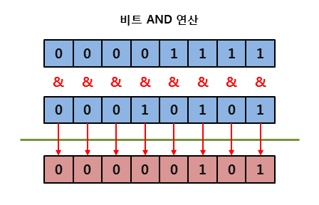
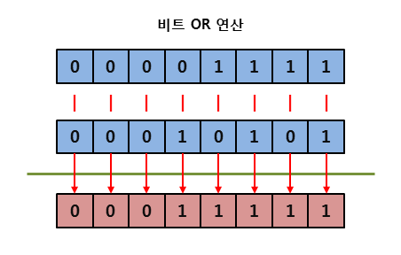
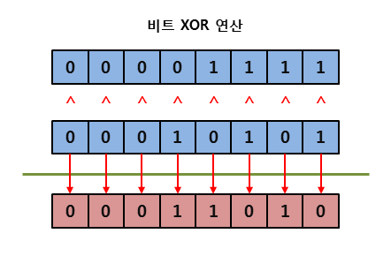
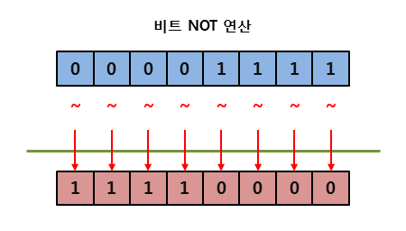
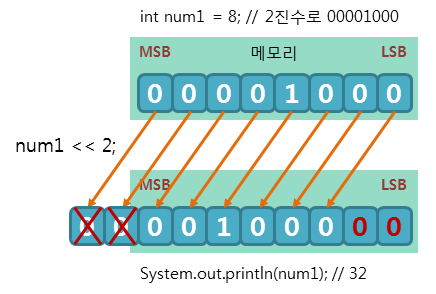
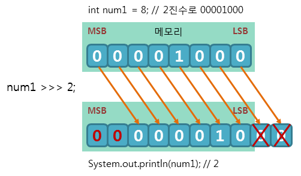
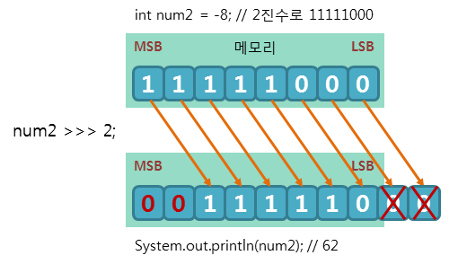
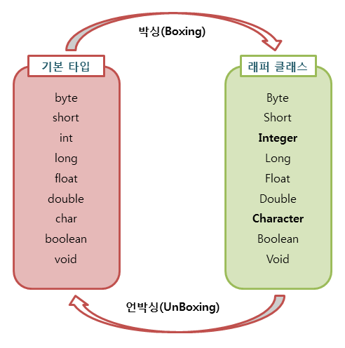

# 자바 스터디 - 3주차

# 1. 산술 연산자 / 비트 연산자 / 관계 연산자 / 논리 연산자
아래에서 각종 연산자에 대한 내용을 다룬다.
## 1.1. 산술 연산자 (arithmetic operator)
| 산술 연산자 | descriptions                                                 |
| ----------- | ------------------------------------------------------------ |
| +           | 왼쪽의 피연산자에 오른쪽 피연산자를 더함.                    |
| -           | 왼쪽의 피연산자에 오른쪽 피연산자를 뺌.                      |
| *           | 왼쪽의 피연산자에 오른쪽 피연산자를 곱함.                    |
| /           | 왼쪽의 피연산자를 오른쪽의 피연산자로 나눔                   |
| %           | 왼쪽의 피연산자를 오른쪽의 피연산로 나눈 후 그 나머지를 반환 |

``` java
System.out.println("5 + 2 = " + (5 + 2));    // 덧셈
System.out.println("5 - 2 = " + (5 - 2));    // 뺄셈
System.out.println("5 * 2 = " + (5 * 2));    // 곱셈
System.out.println("5 / 2 = " + (5 / 2));    // 나눗셈
System.out.println("5 % 2 = " + (5 % 2));    // 나머지
```
## 1.2. 비트 연산자
비트 연산자는 후술할 논리 연산자와 비슷한 일을 수행하지만 비트 단위로 연산을 수행해야할 때 많이 쓴다.

| 비트 연산자 | descriptions                                                                        |
| ----------- | ----------------------------------------------------------------------------------- |
| &           | 대응되는 비트가 모두 1이면 1을 반환함. (비트 AND 연산)                              |
| \|          | 대응되는 비트 중에서 하나라도 1이면 1을 반환함. (비트 OR 연산)                      |
| ^           | 대응되는 비트가 서로 다르면 1을 반환함. (비트 XOR 연산)                             |
| ~           | 비트를 1이면 0으로, 0이면 1로 반전시킴. (비트 NOT 연산, 1의 보수)                   |
| <<          | 명시된 수만큼 비트들을 전부 왼쪽으로 이동시킴. (left shift 연산)                    |
| >>          | 부호를 유지하면서 지정한 수만큼 비트를 전부 오른쪽으로 이동시킴. (right shift 연산) |
| >>>         | 지정한 수만큼 비트를 전부 오른쪽으로 이동시키며, 새로운 비트는 전부 0이 됨.         |

비트 연산은 비트를 왼쪽이나 오른쪽으로 옮길 때 사용하거나, 1의 보수를 만들 때 사용한다.

다음은 논리 연산 결과이다. 뒤에서도 논리 연산이 나오니 다시 보러 올라와도 된다.

| A     | B     | AND   | OR    | NOT   | XOR   |
| ----- | ----- | ----- | ----- | ----- | ----- |
| true  | true  | true  | true  | false | false |
| true  | false | false | true  | false | true  |
| false | true  | false | true  | true  | true  |
| false | false | false | false | true  | false |

> *스터디 질문 사항*: XOR의 경우 A != B와 동일하게 작동?

> *답변*:









## 1.3. 관계 연산자
관계 연산자는 비교 연산자라고도 불리며, 아래표와 같다.
| 관계 연산자 | descriptions                                                       |
| ----------- | ------------------------------------------------------------------ |
| ==          | 왼쪽의 피연산자와 오른쪽의 피연산자가 같으면 참을 반환함.          |
| !=          | 왼쪽의 피연산자와 오른쪽의 피연산자가 같지 않으면 참을 반환함.     |
| >           | 왼쪽의 피연산자가 오른쪽의 피연산자보다 크면 참을 반환함.          |
| >=          | 왼쪽의 피연산자가 오른쪽의 피연산자보다 크거나 같으면 참을 반환함. |
| <           | 왼쪽의 피연산자가 오른쪽의 피연산자보다 작으면 참을 반환함.        |
| <=          | 왼쪽의 피연산자가 오른쪽의 피연산자보다 작거나 같으면 참을 반환함. |

```java
System.out.println('a' == 'A');     // false
System.out.println('a' != 'A');     // true
System.out.println('a' > 'A');      // true
System.out.println('a' >= 'A');     // true
System.out.println('a' < 'A');      // false
System.out.println('a' <= 'A');     // false
```

## 1.4. 논리 연산자
논리 연산자는 `true`와 `false`간의 관계를 나타낸다.
| 논리 연산자 | descriptions                                                         |
| ----------- | -------------------------------------------------------------------- |
| &&          | 논리식이 모두 참이면 참을 반환함. (논리 AND 연산)                    |
| \|\|        | 논리식 중에서 하나라도 참이면 참을 반환함. (논리 OR 연산)            |
| !           | 논리식의 결과가 참이면 거짓을, 거짓이면 참을 반환함. (논리 NOT 연산) |

다음은 논리 연산 결과이다.
| A     | B     | A && B | A \|\| B | !A    |
| ----- | ----- | ------ | -------- | ----- |
| true  | true  | true   | true     | false |
| true  | false | false  | true     | false |
| false | true  | false  | true     | true  |
| false | false | false  | false    | true  |

여기서 `&&`는 계산 결과가 특이하다. A가 `false`면 뒤가 어떻든 `false`이다. 따라서 A가 `false`면 B는 실행하지 않고 `false`가 반환된다.

이와 비슷하게 `||`도 이러한 특징이 있는데, A가 `true`면 뒤가 어떻든 `true`이다. 따라서 A가 `true`면 B는 실행하지 않고 `true`를 반환한다.

# 2. instance of
2주차에 살펴본 연산자이다. 간단히 보고 넘어가겠다. 문법은 다음과 같다.
``` java
object instanceof type
```
``` java
class Parent { }
class Child extends Parent { }

public static void main(String[] args) {
    Parent parent = new Parent();
    Child child = new Child();

    // 인스턴스가 Parent type인지
    System.out.println(parent instanceof Parent);   // true
    System.out.println(child instanceof Parent);    // true

    // 인스턴스가 Child type인지
    System.out.println(parent instanceof Child);    // false
    System.out.println(child instanceof Child);     // true
}
```

# 3. [assignment(=) operator](https://doozi0316.tistory.com/entry/3주차-연산자)
우리가 가장 많이 봐온 `=`와 관련된 연산이다.

| assignment operator | descriptions                                                               |
| ------------------- | -------------------------------------------------------------------------- |
| =                   | 우항의 값을 좌항에 넣는다.                                                 |
| +=                  | 우항의 값을 좌항의 값에 더해서 우항에 저장                                 |
| -=                  | 우항의 값을 좌항의 값에 빼서 좌항에 저장                                   |
| *=                  | 우항의 값을 좌항의 값에 곱해서 좌항에 저장                                 |
| /=                  | 우항의 값을 좌항의 값에 나눠서 좌항에 저장                                 |
| %=                  | 우항의 값을 좌항의 값으로 나눈 나머지를 좌항에 저장                        |
| &=                  | 좌항의 피연산자를 우항의 피연산자와 비트AND연산한 수 그 결과를 좌항에 저장 |
| \|=                 | OR연산 후 좌항에 저장                                                      |
| ^=                  | XOR연산 후 좌항에 저장                                                     |
| <<=                 | 우항만큼 왼쪽 시프트 후 좌항에 저장                                        |
| >>=                 | 우항만큼 오른쪽 시프트 후에 좌항에 저장                                    |
| >>>=                | 우항만큼 부호에 상관없이 오른쪽 시프트 후 좌항에 저장                      |

```java
int A = 10;

A += 10;
System.out.println(A);    // 20

A -= 10;
System.out.println(A);    // 10

A *= 10;
System.out.println(A);    // 100

A /= 10;
System.out.println(A);    // 10

A /= 3;
System.out.println(A);    // 1
```
# 4. 화살표(->) 연산자
->(화살표 연산자)는 람다 표현식을 구성하는데 사용된다. 그렇다면 람다 표현식은 무엇일까?
## 4.1. [Lambda expression](https://velog.io/@hp5234/JAVA-3편-화살표연산자-람다-기초)
람다 표현식은 메서드를 하나의 식으로 표현한 것이다. 이는 클래스에 구애받지 않고 사용이 가능하다. 다음 간단한 예시부터 살펴보자.
```java
// 일반 메소드
int max (int a, int b) {
    return a > b ? a : b;
}

// 람다 표현식
(a, b) -> a > b ? a : b


// 일반 메소드
void printVar(String name, int i) {
    System.out.println(name + " = " + i);
}

// 람다 표현식
(name, i) -> System.out.println(name + " = " + i)
```
- 장점
  - 함수 정의를 위한 클래스를 새로 만들 필요 없이 바로 람다식을 통한 매서드 역할 수행이 가능
  - 람다식을 사용하여 메서드를 변수처럼 다룰 수 있다
    - 다른 메서드의 매개변수로 전달되어지는 것이 가능
    - 메서드의결과로 반환되는 것이 가능
- 단점
  - 많이 사용하면 가독성이 떨어짐
  - 익명함수는 재사용이 불가능
  - 재귀로 만들기는 어려움
  - 반복문 시 람다식이 더 느림

람다식에 선언된 매개변수의 타입은 추론이 가능한 경우 생략 가능 (컴파일러가 선언부를 살펴본다.)
## 4.2. [익명 클래스](https://doozi0316.tistory.com/entry/3주차-연산자#익명클래스_7)
람다 표현식을 사용해서 인스턴스를 임시로 만들어서 사용할 수도 있다. 우선 일반적인 클래스 먼저 살펴보자
```java
public class Parent {
    void something() {
        // Do something
    }
}

public class Child extends Parent {
    @Override
    void something() {
        // Do something
    }
}
```
만약 `Parent` 클래스를 상속 받아야하는 클래스가 많고, 또 일회용이라면 그 때마다 `Child1`, `Child2`, ... 처럼 만드는 것은 비효율 적이기 때문에 이 때 사용하는 것이 익명 클래스이다. 익명 클래스는 다음과 같이 사용하면 된다.
```java
public static void main(String[] args) {
    Parent p1 = new Parent();
    
    @Override
    void something() {
        // Do something
    };

    p1.something();
}
```
> *스터디 질문 사항*: 위의 코드에서 main을 벗어나기 전까지 익명 함수가 유지되나요?

> *답변*:

# 5. 3항 연산자
3항 연산자는 피연산자가 3개이기 때문에 3항 연산자라고 불린다. 위에서 3항 연산을 몇 번 사용했다. 일단 기본 문법부터 살펴보자.
```java
(조건문) ? (참이면) : (거짓이면);
```
삼항 연산자는 조건을 보고 연산을 하여 `true`, `false`를 결정하고, 그에 따라 참에 따른 코드와 거짓에 따른 코드를 실행하게 된다.
```java
// 아래 코드는 위와 동일한 결과를 갖는다.
if (조건문) {
    // (참이면)
}
else {
    // (거짓이면)
}
```
삼항 연산자가 코드를 많이 줄여주지만 남용하면 가독성이 많이 떨어진다.
# 6. [연산자 우선 순위]((https://www.tcpschool.com/java/java_operator_arithmetic))
| 우선순위 | 연산자     | 설명                                      | 결합 방향           |
| -------- | ---------- | ----------------------------------------- | ------------------- |
| 1        | []         | 첨자 연산자                               | 왼쪽에서 오른쪽으로 |
|          | .          | 멤버 연산자                               | 왼쪽에서 오른쪽으로 |
| 2        | ++         | 후위 증가 연산자                          | 왼쪽에서 오른쪽으로 |
|          | --         | 후위 감소 연산자                          | 왼쪽에서 오른쪽으로 |
| 3        | !          | 논리 NOT 연산자                           | 오른쪽에서 왼쪽으로 |
|          | ~          | 비트 NOT 연산자                           | 오른쪽에서 왼쪽으로 |
|          | +          | 양의 부호 (단항 연산자)                   | 오른쪽에서 왼쪽으로 |
|          | -          | 음의 부호 (단항 연산자)                   | 오른쪽에서 왼쪽으로 |
|          | ++         | 전위 증가 연산자                          | 오른쪽에서 왼쪽으로 |
|          | --         | 전위 감소 연산자                          | 오른쪽에서 왼쪽으로 |
|          | (타입)     | 타입 캐스트 연산자                        | 오른쪽에서 왼쪽으로 |
| 4        | *          | 곱셈 연산자                               | 왼쪽에서 오른쪽으로 |
|          | /          | 나눗셈 연산자                             | 왼쪽에서 오른쪽으로 |
|          | %          | 나머지 연산자                             | 왼쪽에서 오른쪽으로 |
| 5        | +          | 덧셈 연산자 (이항 연산자)                 | 왼쪽에서 오른쪽으로 |
|          | -          | 뺄셈 연산자 (이항 연산자)                 | 왼쪽에서 오른쪽으로 |
| 6        | <<         | 비트 왼쪽 시프트 연산자                   | 왼쪽에서 오른쪽으로 |
|          | >>         | 부호 비트를 확장하면서 비트 오른쪽 시프트 | 왼쪽에서 오른쪽으로 |
|          | >>>        | 부호 비트까지 모두 비트 오른쪽 시프트     | 왼쪽에서 오른쪽으로 |
| 7        | <          | 관계 연산자(보다 작은)                    | 왼쪽에서 오른쪽으로 |
|          | <=         | 관계 연산자(보다 작거나 같은)             | 왼쪽에서 오른쪽으로 |
|          | >          | 관계 연산자(보다 큰)                      | 왼쪽에서 오른쪽으로 |
|          | >=         | 관계 연산자(보다 크거나 같은)             | 왼쪽에서 오른쪽으로 |
|          | instanceof | 인스턴스의 실제 타입 반환                 | 왼쪽에서 오른쪽으로 |
| 8        | ==         | 관계 연산자(와 같은)                      | 왼쪽에서 오른쪽으로 |
|          | !=         | 관계 연산자(와 같지 않은)                 | 왼쪽에서 오른쪽으로 |
| 9        | &          | 비트 AND 연산자                           | 왼쪽에서 오른쪽으로 |
| 10       | ^          | 비트 XOR 연산자                           | 왼쪽에서 오른쪽으로 |
| 11       | \|         | 비트 OR 연산자                            | 왼쪽에서 오른쪽으로 |
| 12       | &&         | 논리 AND 연산자                           | 왼쪽에서 오른쪽으로 |
| 13       | \|\|       | 논리 OR 연산자                            | 왼쪽에서 오른쪽으로 |
| 14       | ? :        | 삼항 조건 연산자                          | 오른쪽에서 왼쪽으로 |
| 15       | =          | 대입 연산자 및 복합 대입 연산자           | 오른쪽에서 왼쪽으로 |

대입 연산자 및 복합 대입 연산자 :  =, +=, -=, *=, /=, %=, <<=, >>=, >>>=, &=, ^=, \|=

# 7. Java 13. switch 연산자
파이썬과는 다르게 C언어와 마찬가지로 switch/case문이 있다.
## 7.1. 기존 switch 구문
기존 switch 구문은 c언어와 동일하다.
```java
// 저번주에 다뤘어야 하지만 지금 생각나서 적는다.
// java는 C언어와 같이 큰 따움표와 작은 따움표에 차이를 두는데
// 작은 따움표는 알파벳 하나만을 담는다. 즉, char형이다.
// 큰 따움표는 String형이다.
String str = "A";

switch(str) {
    case "A":
        // Do something
        break;
    case "B":
    case "C":
        // Do something
        break;
    default:
        // Do something
        break;
}
```
## 7.2. java 13 이후 구문
새로운 문법은 훨씬 간결해졌다. 예시를 보자
```java
String str = "A";

switch (str) {
    case "A" -> System.out.println("Do Something");
    case "B", "C" -> System.out.println("Do Something");
}
```
위와 같이 훨씬 간결하게 쓸 수 있다. 다만, 이전 버전에 대한 지원이 안되므로 jdk 버전을 잘 확인하고 사용 해야한다.
# 8. Wrapper Class (2주차 피드백)
프로그램에 따라 `Primitive Type` 데이터를 객체로 취급해야 하는 경우가 있다. 이 때에 객체로 변환하고 작업을 수행해야한다.

Wrapper Class는 java.lang 패키지에 포함되어 타입을 인수로 전달받아 해당 값을 가지는 객체를 반환해준다.

| Primitive Type | Wrapper Class |
| -------------- | ------------- |
| byte           | Byte          |
| short          | Short         |
| int            | Integer       |
| long           | Long          |
| float          | Float         |
| double         | Double        |
| char           | Character     |
| boolean        | Boolean       |
## 8.1. Boxing & UnBoxing


위 그림을 보면 이해가 쉽다. `Primitive Type`에서 `Wapper Class`로 변환하는 과정을 `Boxing`, 그 역을 `UnBoxing`이라 한다.
## 8.2. Auto Boxing & Auto UnBoxing
JDK 1.5부터 컴파일러가 자동으로 박싱과 언박싱을 해준다.
다음 예시들을 보자
```java
// 우선 수동으로 박싱과 언박싱을 해보자.
Integer num = new Integer(17);      // 박싱
int n = num.intValue();             // 언박싱
System.out.println(n);              // 17

// 자동 박싱와 언박싱이다.
Character myChar = 'A';     // 오토 박싱
// Charater myChar = new Character('A');
char c = myChar;            // 오토 언박싱
// char c = myChar.charValue();
System.out.println(c);      // A
```
다음 예시는 오토 언박싱을 이용한 연산이다.
```java
Integer num1 = new Integer(10);     // 박싱
Integer num2 = 20;                  // 오토 박싱

System.out.println(num1 + num2);    // 30
```
자동으로 언박싱하여 `Primitive Type`끼리 연산한다.

다만 주의해야할 점이 있는데, 다음 예시를 보자
```java
Integer num1 = new Integer(10);
Integer num2 = 10;
Integer num3 = 20;

System.out.println(num1 == num2);   // false
system.out.println(num1 < num3);    // true
```
이상하지 않은가? 똑같은 10을 가진 객체인데 `false`가 반환 된다는 것이.

사실 전혀 이상할 것이 없는게 객체는 `Reference Type`이다. 따라서 비교 연산은 `Stack`영역에 있는 메모리 주소값끼리 수행된다.

그렇다면 어떻게 비교를 해야 `num1`과 `num2`의 값 끼리 비교할 수 있을까? 할당을 하기엔 너무 비효율적이다. 따라서 다음 해결 방법이 있다.
```java
System.out.println(num1.equals(num2));  //true
```
객체의 메소드인 .equals()를 사용하면 된다.