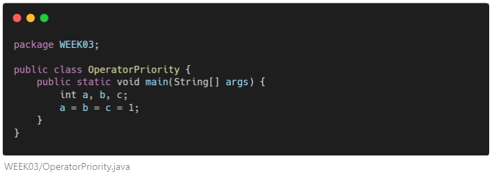
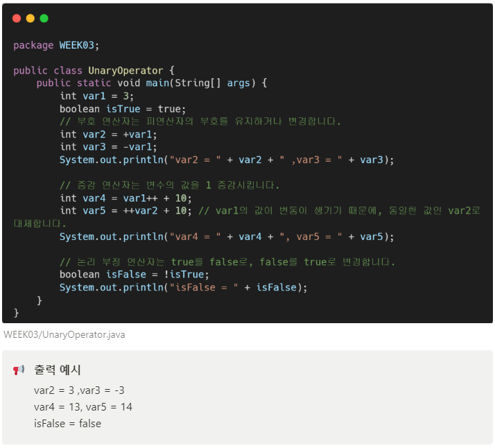
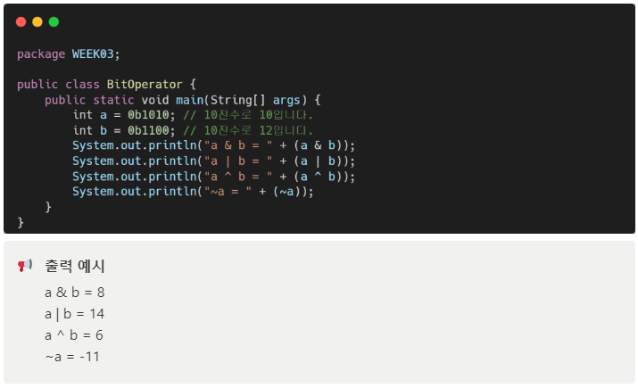
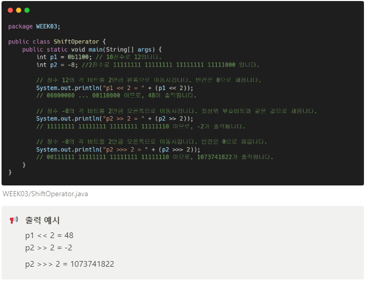
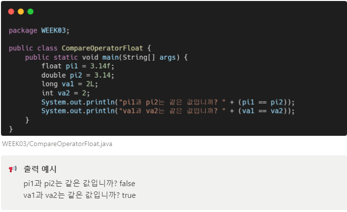
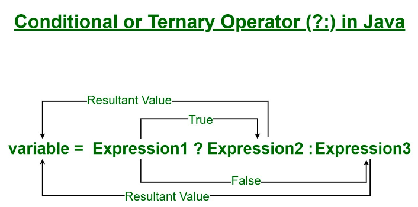
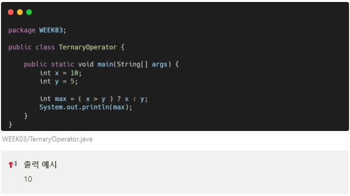
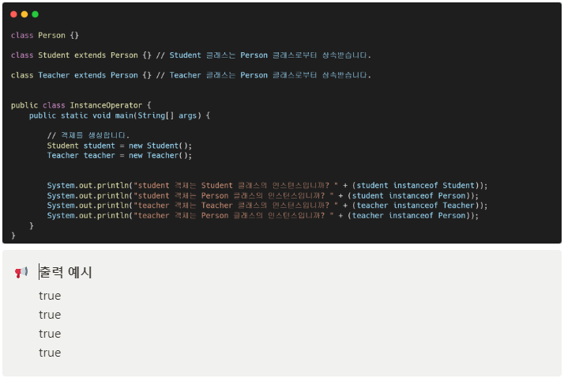
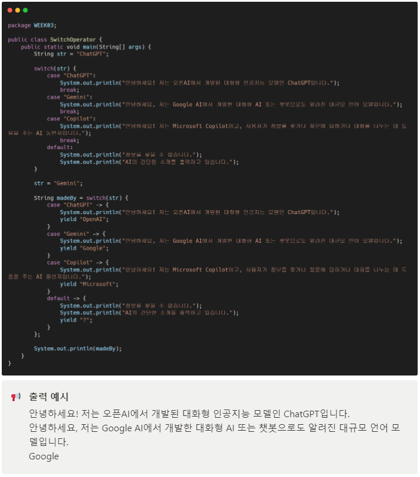

# 자바 스터디 - 3주차
## 개요

연산에 사용되는 표시 또는 기호를 **연산자**(*operator*)라고 부릅니다. 연산자와 함께 연산되는 데이터는 **피연산자**(*operand*)라고 하고, 연산자와 피연산자를 이용하여 연산의 과정을 기술한 것을 **연산식**(*expression*)이라고 부릅니다.

---

## 연산자

연산자는 필요로 하는 피연산자의 수에 따라 **단항, 이항, 삼항 연산자**로 구분됩니다. 연산자는 반드시 하나의 값을 산출하며, 연산식은 다른 연산식의 피연산자가 될 수 있습니다.

### 연산자 우선 순위

연산식에서 다양한 연산자가 복합적으로 구성된 경우, 수학과 동일한 순서로 연산을 처리합니다. 이후, 연산의 우선 순위가 동일한 경우, 왼쪽에서 오른쪽으로 처리됩니다. 그러나, 예외적으로 단항 연산자(++, --, ~, !), 부호 연산자, 대입 연산자(=, +=, -=, …)는 오른쪽에서 왼쪽으로 연산을 수행합니다.

위의 식에서 계산은 c = 1, b = c, a = b 순서로 진행됩니다.

| 순위 | 연산자 | 종류 |
| --- | --- | --- |
| 1 | (), {} | 괄호 |
| 2 | !, ~, ++, -- | 논리 연산자, 증감 연산자 |
| 3 | *, /, % | 산술 연산자 |
| 4 | +, - | 산술 연산자 |
| 5 | <<, >>, >>> | 비트 연산자 |
| 6 | <, <=, >, >= | 비교 연산자  |
| 7 | ==, != | 비교 연산자 |
| 8 | & | 비트 연산자, 논리 연산자 |
| 9 | ^ | 거듭제곱 |
| 10 | | | 논리 연산자 |
| 11 | && | 논리 연산자 |
| 12 | || | 논리 연산자 |
| 13 | ? : | 조건 연산자(3항 연산자) |
| 14 | =, +=, -=, *=, /=, %=, <<=, >>=, &=, ^=, ~= | 대입 연산자 |

### 단항 연산자

**단항 연산자**(*unary operator*)로 대표되는 것은 부호 연산자와 증감 연산자, 논리 부정 연산자가 있습니다.

부호 연산자는 피연산자의 부호를 유지하거나 변경합니다. ‘+’는 유지 ‘-’는 변경을 의미합니다.

부호 연산자는 피연산자의 값을 1 증감시킵니다.

논리 부정 연산자는 boolean 타입에 쓰이며, true를 false로, false를 true로 변경합니다.

증감 연산자에서 ++var1와 같은 것을 **전위 증가 연산자**라고 부르고 var1++는 **후위 증가 연산자**라고 부릅니다. 전자의 경우, 다른 연산을 수행하기 전에 피연산자의 값을 1 증가시키는 것이고, 후자의 경우는 수행 후에 피연산자의 값을 1 증가시키는 것입니다.

위에서, var4 는 var1++ + 10인데, 이 경우, ‘var1 + 10’을 먼저 진행하고, ‘var1 + 1’이 따라서 진행됩니다. 따라서, var4의 값은 13이 됩니다. 반면, var5는 ++var2 + 10인데, 이 경우, ‘var2 + 1’이 먼저 진행되고, ‘var2 + 10’이 따라 진행되어 값이 14가 됩니다. 한편, var1과 var2의 값은 4로 동일하여, 증감 연산자만 단독으로 사용하는 경우, 둘의 차이는 없습니다.

var1++는 같은 연산 방식인 ‘var1 = var1 + 1’과 달리 연산자가 한 번만 들어가기 때문에 실행 속도가 더 빨라 보이지만, 바이트코드로 비교해보면 둘은 동일한 코드를 가집니다. 따라서, 둘의 연산 속도 차이는 없습니다.

### 산술 연산자와 대입 연산자

산술 연산자는 덧셈(+), 뺄셈(-), 곱셈(*), 나눗셈(/), 모듈러 연산(%)이 있으며, 최소 int 타입으로 반환합니다. int보다 범위가 더 큰 자료형이 있는 경우, 해당 자료형으로 반환합니다.

char형 또한, 연산할 경우 int가 되므로, 다시 char형으로 **강제 타입 변환**(*casting*)을 해야합니다.

대입 연산자는 오른쪽 피연산자의 값을 왼쪽 피연산자 값에 저장합니다. =, +=, -=, *=, /=, %=, &=, |=, ^=이 있습니다. 이는 모든 연산자 중 가장 낮은 연산 순위를 가지고 있습니다.

### 비트 연산자

비트 연산자는 비트 단위로 논리 연산하며, 피연산자를 2진수로 표현하여 계산한다.

| 구분 | 연산자 | 설명 |
| --- | --- | --- |
| AND | & | 피연산자가 모두 1인 경우, 1을 반환 나머지는 0을 반환 |
| OR | | | 피연산자 중 적어도 하나가 1인 경우, 1을 반환 나머지는 0을 반환 |
| XOR | ^ | 피연산자 값이 서로 다른 경우, 1을 반환 나머지는 0을 반환 |
| 비트 전환 | ~ | 0을 1로, 1을 0으로 변환 |
| 쉬프트 | <<, >>, >>> | 전자 정수의 각 비트를 후자 정수만큼 왼쪽 또는 오른쪽으로 이동 |

1010과 1100에 대해서, &(and)를 할 경우, 1000이 되어 8이 출력됩니다.

1010과 1100에 대해서, |(or)를 할 경우, 1110이 되어 14가 출력됩니다.

1010과 1100에 대해서, ^(xor)를 할 경우, 0110이 되어 6이 출력됩니다.

1010에 대하여 ~를 할 경우, 11110101이 되고, 이는 -11입니다. Java는 정수를 표현할 때 2의 보수법을 사용하며, 이는 모든 비트를 반전시킨 후 1을 더하는 방식입니다. 따라서, ~를 구하는 방법은 10에 1을 더하고, 부호를 변경하면 됩니다.

>>와 >>>는 양수일 경우, 같은 값이 출력됩니다.

### 비교 연산자와 논리 연산자

**비교 연산자**(**관계 연산자**)는 피연산자의 대소 및 동등을 비교하여 true 또는 false를 출력합니다.

char 타입을 비교할 경우, 유니코드 값으로 비교 연산을 수행합니다.

float와 double 타입을 비교할 경우, 둘의 정확도 차이로 인해 같은 값이더라도, 다르게 인식됩니다.

String의 경우에는 동등 비교 연산자만 사용할 수 있습니다. 해당 변수들이 같은 주소를 참조하는지를 확인하는데 사용됩니다.

논리 연산자는 피연산자로 boolean 타입을 받고, 다음과 같이 있습니다.

| 구분 | 연산자 | true가 출력되는 조건(NOT 제외) |
| --- | --- | --- |
| AND(논리곱) | &&(&) | 피연산자가 모두 true인 경우 |
| OR(논리합) | ||(|) | 피연산자 중 적어도 하나가 true인 경우 |
| XOR(베타적 논라합) | ^ | 피연산자의 논리값이 서로 다른 경우 |
| NOT(논리 부정) | ! | 피연산자의 논리값을 변경 |

&과 |는 두 피연산자의 결과를 모두 산출하는 것과 달리, &&과 ||는 앞의 값이 각각 false와 true면 즉시 결과를 도출합니다. 따라서, &&과 ||을 사용하는 것이 더 효율적입니다.

### 3항 연산자

**3항 연산자**로는 **조건 연산자**가 있습니다. if-then-else 조건문과 같은 연산을 수행하며, 이를 사용하면 코드의 간결성을 높일 수 있습니다.

요약하자면, Expression1 조건이 참 인 경우 Expression2를, 거짓인 경우 Expression3을 연산합니다.

---

## instanceof

**참조 변수**가 참조하고 있는 인스턴스의 실제 타입을 알아보기 위해 사용하는 연산자입니다. 연산 결과는 boolean 타입이고, 결과가 true인 경우 참조 변수(객체)가 형 변환이 가능하다는 뜻입니다.

Student과 Teacher 클래스는 Person 클래스로부터 상속을 받습니다. 이는 참조 관계이기도 하므로, 클래스로 만들어진 객체들도 **instanceof**를 통해, 상속하는 클래스에게 true라는 값을 받을 수 있게 됩니다.

---

### switch 연산자

**switch 연산자**는 Java에서 지원하는 switch/case 문을 더 간결하게 쓸 수 있게 해줍니다.

기존 switch문에서 :를 →로 변경할 수 있고, 다음과 같이 변경할 수 있고, break문을 생략할 수 있습니다.

위와 같이 **yield**를 통해서, 값을 **반환**할 수도 있습니다.