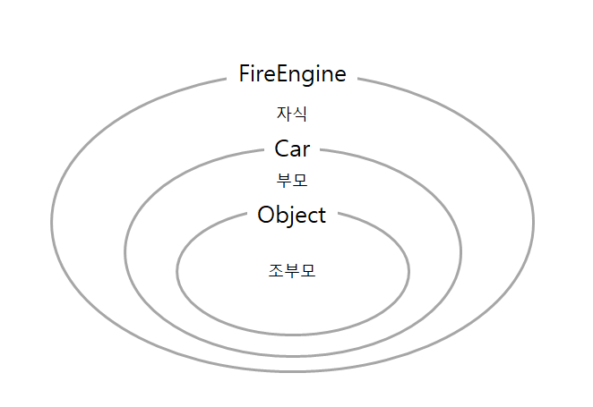
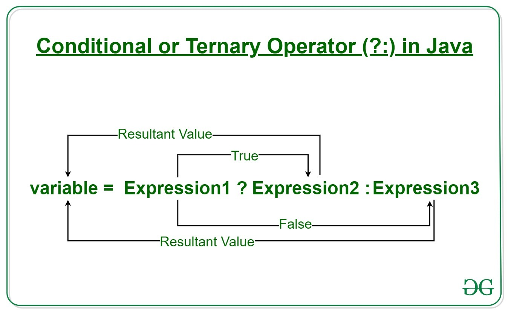
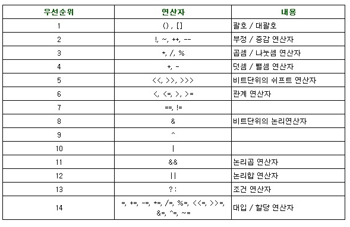

# 자바 스터디 - 3주차
## 산술 연산자 / 비트 연산자 / 관계 연산자 / 논리 연산자
&nbsp;  

- **산술 연산자**  
+, -, *, /, %  
<br>
- **비트 연산자**  
&, |, ^  
<br>
- **관계 연산자**  
<, >, <=, >=, ==, !=  
<br>
- **논리 연산자**  
&&, ||  
<br>

## instanceof
<br>

`instanceof:` 참조변수가 참조하고 있는 인스턴스의 실제 타입을 알아보기 위해 사용하는 연산자  

```java
[참조변수] instanceof [타입/클래스명]
//연산 결과는 boolean 형태로 나옴
``` 
<br>

결과가 `true`면 참조 변수가 검사한 타입으로 형변환이 가능하다는 것을 뜻함  
값이 null인 참조 변수에 대해 instanceof 연산을 수행하면 false를 결과로 얻음  
**조상 타입의 참조 변수로 자손 타입의 인스턴스를 참조할 수 있기 때문에, 참조 변수의 타입과 인스턴스의 타입이 항상 일치하지는 않음**  
조상 타입의 참조 변수로는 실제 인스턴스의 멤버들을 모두 사용할 수 없기 때문에, 실제 인스턴스와 같은 타입의 참조 변수로 형변환을 해야만 인스턴스의 모든 멤버들을 사용할 수 있음

```java
class InstaceofTest {
    public static void main(String args[]) {
        FireEngine fe = new FireEngine();

        if (fe instanceof FireEngine) {
            System.out.println("This is a FireEngine instance.");
        }
        if (fe instanceof Car) {
            System.out.println("This is a Car instance.");
        }
        if (fe instanceof Object) {
            System.out.println("This is an Object instance.);
        }
        // 클래스의 이름을 출력
        System.out.println(fe.getClass().getName()); 
    }
}
class Car {}
class FireEngine extends Car {}
```

조상 클래스로의 형변환에 문제가 없음  
<br>


## assignment(=) operator
&nbsp;  
오른쪽에 위치한 값을 왼쪽 공간에 저장(할당)함

| 연산자 | 의미                                                                |
| ------ | -------------------------------------------------------------------- |
| =      | 오른쪽의 값을 그대로 왼쪽 공간에 저장                              |
| +=     | 왼쪽 공간의 현재값에 오른쪽 값을 더한 후에 다시 왼쪽 공간에 저장     |
| -=     | 왼쪽 공간의 현재값에 오른쪽 값을 뺀 후에 다시 왼쪽 공간에 저장       |
| *=     | 왼쪽 공간의 현재값에 오른쪽 값을 곱한 후에 다시 왼쪽 공간에 저장     |
| /=     | 왼쪽 공간의 현재값에 오른쪽 값을 나눈 몫을 다시 왼쪽 공간에 저장     |
| %=     | 왼쪽 공간의 현재값에 오른쪽 값을 나눈 나머지를 다시 왼쪽 공간에 저장 |
&nbsp;  


## 화살표(->) 연산자
&nbsp;  

**람다 표현식**이라고 말함.  
메소드를 하나의 식으로 표현한 것  
<br>

메소드를 람다 표현식으로 표현하면, **클래스를 작성하고 객체를 생성하지 않아도** 메소드를 사용할 수 있음

```java
//메소드 
int main(int x, int y){
    return x < y ? x : y;
}

//람다 표현식
(x, y) -> x < y ? x : y;
```

## 3항 연산자
<br>

간결하게 if-then-else 조건문과 같은 연산을 실행할 수 있음.  
```
(조건)? 참일 때: 거짓일 때
```  



## 연산자 우선 순위
```
산술>비교>논리>대입
```




## Java 13. switch 연산자

```java
switch(입력변수) {
    case 입력값1: ...
         break;
    case 입력값2: ...
         break;
    ...
    default: ...
         break;
}
```
<br>

switch문도 if-else문의 역할을 하지만 조금 더 정형화되어 있어서 `코드의 가독성`이 좋음.  
입력변수의 값이 입력값1, 2, ...과 같다면 case 문 하위의 명령어 문장이 실행되고 break 됨  
그러나 case 문에는 반드시 `정수와 문자열` 만 사용이 가능하며, 실수는 사용이 불가능함.