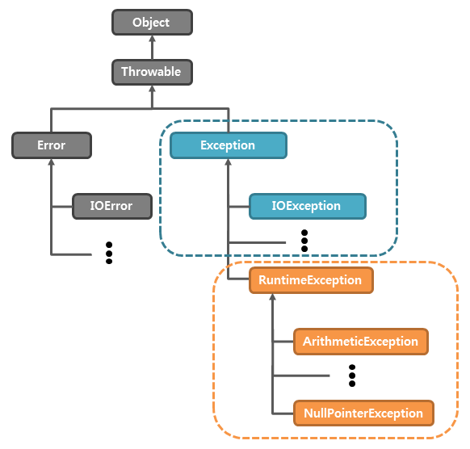

# 자바 스터디 - 9주차

# 1. 자바에서 [예외](https://www.tcpschool.com/java/java_exception_class) 처리 방법 (try, catch, throw, throws, finally)
자바의 예외는 다음과 같은 조상 클래스를 가지고 있다.

- 주황색 박스인 `RuntimeException`의 서브 클래스들은 런타임에 치명적이지 않은 예외들로 구성되어있어 try, catch 보다는 주의해서 코드를 작성하는 것을 자바에서 권한다.
- 파란색 박스인 `Exception`의 서브 클래스들은 치명적인 예외를 발생시키므로 try, catch를 사용하여 예외처리를 해주는 것이 좋다.
- 따라서 자바 컴파일러는 RuntimeException 클래스 이외의 Exception 클래스의 자식 클래스에 속하는 예외가 발생할 가능성이 있는 구문에는 반드시 예외를 처리하도록 강제하고 있다.

## 1.1. try, catch
자바의 예외 처리 방법은 다음과 같다.
```java
public class WriteException {
    public static void main(String[] args) {
        byte[] list = {'a', 'b', 'c'};
        try {
            System.out.write(list);
        } catch (IOException e) {
            e.printStackTrace();
        }
    }
}
```

## 1.2. [throw, throws](https://www.tcpschool.com/java/java_exception_throw)
자바에서는 thorw 키워드를 사용하여 강제로 예외를 발생시킬 수 있다.
```java
Exception e = new Exception('Error Message');
...
throw e;
```
```java
public class HandlingException {
    static void handlingException() {
        try {
            throw new Exception();
        }
        catch (Exception e) {
            System.out.println('호출된 메소드에서 예외가 처리됨');
        }
    }
}
```
```java
public class HandlingException2 {
    static void handlingException() throws Exception { throw new Exception(); }

    public static void main(String[] args) {
        try {
            handlingException();
        } catch (Exception e) {
            System.out.println("main() 메소드에서 예외가 처리됨");
        }
    }
}
```
## 1.3. finally
try문을 실행하고나서 finally로 예외가 일어나든 아니든 실행한다. 사용법은 다음과 같다.
```java
try { ... }
catch { ... }
finally { ... }
```
예시는 다음과 같다.
```java
static String readFile(String fPath) throws IOException {
    BufferedReader br = new BufferedReader(new FileReader(fPath));
    try {
        return br.readLine();
    } finally {
        if (br != null)
            br.close();
    }
}
```
java se7 이후에는 다음과 같이 적어도 된다.
```java
static Stgring readFile(String fPath) throws IOExceprion {
    try (BufferedReader br = new BufferedReader(new FileReader(fPath))) {
        return br.readLine();
    }
}
```

## 1.4. Throwable 클래스
예외처리를 할 때 e를 넘겨주는데 이를 활용하는 방법은 다음과 같은 메소드를 사용하는 것이다.
| 메소드                 | 설명                                                                                                               |
| ---------------------- | ------------------------------------------------------------------------------------------------------------------ |
| String getMessage()    | 해당 throwable 객체에 대한 자세한 내용을 문자열로 반환함.                                                          |
| void printStackTrace() | 해당 throwable 객체와 표준 오류 스트림(standard error stream)에서 해당 객체의 스택 트레이스(stack trace)를 출력함. |
| String toString()      | 해당 throwable 객체에 대한 간략한 내용을 문자열로 반환함.                                                          |

# 2. 자바가 제공하는 예외 계층 구조
자바에서 예외처리를 진행하면 예외 처리의 순서가 중요하다.
```java
try { ... }
catch (Exception e) { ... }
catch (IOExceprion e) { ... }
```
위와 같이 예외처리를 하면 IOException이 발생하더라도 IOException이 Exception의 서브클래스이므로 Exception 또한 IOException을 처리할 수 있어서 IOException의 구문으로 들어가지 않고 Exception 구문으로 들어간다. 따라서 더 좁은 범위의 예외를 먼저 처리해주는 것이 옳다.

자바에서는 여러 개의 예외를 동시에 처리하는 방법이 있는데 이는 java se7부터 지원한다.
```java
try { ... }
catch (IOException | SQLException e) { ... }
```

# 3. Exception과 Error의 차이는?
- Error
  - 시스템이 종료되어야 할 수준과 같이 심각한 오류를 뜻함
- Exception
  - 개발자가 구현한 로직에서 발생
  - 따라서 예외 처리가 가능

# 4. RuntimeException과 RE가 아닌 것의 [차이](https://ksabs.tistory.com/195)는?
- RE는 개발자의 실수 혹은 구현한 로직에서 발생하는 오류로써 프로그래밍 요소들과 관계가 깊다.
- RE가 아닌 오류들은 주로 외부 영향에 의해 발행하는 오류로써 컴파일 시에 검사가 가능하다.

[1. 자바에서 예외 처리 방법 (try, catch, throw, throws, finally)](#1-자바에서-예외-처리-방법-try-catch-throw-throws-finally)에서 적었듯이 RE와 RE가 아닌 것의 클래스 구조도 살펴볼 수 있다.

# 5. 커스텀한 예외 만드는 방법
```java
class MyException extends RuntimeException {
    MyException(String errMsg) {
        super(errMsg);
    }
}
```
