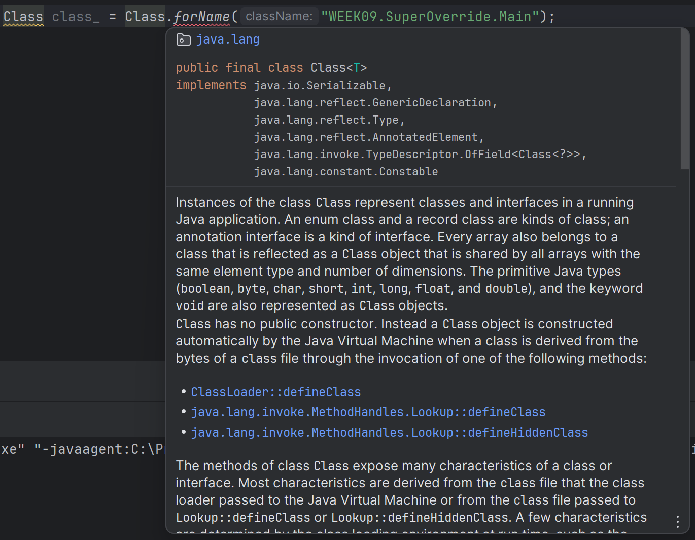
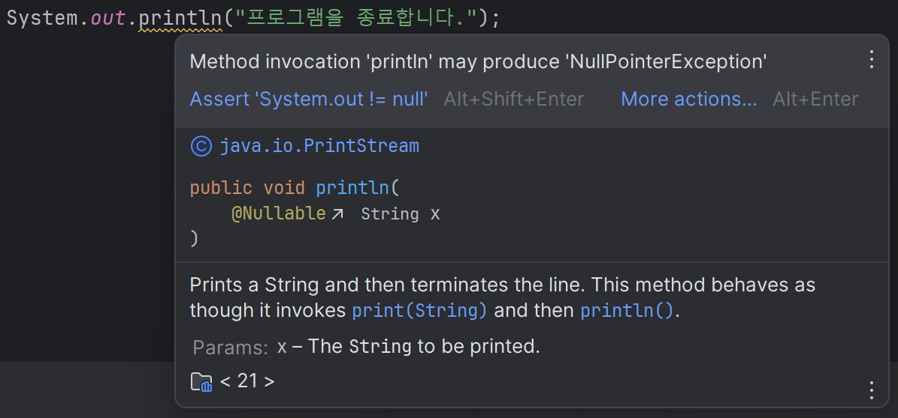
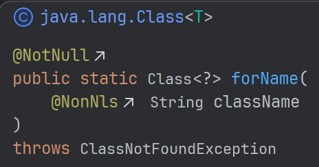

# 자바 스터디 - 9주차

# 5. 예외 처리

## 개요

세미콜론을 빠뜨리거나 오타를 내서 발생하는 사소한 오류부터 잘못된 메소드를 사용한 것까지, 우리는 코딩을 하다보면, 오류 메시지를 정말 많이 접하게 됩니다. 이러한 오류를 통틀어 에러(Error)와  예외(Exception)라고 합니다. 

에러는 컴퓨터 하드웨어의 오동작에 의해 오류가 발생하는 것이고, 그 외 사용자의 실수 등으로 인해 잘못된 조작(코딩)을 해서 발생하는 오류는 예외입니다. 

예외와 에러는 모두 발생시 기본적으로 프로그램을 바로 종료한다는 공통점을 가집니다. 그러나, 에러와 달리 예외는 일종의 작업을 통해, 프로그램을 종료하지 않고 정상 실행 상태를 유지할 수 있습니다. 이를 ‘예외 처리(Exception Handling)’라고 부릅니다.

---

## 일반 예외와 실행 예외

예외는 일반 예외(Checked Exception)과 실행 예외(RE: Runtime Exception)으로 나뉩니다.



일반 예외는 ‘컴파일러 체크 예외’라고 부릅니다. 프로그램이 컴파일될 때, 예외 처리 코드가 있는지를 검사하고, 예외 처리 코드가 없다면 컴파일 오류를 발생시킵니다. IDE에서 보통 위와 같이 실행을 하지 않아도 일반 예외가 발생할 것을 알려줍니다.



실행 예외는 ‘컴파일러 넌(non) 체크 예외’라고 부릅니다. 컴파일 과정 중에 예외 처리 코드가 있는지를 검사하지 않습니다.

Java는 Python과 같이, 예외를 클래스로 관리합니다. JVM은 예외가 발생한 경우 해당 예외 클래스를 객체로 생성합니다. 예외 클래스는 모두 java.lang.Exception 클래스를 상속받습니다.

RuntimeException 클래스를 기준으로, RuntimeException 클래스를 상속받는 모든 클래스를 실행 예외, 아닌 경우를 일반 예외로 구별합니다.

정리하면, 예외는 모두 클래스로 관리하고, 예외 클래스의 최상위 클래스는 java.lang.Exception*입니다. 그 하위 클래스 중 하나인 RuntimeException 클래스의 하위 클래스인 경우 실행 예외, 아닌 경우 일반 예외라고 합니다.

*java.lang.Exception의 상위 클래스는 java.lang.Throwable입니다. 이는 예외 클래스 뿐만 아니라, 오류 클래스(java.lang.Error)을 자식으로 가집니다. 또한, java.lang.Throwable의 상위 클래스는 java.lang.Object입니다. Object 클래스는 Java의 모든 클래스를 자식으로 가지는 최상위 클래스입니다.

---

## 실행 예외 예시

자주 볼 수 있는 실행 예외의 예시입니다. 사용자가 실행 예외에 대한 예외 처리 코드를 넣지 않은 경우, 해당 예외 발생시 프로그램을 종료합니다.

### NullPointerException

객체 참조가 없는 상태인 래퍼런스 타입을 호출할 경우, 생성되는 예외입니다. 다음 예제와 같이 래퍼런스 타입인 String 객체가 어느것도 참조를 하지 않고 있을 때, String 객체의 메소드를 호출하면 NullPointerException이 생성되고 프로그램을 종료합니다.

```java
package WEEK09.RuntimeException;

public class NullPointerExceptionExample {
    public static void main(String[] args) {
        String str = null;
        System.out.println(str.toLowerCase());
    }
}
```

```markdown
Exception in thread "main" java.lang.NullPointerException: Cannot invoke "String.toLowerCase()" because "str" is null 
at WEEK09.RuntimeException.NullPointerExceptionExample.main(NullPointerExceptionExample.java:6)
```

toLowerCase() 메소드는 String 클래스의 멤버고, 문자열을 모두 소문자로 바꿔주는 역할을 합니다. 위의 경우, str이 참조하는 문자열이 없으므로, 예외가 발생합니다.

### ArrayIndextOutOfBoundsException

이 예외도 많이 봤을 수도 있습니다. 배열의 범위를 초과할 경우 발생합니다.

```java
package WEEK09.RuntimeException;

public class ArrayIndexOutOfBoundsExceptionExample {
    public static void main(String[] args) {
        int[] arr = new int[5];
        for (int i=0; i<6; i++) arr[i] = i;
    }
}
```

```markup
Exception in thread "main" java.lang.ArrayIndexOutOfBoundsException: Index 5 out of bounds for length 5
at WEEK09.RuntimeException.ArrayIndexOutOfBoundsExceptionExample.main(ArrayIndexOutOfBoundsExceptionExample.java:6)
```

위에서 배열의 크기는 5고, arr[0]부터 arr[4]까지 사용할 수 있습니다. arr[5]는 arr의 범위를 벗어났기 때문에, 이를 호출할 경우 예외가 발생합니다.

### ClassCastException

부모 클래스의 생성자로 자식 객체를 생성할 수 없습니다. 클래스의 자동 타입 변환은 부모 객체가 자식 클래스의 생성자를 통해서만 발생하기 때문입니다. 

자식 클래스의 생성자로 생성된 부모 객체는 자식 객체로 강제 타입 변환이 될 수 있지만, 그 외에는 강제 타입 변환이 허용되지 않습니다. 

```java
package WEEK09.RuntimeException;

class A { }
class B extends A { }

public class ClassCastExceptionExample {
    public static void main(String[] args) {
        A a = new A();
        B b = new B();

        B b1 = (B) a;
    }
}
```

```markdown
Exception in thread "main" java.lang.ClassCastException: class WEEK09.RuntimeException.A cannot be cast to class WEEK09.RuntimeException.B (WEEK09.RuntimeException.A and WEEK09.RuntimeException.B are in unnamed module of loader 'app')
at WEEK09.RuntimeException.ClassCastExceptionExample.main(ClassCastExceptionExample.java:11)
```

ClassCastException은 위의 조건을 만족하지 않는 강제 타입 변환을 시도할 경우 발생합니다. 위와 같이 부모 클래스의 생성자로 생성된 부모 객체를 자식 객체의 타입으로 변환을 시도할 경우, 예외가 발생합니다.

### **ArithmeticException**

이 예외는 대표적으로 ‘0으로 나누는 경우’ 발생합니다.

```java
package WEEK09.RuntimeException;

public class ArithmeticExceptionExample {
    public static void main(String[] args) {
        System.out.println(10/0);
    }
}
```

```markdown
Exception in thread "main" java.lang.ArithmeticException: / by zero
at WEEK09.RuntimeException.ArithmeticExceptionExample.main(ArithmeticExceptionExample.java:5)
```

---

## 예외 처리

Java 컴파일러는 일반 예외가 발생할 가능성이 있는 코드가 있다면 컴파일 에러를 발생시켜 사용자가 강제적으로 예외 처리 코드를 작성하도록 요구합니다. 한편, 실행 예외는 컴파일러가 직접 확인하지 않기 때문에 사용자가 직접 예외 처리 코드를 설계해야 합니다.

### 예외 처리 코드

### try-catch-finally 블록

이 블록은 생성자와 메소드 안에서 작성되고, catch에 있는 에러가 발생할 경우, catch문으로, 아닌 경우 try문 안의 코드를 실행하고, finally문 안의 코드를 실행합니다.

```java
try {

} catch(ExceptionClass e) {

} finally {

}
```

처리되지 않은 예외(Unhandled Exception)를 예외 처리하지 않은 경우, 프로그램을 종료합니다. 예외 처리가 된 경우 catch문을 실행합니다.

e는 단순 변수명이므로, 굳이 e를 사용하지 않아도 되지만, 통상적으로 e를 사용합니다.

try도 하나의 문(Statement)이기 때문에, try문 내에 사용한 지역 변수의 유효 범위(scope)는 try문 안으로 제한됩니다.

```java
package WEEK09.ExceptionHandling;

public class TryCatchFinally {
    public static void main(String[] args) {
        try {
            int[] arr = new int[5];
            arr[5] = 5;
        } catch(ArrayIndexOutOfBoundsException e) {
            System.out.println("배열의 범위를 초과하였습니다.");
        } finally {
            System.out.println("프로그램을 종료합니다.");
        }
    }
}
```

위 프로그램을 예로 들자면, 범위를 벗어난 배열을 호출하려고 하였으므로, ArrayIndexOutOfBoundsException이 발생하고 아무런 예외 처리 코드를 생성하지 않으면, 프로그램을 즉시 종료합니다. 그러나 위의 코드는 예외 처리 코드를 생성하였기 때문에, catch문이 실행되고, 이어서 finally문까지 실행되며 프로그램을 종료합니다.

```java
package WEEK09.ExceptionHandling;

public class TryCatchFinally2 {
    public static void main(String[] args) {
        try {
            // SuperOverride.Main 클래스는 WEEK06 패키지 내에 있습니다.
            Class class_ = Class.forName("WEEK09.SuperOverride.Main");
        } catch (ClassNotFoundException e) {
            System.out.println("클래스가 존재하지 않습니다.");
        } finally {
            System.out.println("프로그램을 종료합니다.");
        }
    }
}
```

ClassNotFoundException은 일반 예외 클래스이며, 호출하려는 클래스가 없는 경우 발생합니다. forName()은 매개변수 이름인 클래스를 호출하는 메소드입니다.

SuperOverride.Main 클래스는 WEEK09 패키지에 속해있지 않아 호출하려고 하면, 예외가 발생합니다. 위와 같이 실행 예외 뿐만 아니라 일반 예외도 예외 처리를 통해 컴파일 에러가 발생했어야할 코드를 정상적으로 실행할 수 있습니다.

### 다중 catch

try문에는 다양한 예외가 발생할 수 있고, 이 경우 발생되는 예외별로 예외 처리 코드를 만들 수도 있습니다. try문 내에 두 개 이상의 예외가 있더라도, 최초로 발생한 예외에 대한 catch문이 실행됩니다. 예외가 발생할 경우 try문을 종료하고, catch문을 실행하기 때문입니다.

```java
package WEEK09.ExceptionHandling;

public class MultiCatch {
    public static void main(String[] args) {
        try {
            int[] a = new int[5];
            Class class1 = Class.forName("clazz");
        } catch(ArrayIndexOutOfBoundsException e) {
            System.out.println("배열의 범위를 초과하였습니다.");
        } catch(ClassNotFoundException e) {
            System.out.println("클래스가 존재하지 않습니다.");
        } finally {
            System.out.println("프로그램을 종료합니다.");
        }
    }
}
```

### catch 순서

catch문으로 넘어갈 수 있는 조건이 2개 이상이 있는 경우, 가장 첫 번째 catch문으로 이동합니다. 즉, 예외 처리시 자식 클래스를 부모 클래스보다 앞에 와야 합니다. 만약 부모 클래스를 앞에 두게 된다면, 자식 클래스에 해당하는 오류가 발생하여도, 부모 클래스의 예외 처리가 이루어집니다. 이는, 부모 클래스를 자식 클래스가 상속받기 때문에, 부모 클래스의 특징을 가지기 때문입니다.

```java
package WEEK09.ExceptionHandling;

public class CatchSequence {
    public static void main(String[] args) {
        try {
            int[] arr = new int[5];
            arr[5] = 5;
        } catch (ArrayIndexOutOfBoundsException e) {
            System.out.println("배열의 유효 범위를 초과하였습니다.");
        } catch (Exception e) {
            System.out.println("알 수 없는 문제가 발생하였습니다.");
        } finally {
            System.out.println("프로그램을 종료합니다.");
        }
    }
}
```

Exception은 ArrayIndexOutOfBoundsException의 부모이므로, 다중 catch문을 이용할 경우, 뒤로 보내야 합니다. 만약 앞으로 보낸 경우, ArrayIndexOutOfBoundsException이 발생하여도, Exception의 예외 처리 코드로 이동합니다.

### 예외 떠넘기기 throws

메소드 내부에서 예외 처리를 하지 않고, 다른 메소드에서 예외 처리를 떠넘길 수 있습니다. 다음과 같이 떠넘깁니다.

```java
ReturnType MethodName(Parameters, ...) throws Exception1, Exception2, ... { ... } 
```

메소드에 발생할 수 있는 예외를 주로 나열하지만, Exception을 이용하여 모든 예외를 떠넘길 수도 있습니다. throws 키워드가 있는 메소드는 예외를 떠넘기기 때문에 반드시 메소드를 받는 곳에서 예외 처리를 해주어야 합니다.

```java
package WEEK09.ExceptionHandling;

public class ThrowsMethod {
    public static void method() throws Exception {
        System.out.println("오류를 떠넘깁니다.");
    }

    public static void main(String[] args) {
        try {
            method();
        } catch(Exception e) {
            System.out.println("알 수 없는 문제가 발생하였습니다.");
        } finally {
            System.out.println("프로그램을 종료합니다.");
        }
    }
}
```



forName() 메소드는, 메소드 선언부 뒤에 ClassNotFoundException을 떠넘기기 때문에, 사용시 반드시 예외 처리를 해주어야 합니다. 그러지 않을 경우, 컴파일 에러가 발생합니다.

### main() 메소드 예외 떠넘기기

main() 메소드에서도 예외를 떠넘길 수 있는데, JVM에서 최종적으로 예외 처리를 해줍니다. JVM은 예외 내용을 콘솔(Console)에 출력하여 예외 처리를 합니다.

```java
package WEEK09.ExceptionHandling;

public class MainThrow {
    public static void main(String[] args) throws Exception  {
        System.out.println("Hello, World!");
    }
}
```

그러나, main() 메소드를 통해 예외를 처리하는 것은 권장되지 않습니다.

main() 메소드가 프로그램의 실행 진입점이기 때문에, main() 메소드 내부에서 발생하는 예외는 보통 전역적인 예외 처리로 처리되어야 합니다. 이는 main() 메소드 내에서 발생하는 예외는 프로그램 전반에 영향을 미칠 수 있기 때문입니다.

main() 메소드에 throws 절을 추가하면 예외를 main()을 호출하는 코드로 전달하게 되는데, 일반적으로 이는 프로그램이 비정상적으로 종료되는 결과를 야기할 수 있습니다.

---

## 사용자 정의 예외

코딩을 하다보면, Java에서 기본적으로 제공하는 예외 뿐만 아니라, 자신만의 예외에 대한 처리가 필요할 때가 있습니다. 예를 들어, 자신이 설정한 값의 범위를 넘어서는 경우, 기존 Java의 예외를 응용할 수도 있겠지만, 자신이 직접 예외를 만드는 것이 더 편할 수도 있습니다. 

Java는 예외를 클래스로 관리하므로, 클래스를 선언하여 자신만의 예외를 만들 수도 있습니다.

```java
// Exception 클래스를 상속받아 사용자 정의 예외 클래스 정의
public class MyCustomException extends Exception {

    // 예외 메시지를 전달받는 생성자 정의
    public MyCustomException(String message) {
        // 부모 클래스의 생성자 호출을 통해 예외 메시지 설정
        super(message);
    }
}
```

다음과 같이 생성자를 직접 만들지 않고 예외를 만들 수 있습니다.

```java
package WEEK09.CreatingException;

public class NonExistException extends Exception { }
```

```java
package WEEK09.CreatingException;

public class Main {
    public static void main(String[] args) {
        try {
            throw new NonExistException();
        } catch(NonExistException e) {
            System.out.println("해당 사용자가 없습니다.");
        } finally {
                System.out.println("프로그램을 종료합니다.");
        }
    }
}
```

이때는 예외 처리시 catch문에 직접 예외 사항을 입력하여야 합니다. 

```java
package WEEK09.CreatingException;

public class CannotCreateException extends Exception {
    public CannotCreateException(String message) {
        super(message);
        System.out.println("해당 이름으로 계정을 생성할 수 없습니다.");
    }
}
```

```java
package WEEK09.CreatingException;

public class Main2 {
    public static void main(String[] args) {
        try {
            throw new CannotCreateException(null);
        } catch(CannotCreateException e) {

        } finally {
            System.out.println("프로그램을 종료합니다.");
        }
    }
}
```
