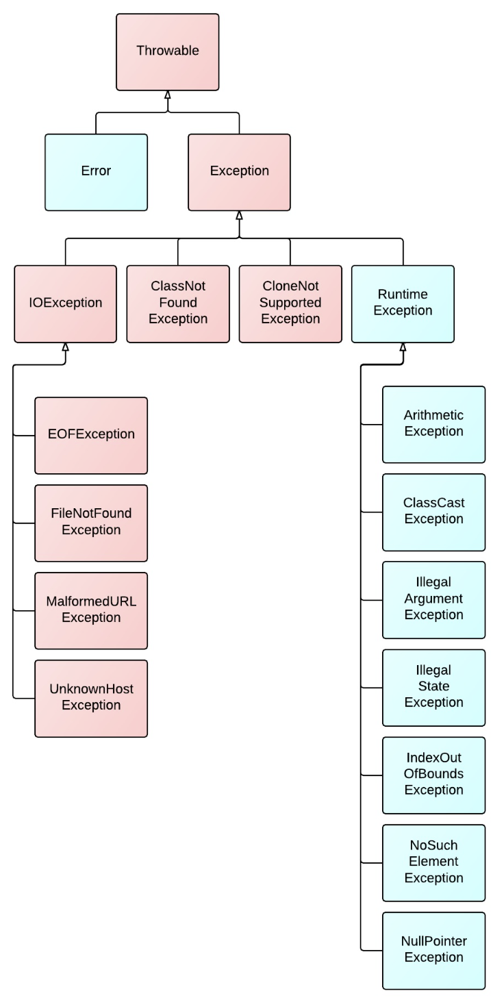

# 자바 스터디 - 9주차

## 자바가 제공하는 예외 계층 구조



- **Throwable class**  
Throwable 클래스는 Java 언어의 모든 오류 및 예외의 슈퍼 클래스  

## Exception과 Error의 차이는?

**오류:** 시스템이 종료되어야 할 수준의 상황과 같이 수습할 수 없는 심각한 문제를 의미함. 개발자가 미리 예측하여 방지하여야 함  

```
ex: OutOfMemoryError, LinkageError, ThreadDeath, AssertionError, VirtualMachineError
```

**예외:** 개발가자 구현한 로직에서 발생한 실수나 사용자의 영향에 의해 발생함. 오류와 달리 개발자가 미리 예측하여 방지할 수 있기에 상황에 맞는 예외 처리를 해야 함.  

```
ex: RuntimeException, NullPointerException, IOException 
```

## RuntimeException과 RE가 아닌 것의 차이는?

| -                         | Checked Exception                                                                                    | Unchecked Exception                                                                                                    |
| ------------------------- | ---------------------------------------------------------------------------------------------------- | ---------------------------------------------------------------------------------------------------------------------- |
| 처리 여부                 | 반드시 예외를 처리해야 함                                                                            | 명시적인 처리를 강제하지 않음                                                                                          |
| 예외 발생시 트랜잭션 처리 | roll-back 하지 않음                                                                                  | roll-back 함                                                                                                           |
| 대표 예외                 | Exception을 상속받는 하위 클래스 중 Runtime Exception을 제외한 모든 예외 / IOException, SQLException | RuntimeException 하위 예외 / NullPointerException, IllegalArgumentException, IndexOutOfBoundException, SystemException |

**빨간색:** 체크 예외(checked Exception)  

**RuntimeException을 상속받지 않은** 예외
체크 예외가 발생할 수 있는 메소드를 사용할 경우, **복구가 가능한** 예외들이기 때문에 반드시 예외를 처리하는 코드를 작성해야 함.  
이때 해결하지 않으면 **컴파일 시 체크 예외**가 발생함.  
보통 외부의 영향으로 컴파일 시에 검사가 가능한 것들임.  

ex: IOException, SQLException  

**파란색:** 언체크 예외(unchecked Exception)

**RuntimeException을 상속한** 예외, **예외처리를 강제하지 않음.**  
언체크 예외는 따로 catch문으로 예외를 잡거나 throws로 선언하지 않아도 됨.  
프로그램에 오류가 있을 때 발생하도록 의도된 것임.  
코드 작성 시의 실수가 실행될 때 발생할 수 있는 예외들임.  
**컴파일 에러가 발생하지 않음.**  
(배열의 범위 벗어남, nullpointer 참조변수 호출, 클래스 간 형변환, 정수를 0으로 나눔)  

ex: NullPointerException, illegalArgumentException  


체크 예외와 언체크 예외의 차이점을 이야기함.  

## 자바에서 예외 처리 방법 (try, catch, throw, throws, finally)
  
### 예외 처리 방법 3가지
1) `예외 복구`: try-catch (finally) - 다른 작업 흐름으로 유도, Checked Exception으로!  
2) `예외 처리 회피`: throws - 호출한 쪽(부모)에게 예외 처리 위임하도록  
3) `예외 전환`: throw - 명확한 의미의 예외로 바로 처리 ==> 개발자들이 비즈니스 로직에서 처리하는 방식! 바로, UncheckedException으로!   
<br>

### 예외 복구 
```java
int max=MAX_TRY;
while (max-->0){
    try {
        <수행할 문장 1>;
        <수행할 문장 2>;
        ...
    } catch(예외1) {
        <수행할 문장 A>;
        ...
    } catch(예외2) {
        <수행할 문장 a>;
        ...
    } finally {
        //예외에 상관 없이 반드시 실행됨
        <마지막에 수행할 문장>;
    }
}

throw new RetryFailedException();   //최대 재시도 횟수를 넘어가면 예외 발생
```

### 예외 처리 회피

```java
public void add() throws SQLException{
    //구현 로직
}
```  

예외가 발생하면 throws를 통해 호출한 쪽(호출 메서드)으로 예외를 던지고 그 처리를 회피하는 것. 무책임하게 던지는 것은 위험하고 호출한 쪽에서 다시 예외를 받아 처리하도록 하거나 해당 메소드에서 예외를 던지는 것이 최선이라는 확신이 있을 때만 사용해야 함.  


### 예외 전환 

```java
catch (SQLException e) {
    throw DuplicateUserIdException();
}
```

예외를 잡아서 다른 예외를 던짐. 호출한 쪽에서 예외를 받아 처리할 때 명확하게 인지할 수 있도록 돕기 위함.  
  
<br>

- **throw와 throws의 차이**  <<여기 보충>>
throw와 throws는 예외 처리와 관련된 키워드로 다음과 같은 차이점이 있음  

**throw:** 메서드 내에서 예외를 발생시키는 데 사용  
<br>

**thorws:** 메서드 선언부에서 사용되며, 해당 메서드가 처리하지 않은 예외를 호출자에게 전달함을 나타냄.  
<br>


## 커스텀한 예외 만드는 방법

```java
public class CustomException extends RuntimeException {

    // 1. 매개 변수가 없는 기본 생성자
    CustomException() {
    }

    // 2. 예외 발생 원인(예외 메시지)을 전달하기 위해 String 타입의 매개변수를 갖는 생성자
    CustomException(String message) {
        super(message); // RuntimeException 클래스의 생성자를 호출합니다.
    }
}
```

```java
throw new 예외();
throw new 예외("메시지");
```

```java
public static void main(String[] args) {
    try{
        test();
    } catch (CustomException e) {
        System.out.println("커스텀 예외 테스트");
    }
}

public static void test() throws CustomException {
    throw new CustomException("예외 테스트 입니다.");
}
```

## 예제 1

```java
public class MinjiException extends Exception {
    public MinjiException() {
        super();
    }

    public MinjiException(String message) {
        super(message);
    }

    public static void main(String[] args) {
        try {
            //테스트 함수 실행
            test();     
        } catch (MinjiException e) {
            //호출자를 통해 넘겨진 예외를 처리함
            System.out.println("exception test!!");
        }
    }

    public static void test() throws MinjiException {   //메서드에서 처리되지 않은 예외를 호출자에게 넘김(throws)
        //예외 발생시킴(throw)
        throw new MinjiException("test");
    }
}
```    
출력 결과   
```
exception test!!
```  

## 예제 2

```java
public class DeviceController {
    // ...
 
    public void sendShutDown() {
        try {
            //넘겨진 예외를 받아 처리함
            tryToShutDown();
        } catch (DeviceShutDownError e) {
            logger.log(e);
        }
    }
 
    private void tryToShutDown() throws DeviceShutDownError {   //발생한 예외를 호출자(tryToShutDown)로 넘김
        DeviceHandle handle = getHandle(DEV1);  //예외 발생
        DeviceRecord record = retrieveDeviceRecord(handle);
 
        pauseDevice(handle);
        clearDeviceWorkQueue(handle);
        closeDevice(handle);
    }
 
    private DeviceHandle getHandle(DeviceId id) {
        // ...
        //DeviceShutDownError 예외를 발생시킴
        throw new DeviceShutDownError("Invalid handle for: " + id.toString());
        // ...
    }
 
    // ...
}
```
